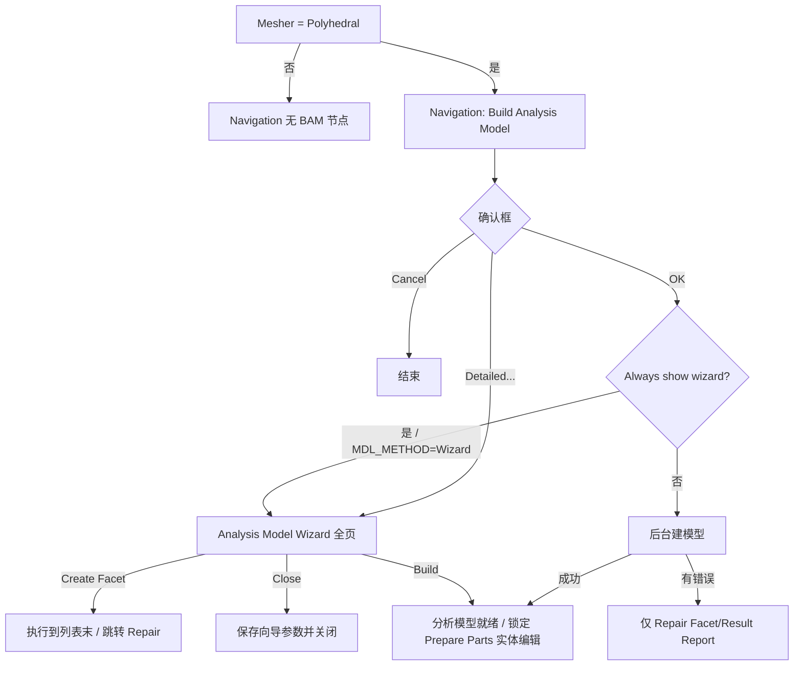

# DEV_PLAN — Analysis Model Wizard 完整功能规划

> 日期：2026-08-13 ｜ 仓库：`pphdecoding` ｜ 对照：Cradle CFD 2025.2 scFLOWpre  
> 手册：`Manuals/scFLOW/HTML/Pre_eng/Scf_pre_Analysis_Model_*.html`（10 页）+  
> `[Execute]-[Build Analysis Model]` / `[Option]-[Navigation]` / Mesher·Faceter  
> 代码入口：`nav_panels.AnalysisModelWizardBody`（`build_am_detailed`）、  
> `pph_gui._confirm_build_analysis_model`（确认框 + Detailed…）  
> 总览对照见 [SCFLOWPRE_FEATURE_PLAN.md](SCFLOWPRE_FEATURE_PLAN.md)  
> §0.4：网格生成策略逆向可行性（基于当前代码实现的结论）  
> §0.5：自研多面体 mesher 候选技术栈（学术 / 开源参考）  
> §0.6：自研拟体素化（Voxel fitting）mesher 候选技术栈

---

## 0. 目标与范围

### 0.1 产品目标

在本查看器中把 **Analysis Model Wizard** 做到与 scFLOWpre **交互面与参数面**对齐：

1. 左栏完整步骤、右栏各页控件与子对话框齐全；
2. 参数读写 `main.xenv`（`FACET` / 相关 `OCT_MESH`）与 `session["build_am"]`；
3. **Create Facet / Build** 通过自动化桥（VBS / scFLOWpreAPI / NativeBridge）真正驱动宿主建面片与闭体识别，本进程不自研完整 Parasolid faceter；
4. Draw 窗口预览、多重边/微小面列表、非法形状报告等**运行时结果**以宿主回传或本地 MDL 解析为数据源，分阶段落地。

### 0.2 非目标（本规划明确不做）

- 在本仓库内完整复刻 Solid-based / Parasolid faceter 内核；
- 替代 scFLOWpre 的 CAD 拓扑修复（切向接触等需回 CAD）；
- Voxel fitting mesher 路径下的 BAM（该路径无独立 Build Analysis Model）。

### 0.3 能力分层

| 层 | 含义 | 验收 |
|----|------|------|
| **L1 UI** | 页、控件、显隐、子对话框布局对齐手册截图 | 离屏 GUI 测试 + 人工对照截图 |
| **L2 参数** | load/apply ↔ xenv / session /（可选）xml | round-trip 测试 |
| **L3 驱动** | Create Facet / Build / Clean → 宿主 API 或 VBS | 样例工程宿主执行 + Reload |
| **L4 结果** | 列表/报告/预览来自真实几何或宿主回调 | 与 scFLOWpre 同工程对照 |

当前实现约 **L1 部分 + L2 全局 FACET 键**；L3/L4 与多数页的运行时列表仍为占位。

### 0.4 网格生成策略逆向可行性（实现结论）

> 基于仓库已落地的格式解析、参数面与 COM/VBS 桥接能力的评估（2026-08-13）。

**结论：能把「产物与控制面」摸得很透，但「完整逆向网格生成策略/算法」基本不现实。**  
当前仓库强项是格式与管线编排，不是在本进程复刻 mesher 内核。与 §0.2 非目标及 [SCFLOWPRE_FEATURE_PLAN.md](SCFLOWPRE_FEATURE_PLAN.md) 阶段 5（可选自研 mesher）一致。

#### 0.4.1 已经摸清的（高置信）

| 层 | 含义 | 代表模块 |
|----|------|----------|
| 产物格式 | 网格**结果**可读可重建显示 | `oct.py`、`mdl.py`、`gphstats.py`、`crdlfld.py` |
| 快照/加密外壳 | 中间态可解压、部分字段对齐 DLL | `sctsnapshot.py`、`blowfish_le.py` |
| 参数面 | Faceter/Octree 键 ↔ 宿主 setter | `main.xenv`、`automation/pipeline_plan.py` |
| 控制面 | BAM → DeleteOctree → SetOctType/MinSize → CreateOctree → CreateMesh | VBS/COM 录制锁定（`host_pipeline.py`、`tests/box_vbs*.vbs`） |
| 显示级 CAD 剖分 | **调用** Cradle Parasolid，非复刻采样器 | `ps_facet2_nodes.py`、`ps_tessellate.py`、`cad_import.py` |
| NativeBridge 符号 | SCTprime 入口可解析；需活宿主上下文 | `native_bridge.py`、`native/scflow_bridge.cpp` |

即：**输入参数、调用顺序、输出 OCT/MDL/GPH 几何状态**可以对照；**为何这一刀、如何生成多面体单元**仍在闭源内核里。

#### 0.4.2 仍不透明的部分

| 瓶颈域 | 已知 | 缺失 |
|--------|------|------|
| BAM / Build Analysis Model | UI + xenv；`MeshingGroup_.BuildAnalysisModel` | 干涉/微小面/匹配/闭体识别的运行时逻辑 |
| Faceting（Solid / AF / Parasolid） | 公差参数；PK 选项块布局；CAD 预览 | `PK_TOPOL_facet_2` 内部采样策略 |
| `CreateOctree` | OctParam / 区域 Size / create type；`.oct` 可读 | 细化判定过程（曲率、邻近、区域规则、平衡） |
| `CreateMesh` → GPH | VBS monitor + WaitForWorker；GPH 统计 | 单元生成、棱柱层、质量、写端 |
| Wrapping / Disc / Overset | Native 符号 + VBS 草稿 | 录制未锁定；依赖 SCTprime 运行时 |

#### 0.4.3 核心瓶颈（按严重度）

1. **致命 — 算法在闭源内核，不在文件里**  
   `CreateOctree` / `CreateMesh` / BAM 在 SCTprime/scFLOWpre 内。`.oct`/`.gph` 只存**结果**，不存决策过程。样例深度直方图等最多得到经验启发，得不到可证明等价的策略。

2. **致命 — Parasolid faceter / B-rep**  
   面片化依赖商业内核。无合法内核路径则 BAM 前置几何做不全；完整 RE 内核在工程与合规上均不成立。

3. **高 — 宿主进程 / 许可证上下文**  
   能**驱动**已安装的 scFLOWpre；难以把 mesher 当独立库完整拉出（裸调常缺 document 态）。

4. **高 — Wrapping 等高层命令**  
   VBS 层未锁定；NativeBridge 仍绑活宿主。

5. **中–高 — GPH 写端与体网格算法**  
   读/统计/显示已有；自研 polyhedral 等于另写 mesher，目标应是**兼容格式**，非 bit-identical Cradle。

#### 0.4.4 现实策略

| 路径 | 角色 |
|------|------|
| **主路径：AutomationBridge** | COM/VBS（及必要的 NativeBridge）继续当真正网格器——复现官方策略的唯一可靠方式 |
| **旁路：格式与查看器** | 继续 OCT/MDL/GPH 消费、参数 UI、行为表征 |
| **可选自研** | 新写 octree + 开源体网格器并写出 CRDL-FLD；接受与官方**算法不等价**（见功能计划阶段 5） |
| **明确不做** | 以「完整逆向 CreateOctree/CreateMesh/BAM/Wrapping/Parasolid」为完成标准 |

**一句话：「完全逆向策略」≈ 不；「完整理解产物 + 可靠驱动官方算法」≈ 已经在走且可行。**

### 0.5 自研多面体 mesher 候选技术栈

> 可选长期路径（[SCFLOWPRE_FEATURE_PLAN.md](SCFLOWPRE_FEATURE_PLAN.md) 阶段 5）：写出兼容 CRDL-FLD / 自有格式的 polyhedral，**不追求**与 Cradle bit-identical。  
> 注意：CGAL「Polyhedral domain」多指「由多面体表面围成的区域」上的 **四面体** 生成，勿与 CFD 任意多面体体网格混淆。

#### 0.5.1 与 Cradle / scFLOW 路线最接近的开源参考

| 来源 | 思路 | 为何相关 |
|------|------|----------|
| **cfMesh `pMesh`**（OpenFOAM 社区，GPL） | 背景 **octree**（曲率/邻近/尺寸场）→ 四面体模板 → **对偶成任意 polyhedra** → 投影贴体 | 与本仓库已解析的 OCT + 多面体流程最像；inside-out，对脏 STL 较容忍 |
| **OpenFOAM `polyDualMesh`** | 先 tet，再取对偶 | 实现简单；质量依赖前序 tet |
| **snappyHexMesh / hex-dominant** | 笛卡尔/六面体为主 + 贴体 | 非纯 polyhedral，但「背景网格 + 贴体」可借鉴 |

**首选拆读蓝本：** cfMesh `pMesh`（Creative Fields 文档：octree 细化与平衡 → tet 模板 → dual → 边界投影）。

#### 0.5.2 学术上更「正统」的 polyhedral：Voronoi 系

| 论文 / 系统 | 要点 | 参考 |
|-------------|------|------|
| **VoroCrust**（ACM TOG） | 无 clipping 的 conforming Voronoi；保尖角；primal–dual | [PMC](https://pmc.ncbi.nlm.nih.gov/articles/PMC7439975/) |
| **Clipped Voronoi + 粘性层** | 分层放 seed + 边界裁剪；工程 CFD 常用 | doi:10.1002/nme.5963 |
| **NASA LAVA Voronoi mesher**（2024） | 工业级：seed、Lloyd 平滑、裁剪、合缝 | [NTRS PDF](https://ntrs.nasa.gov/api/citations/20240008543/downloads/LAVA_Voronoi_Aviation24_compressed.pdf) |
| Cadence 等工业材料 | clipped Voronoi + 近壁 strand | 思路参考，非开源 |

Star-CCM+ / 部分现代 CFD mesher 的「多面体」本质亦接近 **clipped/restricted Voronoi**。

#### 0.5.3 CGAL：能当积木、不当整机

**适合：**

- `Mesh_3`：高质量 **tet**（隐式曲面 / 多面体域 / 特征保护）
- 3D Triangulation / Voronoi / Restricted Voronoi、Lloyd / ODT
- 布尔、AABB、特征探测

**不适合：** 开箱即用的 scFLOW 式任意 polyhedral 体网格。  
要 polyhedral 需自做 **tet→dual**，或 **CGAL Voronoi + 自写 clipping/合缝**。

许可：多为 **GPLv3+ / GeometryFactory 商业双许可**，嵌入闭源产品须提前核算。

#### 0.5.4 可拼装的开源积木（偏效率）

| 库 | 角色 |
|----|------|
| **Voro++** | 快速计算 Voronoi 胞元 |
| **TetGen / fTetWild / TetWild** | 稳健 tet |
| **MMG3D** | 自适应与重网格 |
| **Gmsh** | 前端 + tet；再 dual |
| **Geogram** | 受限 Voronoi / 重网格 |
| **libigl** | 原型与质量度量 |

#### 0.5.5 建议流水线（对齐本仓库 OCT 能力）

```text
面网格(MDL/STL)
  → 尺寸场 + 八叉树细化（可对齐现有 oct 语义 / oct.py）
  → (A) tet 模板 → dual polyhedra     ← cfMesh 路线，工程落地最快
  → (B) seed + clipped / VoroCrust Voronoi  ← 更接近文献中的「真·多面体 CFD」
  → 近壁棱柱/层（最难：多数开源最弱）
  → 写出 CRDL-FLD .oct/.gph 或自有格式（算法不等价 Cradle 可接受）
```

**效率关键：** 并行种子生成、空间索引、边界裁剪/投影、避免反复堆分配（cfMesh 强调）、Lloyd 仅局部迭代。

**最大工程坑：** 脏 CAD、尖角、薄特征、边界层、并行合缝——LAVA / VoroCrust / cfMesh 文献篇幅多在此，而非「算一次 Voronoi」。

#### 0.5.6 选型小结

| 问题 | 建议 |
|------|------|
| 与现有 OCT 栈最合拍？ | **cfMesh `pMesh` +（可选）Voro++/CGAL 子步骤** |
| 学术主线？ | **Voronoi（clipped / VoroCrust）** 与 **octree→tet→dual** 两派并读 |
| CGAL 定位？ | tet / Voronoi / 几何内核，**不要**指望 `make_mesh_3` 直接出 scFLOW 式 polyhedral |
| 与 §0.4 关系？ | 自研是**兼容产物**路径；官方策略仍靠 AutomationBridge |

### 0.6 自研拟体素化（Voxel fitting）mesher 候选技术栈

> 对照 scFLOWpre **Voxel fitting mesher**（`MESH/MESHER=1`）：手册/UI 写明生成  
> **hex-dominant polyhedron**，**直接从零件出发**（无独立 BAM / 独立面网格阶段，见 §0.2）。  
> 本仓库已暴露参数面：`Mesher/Faceter` 的 Voxel 行、`OCT_MESH/VOXEL_OCT_REFINE_TYPE`、  
> `MESH_COMMON/USE_ROUGH_POLY_WHEN_VOXEL_MESHING`、`NUMBER_OF_INITIAL_DIVISION_WHEN_VOXEL_MESHING` 等  
> （`nav_panels.MesherFaceterBody`、`option_settings`、`pipeline_plan.OCTREE_SETTING_MAP`）。

#### 0.6.1 scFLOWpre Voxel fitting：已知控制面与复刻难度

**已知（高置信，来自 UI / xenv / 手册文案）：**

| 项 | 内容 |
|----|------|
| 产品定位 | hex-dominant；相对 Polyhedral **跳过 BAM**；面片精度仍可调（Voxel 专用 Facet accuracy） |
| 八叉树 | 「Inclusion of octree creation process in meshing」；`SetVoxelOctRefineType`（录制映射含 `octree`） |
| 粗化/初分 | rough poly when voxel；initial division 次数 |
| 产物形态 | 与 Polyhedral 共用 OCT/GPH 一类成员可读（`oct.py` / `gphstats.py`），但细化策略与单元模板不同 |

**未知（仍在宿主内核）：** 笛卡尔根网格如何铺、cut/snap/层插入、级别过渡处如何把 hanging-node hex 变成 polyhedra、与 Solid/Facet 面片的精确耦合顺序。

**复刻难度总判：**

| 维度 | 相对 §0.5 任意多面体 | 说明 |
|------|----------------------|------|
| 概念清晰度 | **更容易** | 工业界 hex-core / Cartesian / snappy 文献与开源极多；与「已解析 OCT」同族 |
| 做出「能跑的 hex-dominant」MVP | **中等偏低** | 可直接借 cfMesh `cartesianMesh` / snappy 管线 |
| 对齐 Cradle 行为 / 质量 / 边界层 | **仍然高** | snap、尖角、薄壁、层、rough poly、与 scFLOW 求解器兼容的单元质量 |
| bit-identical 官方 Voxel | **不现实** | 同 §0.4：算法不在文件里 |

**相对 Polyhedral 自研：** Voxel 路线更适合作为**第一条自研 mesher MVP**（背景网格 + 贴体），再视需求加层与质量优化；不必先啃 VoroCrust。

#### 0.6.2 最接近的开源 / 工业参照

| 来源 | 思路 | 与 Voxel fitting 的关系 |
|------|------|-------------------------|
| **cfMesh `cartesianMesh`**（GPL） | 背景笛卡尔/八叉树 → hex-dominant，级别过渡为 polyhedra；可加层；脏几何容忍 | **首选拆读蓝本**；产品语义最接近「hex-dominant + octree」 |
| **OpenFOAM `snappyHexMesh`** | blockMesh 背景 hex → castellation → snap → addLayers | 经典 Cartesian；步骤清晰，可作教学与对照 |
| **Ansys Fluent Hexcore / Pointwise hex-core voxel** | 内部轴对齐 hex + 近壁 tet/过渡；octree 细化 | 工业「voxel / hex-core」术语来源；闭源，仅读论文/博客 |
| **Inria Hexotic**（octree all-hex） | 平衡八叉树 → 对偶全六面体 + buffer + 可插层 | 学术/工程 hex 路线；评估版/商业，非自由嵌入 |
| **HybridOctree_Hex**（CMU, JoCS 2024） | hybrid octree 模板 → all-hex + Jacobian 优化 | [GitHub](https://github.com/CMU-CBML/HybridOctree_Hex)；偏结构 all-hex，可借鉴平衡/贴体/质量 |

#### 0.6.3 可借鉴的学术论文（近年与经典）

| 文献 | 要点 |
|------|------|
| Maréchal et al.，Hexotic / IMR（octree hex） | 平衡与 pairing、对偶消 hanging node、尖角与层；[IMR18 PDF](https://team.inria.fr/gamma/files/2021/03/imr18.pdf) |
| Tong et al.，**HybridOctree_Hex**，*J. Comput. Sci.* 2024 | 自适应 all-hex + scaled Jacobian>0.5；doi:10.1016/j.jocs.2024.102278 |
| Steinbrenner / Karman 等，Pointwise hex-core voxel（2020 前后） | 根 voxel + octree 尺寸场；cut/inside/outside 分类；过渡 tet/pyramid |
| OpenFOAM snappy 用户文档 + 社区论文 | castellation / snap / layer 三阶段工程实践 |
| （可选）Cut-cell / immersed boundary 文献 | 若走「不 snap、保留切割面」的变体；与 Cradle「fitting」贴体目标略不同 |

#### 0.6.4 CGAL 与其它积木在 Voxel 栈中的角色

**CGAL：**

- **有用：** AABB 树、距离场、布尔、表面特征、（若过渡区需要）`Mesh_3` tet
- **无：** 现成 hex-core / voxel fitting / snappy 式管线  
→ Voxel 自研**不要以 CGAL 为主引擎**；几何查询可嵌入。

**其它积木：**

| 库 / 组件 | 角色 |
|-----------|------|
| 本仓库 `oct.py` / OCT 写端（待建） | 背景细化与尺寸场；与 scFLOW OCT 语义对齐的**展示/中间格式** |
| OpenFOAM / cfMesh 源码 | Cartesian 细化、贴体、层、并行容器 |
| Embree / libigl / Geogram | 快速求交与投影 |
| MMG | 过渡区或表面重网格（可选） |

#### 0.6.5 建议流水线（自研拟体素化）

```text
零件面片(MDL/STL) 或 CAD 预览面
  → 根笛卡尔盒 + 初始划分（对齐 NUMBER_OF_INITIAL_DIVISION_*）
  → 八叉树 / 2:1 平衡细化（曲率·邻近·区域 Size；可选对齐 VOXEL_OCT_REFINE_TYPE）
  → 体素分类：outside / cutting / inside
  → (A) snappy 风格：castellated hex → snap 到表面 → addLayers
  → (B) hex-core 风格：内部纯 hex，切割带 tet/pyramid 或合并为 polyhedra
  → (C) cfMesh 风格：级别跃迁处直接生成 polyhedra（hex-dominant）
  → 可选 rough poly / 质量平滑
  → 写出 .oct（中间）+ .gph / 自有体网格（算法不等价 Cradle）
```

**效率关键：** 并行 octree、稀疏存储、求交加速、层插入失败回退。  
**最大坑：** snap 失败导致非正交/负体积；薄特征过度细化；层在尖角崩溃——与「算 octree」相比，**贴体与层**仍是主成本。

#### 0.6.6 选型小结（Voxel vs Polyhedral）

| 问题 | 建议 |
|------|------|
| 自研 MVP 先做哪条？ | **Voxel / hex-dominant（§0.6）**，再考虑 §0.5 任意 polyhedral |
| 首选开源蓝本？ | **cfMesh `cartesianMesh`**；对照 **snappyHexMesh**；质量/全 hex 参考 **HybridOctree_Hex / Hexotic 论文** |
| CGAL？ | 几何查询与可选 tet 过渡，**非** voxel 主流程 |
| 与宿主关系？ | 短期仍用 COM 跑官方 Voxel；自研仅作离线/兼容格式实验 |
| 与 BAM？ | Voxel 路径**无**独立 BAM（§0.2）；勿把 Analysis Model Wizard 硬套到 Voxel |

---

## 1. 入口与前置条件

### 1.1 调用链（应对齐 scFLOWpre）



### 1.2 前置条件矩阵

| 条件 | 来源 | 行为 |
|------|------|------|
| Mesher = Polyhedral (`MESH/MESHER=0`) | Mesher/Faceter Setting | 显示 BAM 节点；Voxel 时隐藏 |
| Surface mesher = Facet-based | 同上 | 可用 Method for building analysis model |
| `FACET/MDL_METHOD=1` | Mesher/Faceter 或 Option | Analysis Model Wizard 路径 |
| `FACET/MDL_METHOD=0` | 同上 | SCTpre V12 compatible（简化设置，非本向导重点） |
| Always show analysis model wizard | Option → Navigation | OK 后强制进向导；未勾选则仅错误时出 Repair |
| Show [Build Analysis Model] item | Option → Navigation | 可强制隐藏 BAM 节点（与 Polyhedral 规则叠加） |
| 已打开工程 | GUI | 否则提示先打开 PPH |

### 1.3 本仓库入口状态（截至 2026-08-09）

| 入口 | 状态 | 缺口 |
|------|------|------|
| Polyhedral 时显示 BAM | ✅ | Option「Show BAM item」未做 |
| 确认框文案 OK/Cancel | ✅ | — |
| Detailed… → Wizard | ✅ | OK 后未按 Always show 自动进向导 |
| Always show / Show BAM item | ❌ | 需 Option 面板 + xenv/session |
| Execute 勾选 BAM → VBS | ◑ | 有管线钩子，与向导参数未完全打通 |

---

## 2. 向导外壳（Shell）

### 2.1 窗口

| 项 | 规格 |
|----|------|
| 标题 | `Analysis Model Wizard` |
| 布局 | 左 `QListWidget` 步骤列表 + 右 `QStackedWidget` + 底按钮栏 |
| 尺寸 | ≥ 920×640（可记忆上次尺寸） |
| 外层按钮 | `dialog_buttons = 0`（按钮全在内容区） |

### 2.2 左栏完整步骤（9 页，顺序固定）

> 手册截图在 Solid-based + 非 octree 精度时为 **9 项**（含 Influence）。  
> 指定 octree 精度时隐藏 3–5 相关页（见 §2.4）。

| # | Key | 显示名 | 手册 |
|---|-----|--------|------|
| 1 | `interference` | Solution Method for Solid/Sheet Interference | `..._Solution_method_for_solid_sheet_interference` |
| 2 | `multifold` | Configuration of Multi-fold Edges and Faces | `..._configuration_of_multi-fold_edges_and_faces` |
| 3 | `acc_whole` | Facet Accuracy for Whole Model | `..._Facet_Accuracy_for_Whole_Model` |
| 4 | `acc_part` | Facet Accuracy for Part and Region | `..._Facet_Accuracy_for_Part_and_Region` |
| 5 | `influence` | Influence of adjacent part | `..._Influence_of_adjacent_part` |
| 6 | `auto_tiny` | Automatic Removal of Tiny Faces | `..._Automatic_Removal_of_Tiny_Faces` / `Scf_pre_Analysis_Model_Automatic_Removal_of_Tiny_Faces` |
| 7 | `face_match` | Create Facet/Face Matching | `..._Create_Facet_Face_Matching` |
| 8 | `remove_tiny` | Remove Tiny Faces | `..._Remove_Tiny_Faces` |
| 9 | `repair` | Repair Facet/Result Report | `..._Repair_Facet_Result_Report` |

**现状**：实现 8 页，**缺 `influence`**。

### 2.3 底栏按钮语义

| 按钮 | 可见/使能 | 行为 |
|------|-----------|------|
| `<< Back` | 非首可见页 | 上一可见页（不执行建面片） |
| `Next >>` | 非末可见页 | **执行当前步必要处理**后进下一页（手册：从列表顶依次执行）；末页禁用 |
| `Create Facet` | 非 Repair 页 | **集体执行**至列表末（等价连点 Next），并进入 Repair |
| `Close` | 非可 Build 状态 | 保存参数，关闭；不 Build |
| `Build` | Repair 且模型可建 | 闭体识别完成 → 锁定 Prepare Parts 实体编辑；替换 Close |

### 2.4 页显隐规则

| 条件 | 隐藏页 |
|------|--------|
| Solid-based faceter **且** Specification type = Specify octree | `acc_whole`, `acc_part`, `auto_tiny`（手册注明）；改用 [Octree Parameter for Building Analysis Model] |
| 非 Solid-based（Parasolid faceter） | `auto_tiny` 相关操作无效/禁用；Face Matching 不可用（手册 Note） |
| `MDL_METHOD` ≠ Wizard | 不应进入本向导（走 V12 简化路径） |

### 2.5 Shell 待办

- [ ] 补齐左栏第 5 页 `influence`
- [ ] Next 真正“执行当前步”而非仅翻页（依赖 L3）
- [ ] Create Facet 批处理管线 + 进度/取消
- [ ] Repair 可建时 Close→Build 切换（已有雏形，需接真实错误等级）
- [ ] 与 Option「Always show wizard」联动：确认框 OK 后自动打开向导或仅 Repair

---

## 3. 分页功能规格与现状

图例：✅ 已对齐 ｜ ◑ 部分 ｜ ❌ 未做 ｜ 🔌 需宿主/几何引擎

### 3.1 Solution Method for Solid/Sheet Interference

| 功能 | 规格 | 状态 |
|------|------|------|
| Project solids | 勾选 → 体-体投影边界边；`FACET/PROJECT_SOLIDS` | ◑ UI+xenv |
| Project sheets | 勾选 → 片-片；仅 sheet 集合时取消；`PROJECT_SHEETS` | ◑ |
| Use solid-based faceter | `USE_FACETTER` true/false（与 Mesher/Faceter 同步） | ◑ |
| Specification type of faceting accuracy | Specify value / Specify octree；`FACET_ACCURACY_SPECIFY_TYPE` | ◑ |
| Element size parameter / Use | 启用尺寸过渡；默认灰显，AF 时可用 | ◑ UI |
| Direction of effect | Fine / Coarse side | ◑ session |
| Range of effect | 滑条+数值 | ◑ session |
| 切到 Specify octree | 打开/提示 Octree Parameter for BAM | ❌ |
| 与 Mesher/Faceter 双向同步 | 向导改 AF 后写回并刷新 Mesher 面板 | ❌ |

**子对话框**：Octree Parameter for Building Analysis Model（Detail… / Create Octree / 領域登録）— 独立规划，见 §5.1。

### 3.2 Configuration of Multi-fold Edges and Faces

| 功能 | 规格 | 状态 |
|------|------|------|
| Tab: Multi-Fold Edges | 按 part 树分类显示识别到的多重边对；选中高亮 Draw | ◑ 空树 |
| Tab: Multi-Fold Faces | 同上，多重面 | ◑ 空树 |
| Tolerance edge `1/N` | 默认 `1e+06`；减小分母更易成对；Apply 重识别 | ◑ 文本+session |
| Tolerance face `1/N` | 同上 | ◑ |
| Apply | 重跑识别并刷新树 | 🔌 |
| 树图标/成对计数文案 | 如 `Cuboid (8 pairs…)` | ❌ |
| Draw 联动高亮边/面 | 选中树节点 | 🔌 |

### 3.3 Facet Accuracy for Whole Model

| 功能 | 规格 | 状态 |
|------|------|------|
| **Parasolid 路径** Precision of distance / angle / Maximum edge | 相对默认值；滑条右=更细；`SIMPLE_*` | ◑ |
| **Solid-based 路径** Lower limit of angular precision | `SOLID_BASE_MINIMUM_ANGLE`（deg） | ◑ |
| Reduction ratio `1/N` | `SOLID_BASE_LENGTH_FACTOR = 1/N` | ◑ |
| Maximum edge `×` | `SIMPLE_MAX_WIDTH` | ◑ |
| Specify absolute value | `USE_ABSOLUTE_VALUE`；距离/最大边绝对量 | ◑ |
| Reset to the default value | 恢复默认 | ✅ |
| Preview mesh accuracy | 标记 part/face → Preview in draw window / Clear | 🔌 |
| Specify octree 时本页隐藏 | 见 §2.4 | ✅ 显隐 |

### 3.4 Facet Accuracy for Part and Region

| 功能 | 规格 | 状态 |
|------|------|------|
| 列表 Region/Part Name + Facet Accuracy | 默认 Default；体/面图标；数据来自 xml/groups | ◑ |
| Edit | 弹出子对话框（见 §5.2） | ◑ 现为简易 InputDialog |
| Default | 恢复 Default | ◑ |
| Preview mesh accuracy | 标记数 + Preview/Clear | 🔌 |
| AF+octree 时隐藏 | §2.4 | ✅ |
| 持久化 | 每 part/region 精度 → session + 宿主/可选 xml | ◑ 仅 session |

### 3.5 Influence of adjacent part（**缺失页**）

| 功能 | 规格 | 状态 |
|------|------|------|
| 左栏插入本页（acc_part 与 auto_tiny 之间） | 9 步完整列表 | ❌ |
| Consider the edge lengths of spatially adjacent facets | 总开关 | ❌ |
| Target region 表（Region Name / Target） | 勾选影响源；体/面图标 | ❌ |
| Set / Remove | 将选中行标为 Target 或清除 | ❌ |
| 说明文案 | Specify the region that affects… | ❌ |
| OFF 时忽略 Target | 手册 Note | ❌ |
| 参数落盘 | session + 可映射 xenv（若有键）/宿主 | ❌ |

### 3.6 Automatic Removal of Tiny Faces

| 功能 | 规格 | 状态 |
|------|------|------|
| 说明：仅 Solid-based 有效 | 文案+禁用逻辑 | ◑ |
| Show only parts with tiny faces | 过滤左表 | ◑ UI |
| Move view center to selection face | Draw 相机 | 🔌 |
| 左表 Part Name / Reference | Default (5%) 等 | ◑ |
| Edit / Default | 改参考值% | ◑ |
| Re-recognize tiny faces | 刷新右表 | 🔌 |
| 右表 Part / Num / Width / Target | 微小面列表 | 🔌 空 |
| Exclude / Specify for auto removal | 逐面开关 | 🔌 |
| 默认参考 SOLID_BASE_TINY_FACE_WIDTH_RATIO | % ↔ 0–1 | ◑ |

### 3.7 Create Facet / Face Matching

| 功能 | 规格 | 状态 |
|------|------|------|
| 先 Create Facet（本页或底栏）生成面片后再匹配 | 流程 | 🔌 |
| List of matching faces | 勾选、Group1/2 N、Min/Max dist、Direction | ◑ 空表 |
| Reverse matching direction | 切换 Forward/Reverse | ◑ 表操作 |
| Change Tolerance | 弹窗改容差并重检测 | ◑ 对话框雏形 |
| Preview | Draw 预览匹配对 | 🔌 |
| Match | 合并 face group | 🔌 |
| 仅 Solid-based | 禁用+说明 | ◑ |

### 3.8 Remove Tiny Faces

| 功能 | 规格 | 状态 |
|------|------|------|
| Tiny face list | Part / Face ID / 宽度指标 / facet 数 | ◑ 空表 |
| Tolerance absolute width + 单位 | 默认 0.001 m | ◑ |
| Refresh list | 按容差重识别 | 🔌 |
| Remove | 删除勾选项（影响棱柱层/质量） | 🔌 |
| 删除前人工确认提示 | 手册强调 | ❌ |

### 3.9 Repair Facet / Result Report

| 功能 | 规格 | 状态 |
|------|------|------|
| Illegal shape report 表 | Level / Number / Type / Cause + 计数 | ◑ 空表 |
| Type of problem / Level 过滤 | Refresh list | ◑ |
| Cause and solution 文本 | 无错误时固定英文提示 | ◑ 用 groups 摘要凑数 |
| Clean all / Clean | Level≥4 时修复可修问题 | 🔌 |
| Intersecting edges are not created | 引导回 Prepare Parts / Interference | ❌ 文案分支 |
| Build 替换 Close | 可建时 | ◑ 末页显示 Build，未接真实判定 |
| 重叠体优先级 | 树下方优先；分析域置顶 | ◑ 文档提示 / 无校验 |
| CreateMDL 后刷新 MDL/模型树 | Reload 成员 | 🔌 |

---

## 4. 数据模型

### 4.1 xenv（全局，与 Mesher/Faceter 共享）

| Section | Key | 向导用途 |
|---------|-----|----------|
| FACET | `PROJECT_SOLIDS` / `PROJECT_SHEETS` | Interference |
| FACET | `USE_FACETTER` | AF on/off |
| FACET | `FACET_ACCURACY_SPECIFY_TYPE` | value / octree |
| FACET | `USE_ABSOLUTE_VALUE` | 绝对精度 |
| FACET | `SIMPLE_CHORD_TOLERANCE` / `_ABS` | Parasolid 距离 |
| FACET | `SIMPLE_MAX_ANGLE` | Parasolid/共用角 |
| FACET | `SIMPLE_MAX_WIDTH` / `_ABS` | 最大边 |
| FACET | `SOLID_BASE_MINIMUM_ANGLE` | AF 角下限 |
| FACET | `SOLID_BASE_LENGTH_FACTOR` | AF 边长缩减比 |
| FACET | `SOLID_BASE_TINY_FACE_WIDTH_RATIO` | 自动去微小面参考 |
| FACET | `SOLID_BASE_*_FOR_OCTREE` | octree 精度路径 |
| FACET | `MDL_METHOD` | 必须为 `1`（Wizard） |
| MESH | `MESHER` / `SURF_MESHER` | 入口门控（只读校验） |

### 4.2 session[`build_am`]（向导私有 / 运行时）

建议统一结构（实现时逐步填满）：

```text
build_am:
  wizard_page: str
  project_solids / project_sheets / use_facetter / acc_type
  sb_ang / sb_len / max_edge / ps_* / absolute / dist_abs / edge_abs
  tiny_pct / tol_multifold_edge / tol_multifold_face
  match_tol / remove_tiny_tol
  elem_use / elem_dir / elem_range
  part_acc: { name: "Default"|label }
  tiny_ref: { part: "Default (5)"|number }
  influence_enable: bool
  influence_targets: [region_name, ...]
  multifold_edges / multifold_faces: [...]   # 识别结果缓存
  match_pairs: [...]
  tiny_faces_auto / tiny_faces_manual: [...]
  report_rows: [{level, count, type, cause}, ...]
  report_level_max: int
  buildable: bool
  create_facet_requested / build_requested: bool
  detailed: bool   # 经 Detailed… 进入
```

### 4.3 与宿主 API 的对应（执行层）

| 向导动作 | 宿主线索（SCTprime / VBS） |
|----------|---------------------------|
| Create Facet / 预览 | `IMDLWizard::CreateMDLFacetPreview` / `CreateMDL` |
| Build | `MeshingGroup_.BuildAnalysisModel` / `CreateMDL` |
| Multi-fold 识别 | `CreateIMultiEdgeGroupInfo` / `CreateIMultiFaceGroupInfo` |
| Boundary | `CreateBoundary` |
| Octree for BAM | `Get/SetConfigMDLWizard_OctLengthParam*`、`CreateFacetOctree` |
| Tiny faces | `ITinyFacesClass` 等 |

管线已有：`automation/pipeline_plan.py` → `build_analysis_model`；需把向导 session 序列化为 VBS 前参数写入 xenv。

---

## 5. 关联对话框与 Option

### 5.1 Octree Parameter for Building Analysis Model

- 触发：Interference 页 Select octree，或 Condition 菜单等价入口。
- UI：Octree parameter + Detail… + Create Octree + 領域登録 + OK（手册图）。
- 限制：不可用 No-slip wall；可用 Solid parts 表面、Obstacle（排除 IO/自由滑移）。
- 复用/特化现有 `OctreeParamBody` / `OctreeDetailDialog`，session 键建议 `build_am_octree` 与网格 Octree 分离。

### 5.2 Facet Accuracy for Part and Region — Edit 子对话框

- Parasolid：distance / angle / max edge。
- Solid-based：**无** Precision of distance；其余对齐整模页。
- OK 写回选中 part/region 行。

### 5.3 Change Tolerance（Face Matching）

- 容差数值 + 重检测按钮；关闭后刷新匹配表。

### 5.4 Option → Navigation（环境）

| 选项 | 规划 |
|------|------|
| Always show the analysis model wizard | session/xenv；OK 确认后强制向导 |
| Show [Build Analysis Model] item | 与 Polyhedral 规则 AND |
| Show [Mesher/Faceter Setting] item | 既有节点门控扩展 |
| Enable condition/region before BAM | 行为标志（后置） |

---

## 6. Draw / 模型树联动

| 动作 | 行为 |
|------|------|
| Preview mesh accuracy | 临时 facet 叠加显示；Clear 清除 |
| 选中 multi-fold / tiny / match 行 | 高亮对应边/面；可选移相机 |
| Build 成功 | 刷新 MDL 图层、模型树闭体/面域；禁用 Create/Modify Parts（Prepare Parts 锁定）直至 Execute→Prepare Parts |
| 重叠优先级提示 | Property/Message：树序下方优先 |

---

## 7. 分阶段实施计划

### 里程碑 W0 — 规划与壳完善（本文档）

- [x] 确认框 + Detailed… 入口
- [x] Polyhedral 门控
- [ ] 左栏补 `influence`；页显隐与手册 9 步一致
- [ ] DEV_PLAN 评审（本文）

### 里程碑 W1 — L1 UI 补齐（纯界面）

1. Influence 整页（表+Set/Remove+开关）
2. Acc Part Edit 子对话框（AF/Parasolid 两套字段）
3. Multi-fold / Match / Tiny / Report 表头、列宽、图标、空态文案对齐截图
4. Interference → Specify octree 时嵌入/弹出 BAM-Octree 对话框骨架
5. 测试：每页控件存在性、显隐矩阵、Detailed 打开

### 里程碑 W2 — L2 参数闭环

1. session schema 定稿 + 序列化
2. 与 Mesher/Faceter 双向同步（USE_FACETTER / ACC_TYPE / SOLID_BASE_*）
3. Option Navigation 三项读写
4. OK（无 Detailed）+ Always show 分支
5. 测试：xenv round-trip、改 Mesher 后向导初值

### 里程碑 W3 — L3 宿主驱动

1. Create Facet / Build / Next 逐步执行 → VBS 或 API（优先复用 `pipeline_plan` / `host_pipeline`）
2. Clean / Match / Remove tiny / Re-recognize 命令映射
3. 完成后 `.scflow_api.done` 轮询 Reload（已有 Execute 模式可复用）
4. Prepare Parts 锁定/解锁状态机

### 里程碑 W4 — L4 结果回填

1. 解析宿主输出或本地 MDL：multi-fold、tiny、match、illegal report
2. Preview 临时几何进 VTK
3. buildable 判定驱动 Build 按钮
4. 样例对照：box（改 Polyhedral）/ laptop 等

### 里程碑 W5 — 打磨与文档

1. 错误文案/Level 分级与手册一致
2. 进度条、取消、长时任务不卡 UI
3. README / SCFLOWPRE_FEATURE_PLAN 状态表更新
4. 回归：`tests/test_build_am.py` 扩展为页覆盖矩阵

---

## 8. 验收清单（对照手册）

- [ ] Polyhedral 外无 BAM；Voxel 无节点
- [ ] 确认框文案与 scFLOWpre 一致；Detailed… 进向导
- [ ] Always show 开：OK→向导；关：仅错误→Repair
- [ ] 9 步列表完整；AF+octree 时隐藏精度/自动微小面页
- [ ] 各页控件与截图一致（含 Influence）
- [ ] Create Facet 后 Repair 有报告；可建时出现 Build
- [ ] Build 后 MDL 更新且 Create/Modify Parts 锁定
- [ ] 参数写回 xenv，Save As 后 scFLOWpre 打开一致
- [ ] Face Matching / Auto tiny 在 Parasolid 路径禁用

---

## 9. 代码落点

| 区域 | 文件 |
|------|------|
| 向导 UI/参数 | `nav_panels.py` → `AnalysisModelWizardBody`、`_BAM_WIZARD_PAGES` |
| 确认框 / 导航门控 | `pph_gui.py` → `_confirm_*`、`_sync_nav_mesher`、`NavigationWindow` |
| BAM-Octree | `nav_panels.py` → Octree* 特化或新 `BuildAmOctreeBody` |
| Option Navigation | 新建 Option 面板或并入既有 settings |
| 执行桥 | `automation/pipeline_plan.py`、`host_pipeline.py`、ExecuteBody |
| 测试 | `tests/test_build_am.py`（扩展）、可选 `tests/test_am_wizard_pages.py` |
| 本规划 | `DEV_PLAN.md`（本文） |

---

## 10. 现状总表（快照）

| 模块 | L1 UI | L2 参数 | L3 驱动 | L4 结果 |
|------|-------|---------|---------|---------|
| Shell（8/9 页） | ◑ 缺 Influence | ◑ | ❌ Next/Create 真执行 | — |
| Interference | ◑ | ◑ xenv | ❌ octree 子框 | — |
| Multi-fold | ◑ 空树 | ◑ tol | 🔌 | 🔌 |
| Acc Whole | ◑ | ◑ | 🔌 Preview | 🔌 |
| Acc Part | ◑ | ◑ session | ❌ 真 Edit 对话框 | 🔌 |
| Influence | ❌ | ❌ | ❌ | — |
| Auto Tiny | ◑ | ◑ ratio | 🔌 | 🔌 |
| Face Match | ◑ | ◑ tol | 🔌 | 🔌 |
| Remove Tiny | ◑ | ◑ tol | 🔌 | 🔌 |
| Repair | ◑ | ◑ | 🔌 Clean/Build | 🔌 |
| 确认框+Detailed | ✅ | — | OK→flag only | — |
| Polyhedral 门控 | ✅ | ✅ | — | — |

---

## 11. 建议近期迭代顺序（可执行）

- [x] **补 Influence 页 + 左栏 9 步**（纯 UI，立刻可见“完善”）
- [x] **Acc Part 真 Edit 子对话框 + AF/Parasolid 字段分流**
- [x] **Always show wizard / OK 自动进向导**
- [x] **BAM-Octree 子对话框挂到 Specify octree**
- [x] **Create Facet/Build 接入现有 VBS 管线并 Reload**
- [ ] **结果列表从 MDL/报告回填（先 Repair，再 tiny/multifold）**（Repair 已回填；tiny/multifold 待宿主/几何结果）

---

*本文仅规划 Analysis Model Wizard 及其直接关联入口；Octree/Mesh/Condition Wizard 等仍以 SCFLOWPRE_FEATURE_PLAN 为准，冲突时以手册 + 本 DEV_PLAN 向导章节为准。*
