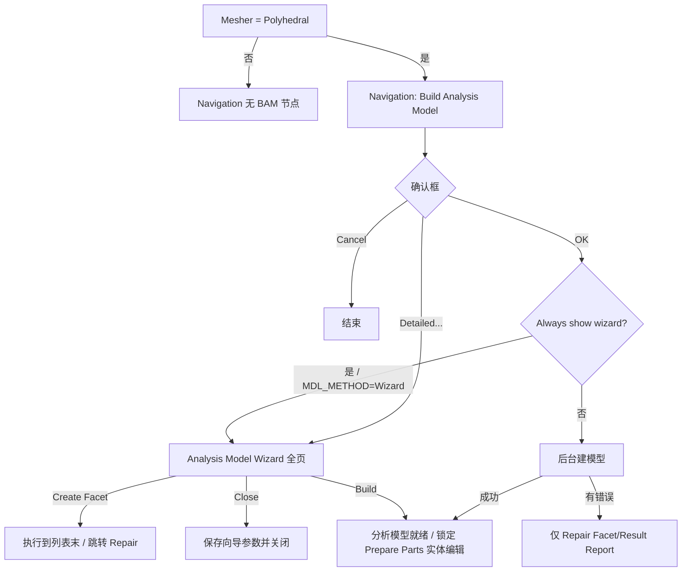

# DEV_PLAN — Analysis Model Wizard 完整功能规划

> 日期：2026-08-13 ｜ 仓库：`pphdecoding` ｜ 对照：Cradle CFD 2025.2 scFLOWpre  
> 手册：`Manuals/scFLOW/HTML/Pre_eng/Scf_pre_Analysis_Model_*.html`（10 页）+  
> `[Execute]-[Build Analysis Model]` / `[Option]-[Navigation]` / Mesher·Faceter  
> 代码入口：`nav_panels.AnalysisModelWizardBody`（`build_am_detailed`）、  
> `pph_gui._confirm_build_analysis_model`（确认框 + Detailed…）  
> 总览对照见 [SCFLOWPRE_FEATURE_PLAN.md](SCFLOWPRE_FEATURE_PLAN.md)  
> §0.4：网格生成策略逆向可行性（基于当前代码实现的结论）  
> §0.5：自研多面体 mesher 候选技术栈（学术 / 开源参考）  
> §0.6：自研拟体素化（Voxel fitting）mesher 候选技术栈
> §12：整体现状与 scFLOWpre 全量差距（全量比对快照，2026-08-14）
> §13：PPH 格式解码 + 写回闭环缺口（2026-08-14）
> §14：解码未完整的功能补齐计划（2026-08-14）
> §15：写回未完整的功能补齐计划（2026-08-14）
> §16：gphstats.py / oct.py / parasolid.py 系统改进（DLL 逆向，2026-08-15；§16.5 pskernel 版本审计/V37 逆向）
> §17：全量功能差距排序与改进计划（2026-08-16，详版见 function_gap_analysis.md）

---

## 0. 目标与范围

### 0.1 产品目标

在本查看器中把 **Analysis Model Wizard** 做到与 scFLOWpre **交互面与参数面**对齐：

1. 左栏完整步骤、右栏各页控件与子对话框齐全；
2. 参数读写 `main.xenv`（`FACET` / 相关 `OCT_MESH`）与 `session["build_am"]`；
3. **Create Facet / Build** 通过自动化桥（VBS / scFLOWpreAPI / NativeBridge）真正驱动宿主建面片与闭体识别，本进程不自研完整 Parasolid faceter；
4. Draw 窗口预览、多重边/微小面列表、非法形状报告等**运行时结果**以宿主回传或本地 MDL 解析为数据源，分阶段落地。

### 0.2 非目标（本规划明确不做）

- 在本仓库内完整复刻 Solid-based / Parasolid faceter 内核；
- 替代 scFLOWpre 的 CAD 拓扑修复（切向接触等需回 CAD）；
- Voxel fitting mesher 路径下的 BAM（该路径无独立 Build Analysis Model）。

### 0.3 能力分层

| 层 | 含义 | 验收 |
|----|------|------|
| **L1 UI** | 页、控件、显隐、子对话框布局对齐手册截图 | 离屏 GUI 测试 + 人工对照截图 |
| **L2 参数** | load/apply ↔ xenv / session /（可选）xml | round-trip 测试 |
| **L3 驱动** | Create Facet / Build / Clean → 宿主 API 或 VBS | 样例工程宿主执行 + Reload |
| **L4 结果** | 列表/报告/预览来自真实几何或宿主回调 | 与 scFLOWpre 同工程对照 |

当前实现约 **L1 部分 + L2 全局 FACET 键**；L3/L4 与多数页的运行时列表仍为占位。

### 0.4 网格生成策略逆向可行性（实现结论）

> 基于仓库已落地的格式解析、参数面与 COM/VBS 桥接能力的评估（2026-08-13）。

**结论：能把「产物与控制面」摸得很透，但「完整逆向网格生成策略/算法」基本不现实。**  
当前仓库强项是格式与管线编排，不是在本进程复刻 mesher 内核。与 §0.2 非目标及 [SCFLOWPRE_FEATURE_PLAN.md](SCFLOWPRE_FEATURE_PLAN.md) 阶段 5（可选自研 mesher）一致。

#### 0.4.1 已经摸清的（高置信）

| 层 | 含义 | 代表模块 |
|----|------|----------|
| 产物格式 | 网格**结果**可读可重建显示 | `oct.py`、`mdl.py`、`gphstats.py`、`crdlfld.py` |
| 快照/加密外壳 | 中间态可解压、部分字段对齐 DLL | `sctsnapshot.py`、`blowfish_le.py` |
| 参数面 | Faceter/Octree 键 ↔ 宿主 setter | `main.xenv`、`automation/pipeline_plan.py` |
| 控制面 | BAM → DeleteOctree → SetOctType/MinSize → CreateOctree → CreateMesh | VBS/COM 录制锁定（`host_pipeline.py`、`tests/box_vbs*.vbs`） |
| 显示级 CAD 剖分 | **调用** Cradle Parasolid，非复刻采样器 | `ps_facet2_nodes.py`、`ps_tessellate.py`、`cad_import.py` |
| NativeBridge 符号 | SCTprime 入口可解析；需活宿主上下文 | `native_bridge.py`、`native/scflow_bridge.cpp` |

即：**输入参数、调用顺序、输出 OCT/MDL/GPH 几何状态**可以对照；**为何这一刀、如何生成多面体单元**仍在闭源内核里。

#### 0.4.2 仍不透明的部分

| 瓶颈域 | 已知 | 缺失 |
|--------|------|------|
| BAM / Build Analysis Model | UI + xenv；`MeshingGroup_.BuildAnalysisModel` | 干涉/微小面/匹配/闭体识别的运行时逻辑 |
| Faceting（Solid / AF / Parasolid） | 公差参数；PK 选项块布局；CAD 预览 | `PK_TOPOL_facet_2` 内部采样策略 |
| `CreateOctree` | OctParam / 区域 Size / create type；`.oct` 可读 | 细化判定过程（曲率、邻近、区域规则、平衡） |
| `CreateMesh` → GPH | VBS monitor + WaitForWorker；GPH 统计 | 单元生成、棱柱层、质量、写端 |
| Wrapping / Disc / Overset | Native 符号 + VBS 草稿 | 录制未锁定；依赖 SCTprime 运行时 |

#### 0.4.3 核心瓶颈（按严重度）

1. **致命 — 算法在闭源内核，不在文件里**  
   `CreateOctree` / `CreateMesh` / BAM 在 SCTprime/scFLOWpre 内。`.oct`/`.gph` 只存**结果**，不存决策过程。样例深度直方图等最多得到经验启发，得不到可证明等价的策略。

2. **致命 — Parasolid faceter / B-rep**  
   面片化依赖商业内核。无合法内核路径则 BAM 前置几何做不全；完整 RE 内核在工程与合规上均不成立。

3. **高 — 宿主进程 / 许可证上下文**  
   能**驱动**已安装的 scFLOWpre；难以把 mesher 当独立库完整拉出（裸调常缺 document 态）。

4. **高 — Wrapping 等高层命令**  
   VBS 层未锁定；NativeBridge 仍绑活宿主。

5. **中–高 — GPH 写端与体网格算法**  
   读/统计/显示已有；自研 polyhedral 等于另写 mesher，目标应是**兼容格式**，非 bit-identical Cradle。

#### 0.4.4 现实策略

| 路径 | 角色 |
|------|------|
| **主路径：AutomationBridge** | COM/VBS（及必要的 NativeBridge）继续当真正网格器——复现官方策略的唯一可靠方式 |
| **旁路：格式与查看器** | 继续 OCT/MDL/GPH 消费、参数 UI、行为表征 |
| **可选自研** | 新写 octree + 开源体网格器并写出 CRDL-FLD；接受与官方**算法不等价**（见功能计划阶段 5） |
| **明确不做** | 以「完整逆向 CreateOctree/CreateMesh/BAM/Wrapping/Parasolid」为完成标准 |

**一句话：「完全逆向策略」≈ 不；「完整理解产物 + 可靠驱动官方算法」≈ 已经在走且可行。**

### 0.5 自研多面体 mesher 候选技术栈

> 可选长期路径（[SCFLOWPRE_FEATURE_PLAN.md](SCFLOWPRE_FEATURE_PLAN.md) 阶段 5）：写出兼容 CRDL-FLD / 自有格式的 polyhedral，**不追求**与 Cradle bit-identical。  
> 注意：CGAL「Polyhedral domain」多指「由多面体表面围成的区域」上的 **四面体** 生成，勿与 CFD 任意多面体体网格混淆。

#### 0.5.1 与 Cradle / scFLOW 路线最接近的开源参考

| 来源 | 思路 | 为何相关 |
|------|------|----------|
| **cfMesh `pMesh`**（OpenFOAM 社区，GPL） | 背景 **octree**（曲率/邻近/尺寸场）→ 四面体模板 → **对偶成任意 polyhedra** → 投影贴体 | 与本仓库已解析的 OCT + 多面体流程最像；inside-out，对脏 STL 较容忍 |
| **OpenFOAM `polyDualMesh`** | 先 tet，再取对偶 | 实现简单；质量依赖前序 tet |
| **snappyHexMesh / hex-dominant** | 笛卡尔/六面体为主 + 贴体 | 非纯 polyhedral，但「背景网格 + 贴体」可借鉴 |

**首选拆读蓝本：** cfMesh `pMesh`（Creative Fields 文档：octree 细化与平衡 → tet 模板 → dual → 边界投影）。

#### 0.5.2 学术上更「正统」的 polyhedral：Voronoi 系

| 论文 / 系统 | 要点 | 参考 |
|-------------|------|------|
| **VoroCrust**（ACM TOG） | 无 clipping 的 conforming Voronoi；保尖角；primal–dual | [PMC](https://pmc.ncbi.nlm.nih.gov/articles/PMC7439975/) |
| **Clipped Voronoi + 粘性层** | 分层放 seed + 边界裁剪；工程 CFD 常用 | doi:10.1002/nme.5963 |
| **NASA LAVA Voronoi mesher**（2024） | 工业级：seed、Lloyd 平滑、裁剪、合缝 | [NTRS PDF](https://ntrs.nasa.gov/api/citations/20240008543/downloads/LAVA_Voronoi_Aviation24_compressed.pdf) |
| Cadence 等工业材料 | clipped Voronoi + 近壁 strand | 思路参考，非开源 |

Star-CCM+ / 部分现代 CFD mesher 的「多面体」本质亦接近 **clipped/restricted Voronoi**。

#### 0.5.3 CGAL：能当积木、不当整机

**适合：**

- `Mesh_3`：高质量 **tet**（隐式曲面 / 多面体域 / 特征保护）
- 3D Triangulation / Voronoi / Restricted Voronoi、Lloyd / ODT
- 布尔、AABB、特征探测

**不适合：** 开箱即用的 scFLOW 式任意 polyhedral 体网格。  
要 polyhedral 需自做 **tet→dual**，或 **CGAL Voronoi + 自写 clipping/合缝**。

许可：多为 **GPLv3+ / GeometryFactory 商业双许可**，嵌入闭源产品须提前核算。

#### 0.5.4 可拼装的开源积木（偏效率）

| 库 | 角色 |
|----|------|
| **Voro++** | 快速计算 Voronoi 胞元 |
| **TetGen / fTetWild / TetWild** | 稳健 tet |
| **MMG3D** | 自适应与重网格 |
| **Gmsh** | 前端 + tet；再 dual |
| **Geogram** | 受限 Voronoi / 重网格 |
| **libigl** | 原型与质量度量 |

#### 0.5.5 建议流水线（对齐本仓库 OCT 能力）

```text
面网格(MDL/STL)
  → 尺寸场 + 八叉树细化（可对齐现有 oct 语义 / oct.py）
  → (A) tet 模板 → dual polyhedra     ← cfMesh 路线，工程落地最快
  → (B) seed + clipped / VoroCrust Voronoi  ← 更接近文献中的「真·多面体 CFD」
  → 近壁棱柱/层（最难：多数开源最弱）
  → 写出 CRDL-FLD .oct/.gph 或自有格式（算法不等价 Cradle 可接受）
```

**效率关键：** 并行种子生成、空间索引、边界裁剪/投影、避免反复堆分配（cfMesh 强调）、Lloyd 仅局部迭代。

**最大工程坑：** 脏 CAD、尖角、薄特征、边界层、并行合缝——LAVA / VoroCrust / cfMesh 文献篇幅多在此，而非「算一次 Voronoi」。

> **落地状态（2026-08-14）：** `polymesh.py` 已实现路线 (B)：Voronoi 对偶 +
> 表面裁剪 + Lloyd 平滑 + 近壁层（LAVA 式拉伸 seed）+ VoroCrust 式镜像加权
> seed 特征保形（`--preserve-features --lloyd N --layers N`）。详见
> `docs/POLYMESH_NOTES.md`。

#### 0.5.6 选型小结

| 问题 | 建议 |
|------|------|
| 与现有 OCT 栈最合拍？ | **cfMesh `pMesh` +（可选）Voro++/CGAL 子步骤** |
| 学术主线？ | **Voronoi（clipped / VoroCrust）** 与 **octree→tet→dual** 两派并读 |
| CGAL 定位？ | tet / Voronoi / 几何内核，**不要**指望 `make_mesh_3` 直接出 scFLOW 式 polyhedral |
| 与 §0.4 关系？ | 自研是**兼容产物**路径；官方策略仍靠 AutomationBridge |

### 0.6 自研拟体素化（Voxel fitting）mesher 候选技术栈

> 对照 scFLOWpre **Voxel fitting mesher**（`MESH/MESHER=1`）：手册/UI 写明生成  
> **hex-dominant polyhedron**，**直接从零件出发**（无独立 BAM / 独立面网格阶段，见 §0.2）。  
> 本仓库已暴露参数面：`Mesher/Faceter` 的 Voxel 行、`OCT_MESH/VOXEL_OCT_REFINE_TYPE`、  
> `MESH_COMMON/USE_ROUGH_POLY_WHEN_VOXEL_MESHING`、`NUMBER_OF_INITIAL_DIVISION_WHEN_VOXEL_MESHING` 等  
> （`nav_panels.MesherFaceterBody`、`option_settings`、`pipeline_plan.OCTREE_SETTING_MAP`）。

#### 0.6.1 scFLOWpre Voxel fitting：已知控制面与复刻难度

**已知（高置信，来自 UI / xenv / 手册文案）：**

| 项 | 内容 |
|----|------|
| 产品定位 | hex-dominant；相对 Polyhedral **跳过 BAM**；面片精度仍可调（Voxel 专用 Facet accuracy） |
| 八叉树 | 「Inclusion of octree creation process in meshing」；`SetVoxelOctRefineType`（录制映射含 `octree`） |
| 粗化/初分 | rough poly when voxel；initial division 次数 |
| 产物形态 | 与 Polyhedral 共用 OCT/GPH 一类成员可读（`oct.py` / `gphstats.py`），但细化策略与单元模板不同 |

**未知（仍在宿主内核）：** 笛卡尔根网格如何铺、cut/snap/层插入、级别过渡处如何把 hanging-node hex 变成 polyhedra、与 Solid/Facet 面片的精确耦合顺序。

**复刻难度总判：**

| 维度 | 相对 §0.5 任意多面体 | 说明 |
|------|----------------------|------|
| 概念清晰度 | **更容易** | 工业界 hex-core / Cartesian / snappy 文献与开源极多；与「已解析 OCT」同族 |
| 做出「能跑的 hex-dominant」MVP | **中等偏低** | 可直接借 cfMesh `cartesianMesh` / snappy 管线 |
| 对齐 Cradle 行为 / 质量 / 边界层 | **仍然高** | snap、尖角、薄壁、层、rough poly、与 scFLOW 求解器兼容的单元质量 |
| bit-identical 官方 Voxel | **不现实** | 同 §0.4：算法不在文件里 |

**相对 Polyhedral 自研：** Voxel 路线更适合作为**第一条自研 mesher MVP**（背景网格 + 贴体），再视需求加层与质量优化；不必先啃 VoroCrust。

#### 0.6.2 最接近的开源 / 工业参照

| 来源 | 思路 | 与 Voxel fitting 的关系 |
|------|------|-------------------------|
| **cfMesh `cartesianMesh`**（GPL） | 背景笛卡尔/八叉树 → hex-dominant，级别过渡为 polyhedra；可加层；脏几何容忍 | **首选拆读蓝本**；产品语义最接近「hex-dominant + octree」 |
| **OpenFOAM `snappyHexMesh`** | blockMesh 背景 hex → castellation → snap → addLayers | 经典 Cartesian；步骤清晰，可作教学与对照 |
| **Ansys Fluent Hexcore / Pointwise hex-core voxel** | 内部轴对齐 hex + 近壁 tet/过渡；octree 细化 | 工业「voxel / hex-core」术语来源；闭源，仅读论文/博客 |
| **Inria Hexotic**（octree all-hex） | 平衡八叉树 → 对偶全六面体 + buffer + 可插层 | 学术/工程 hex 路线；评估版/商业，非自由嵌入 |
| **HybridOctree_Hex**（CMU, JoCS 2024） | hybrid octree 模板 → all-hex + Jacobian 优化 | [GitHub](https://github.com/CMU-CBML/HybridOctree_Hex)；偏结构 all-hex，可借鉴平衡/贴体/质量 |

#### 0.6.3 可借鉴的学术论文（近年与经典）

| 文献 | 要点 |
|------|------|
| Maréchal et al.，Hexotic / IMR（octree hex） | 平衡与 pairing、对偶消 hanging node、尖角与层；[IMR18 PDF](https://team.inria.fr/gamma/files/2021/03/imr18.pdf) |
| Tong et al.，**HybridOctree_Hex**，*J. Comput. Sci.* 2024 | 自适应 all-hex + scaled Jacobian>0.5；doi:10.1016/j.jocs.2024.102278 |
| Steinbrenner / Karman 等，Pointwise hex-core voxel（2020 前后） | 根 voxel + octree 尺寸场；cut/inside/outside 分类；过渡 tet/pyramid |
| OpenFOAM snappy 用户文档 + 社区论文 | castellation / snap / layer 三阶段工程实践 |
| （可选）Cut-cell / immersed boundary 文献 | 若走「不 snap、保留切割面」的变体；与 Cradle「fitting」贴体目标略不同 |

#### 0.6.4 CGAL 与其它积木在 Voxel 栈中的角色

**CGAL：**

- **有用：** AABB 树、距离场、布尔、表面特征、（若过渡区需要）`Mesh_3` tet
- **无：** 现成 hex-core / voxel fitting / snappy 式管线  
→ Voxel 自研**不要以 CGAL 为主引擎**；几何查询可嵌入。

**其它积木：**

| 库 / 组件 | 角色 |
|-----------|------|
| 本仓库 `oct.py` / OCT 写端（待建） | 背景细化与尺寸场；与 scFLOW OCT 语义对齐的**展示/中间格式** |
| OpenFOAM / cfMesh 源码 | Cartesian 细化、贴体、层、并行容器 |
| Embree / libigl / Geogram | 快速求交与投影 |
| MMG | 过渡区或表面重网格（可选） |

#### 0.6.5 建议流水线（自研拟体素化）

```text
零件面片(MDL/STL) 或 CAD 预览面
  → 根笛卡尔盒 + 初始划分（对齐 NUMBER_OF_INITIAL_DIVISION_*）
  → 八叉树 / 2:1 平衡细化（曲率·邻近·区域 Size；可选对齐 VOXEL_OCT_REFINE_TYPE）
  → 体素分类：outside / cutting / inside
  → (A) snappy 风格：castellated hex → snap 到表面 → addLayers
  → (B) hex-core 风格：内部纯 hex，切割带 tet/pyramid 或合并为 polyhedra
  → (C) cfMesh 风格：级别跃迁处直接生成 polyhedra（hex-dominant）
  → 可选 rough poly / 质量平滑
  → 写出 .oct（中间）+ .gph / 自有体网格（算法不等价 Cradle）
```

**效率关键：** 并行 octree、稀疏存储、求交加速、层插入失败回退。  
**最大坑：** snap 失败导致非正交/负体积；薄特征过度细化；层在尖角崩溃——与「算 octree」相比，**贴体与层**仍是主成本。

#### 0.6.6 选型小结（Voxel vs Polyhedral）

| 问题 | 建议 |
|------|------|
| 自研 MVP 先做哪条？ | **Voxel / hex-dominant（§0.6）**，再考虑 §0.5 任意 polyhedral |
| 首选开源蓝本？ | **cfMesh `cartesianMesh`**；对照 **snappyHexMesh**；质量/全 hex 参考 **HybridOctree_Hex / Hexotic 论文** |
| CGAL？ | 几何查询与可选 tet 过渡，**非** voxel 主流程 |
| 与宿主关系？ | 短期仍用 COM 跑官方 Voxel；自研仅作离线/兼容格式实验 |
| 与 BAM？ | Voxel 路径**无**独立 BAM（§0.2）；勿把 Analysis Model Wizard 硬套到 Voxel |

---

## 1. 入口与前置条件

### 1.1 调用链（应对齐 scFLOWpre）



### 1.2 前置条件矩阵

| 条件 | 来源 | 行为 |
|------|------|------|
| Mesher = Polyhedral (`MESH/MESHER=0`) | Mesher/Faceter Setting | 显示 BAM 节点；Voxel 时隐藏 |
| Surface mesher = Facet-based | 同上 | 可用 Method for building analysis model |
| `FACET/MDL_METHOD=1` | Mesher/Faceter 或 Option | Analysis Model Wizard 路径 |
| `FACET/MDL_METHOD=0` | 同上 | SCTpre V12 compatible（简化设置，非本向导重点） |
| Always show analysis model wizard | Option → Navigation | OK 后强制进向导；未勾选则仅错误时出 Repair |
| Show [Build Analysis Model] item | Option → Navigation | 可强制隐藏 BAM 节点（与 Polyhedral 规则叠加） |
| 已打开工程 | GUI | 否则提示先打开 PPH |

### 1.3 本仓库入口状态（截至 2026-08-09）

| 入口 | 状态 | 缺口 |
|------|------|------|
| Polyhedral 时显示 BAM | ✅ | Option「Show BAM item」未做 |
| 确认框文案 OK/Cancel | ✅ | — |
| Detailed… → Wizard | ✅ | OK 后未按 Always show 自动进向导 |
| Always show / Show BAM item | ❌ | 需 Option 面板 + xenv/session |
| Execute 勾选 BAM → VBS | ◑ | 有管线钩子，与向导参数未完全打通 |

---

## 2. 向导外壳（Shell）

### 2.1 窗口

| 项 | 规格 |
|----|------|
| 标题 | `Analysis Model Wizard` |
| 布局 | 左 `QListWidget` 步骤列表 + 右 `QStackedWidget` + 底按钮栏 |
| 尺寸 | ≥ 920×640（可记忆上次尺寸） |
| 外层按钮 | `dialog_buttons = 0`（按钮全在内容区） |

### 2.2 左栏完整步骤（9 页，顺序固定）

> 手册截图在 Solid-based + 非 octree 精度时为 **9 项**（含 Influence）。  
> 指定 octree 精度时隐藏 3–5 相关页（见 §2.4）。

| # | Key | 显示名 | 手册 |
|---|-----|--------|------|
| 1 | `interference` | Solution Method for Solid/Sheet Interference | `..._Solution_method_for_solid_sheet_interference` |
| 2 | `multifold` | Configuration of Multi-fold Edges and Faces | `..._configuration_of_multi-fold_edges_and_faces` |
| 3 | `acc_whole` | Facet Accuracy for Whole Model | `..._Facet_Accuracy_for_Whole_Model` |
| 4 | `acc_part` | Facet Accuracy for Part and Region | `..._Facet_Accuracy_for_Part_and_Region` |
| 5 | `influence` | Influence of adjacent part | `..._Influence_of_adjacent_part` |
| 6 | `auto_tiny` | Automatic Removal of Tiny Faces | `..._Automatic_Removal_of_Tiny_Faces` / `Scf_pre_Analysis_Model_Automatic_Removal_of_Tiny_Faces` |
| 7 | `face_match` | Create Facet/Face Matching | `..._Create_Facet_Face_Matching` |
| 8 | `remove_tiny` | Remove Tiny Faces | `..._Remove_Tiny_Faces` |
| 9 | `repair` | Repair Facet/Result Report | `..._Repair_Facet_Result_Report` |

**现状**：实现 8 页，**缺 `influence`**。

### 2.3 底栏按钮语义

| 按钮 | 可见/使能 | 行为 |
|------|-----------|------|
| `<< Back` | 非首可见页 | 上一可见页（不执行建面片） |
| `Next >>` | 非末可见页 | **执行当前步必要处理**后进下一页（手册：从列表顶依次执行）；末页禁用 |
| `Create Facet` | 非 Repair 页 | **集体执行**至列表末（等价连点 Next），并进入 Repair |
| `Close` | 非可 Build 状态 | 保存参数，关闭；不 Build |
| `Build` | Repair 且模型可建 | 闭体识别完成 → 锁定 Prepare Parts 实体编辑；替换 Close |

### 2.4 页显隐规则

| 条件 | 隐藏页 |
|------|--------|
| Solid-based faceter **且** Specification type = Specify octree | `acc_whole`, `acc_part`, `auto_tiny`（手册注明）；改用 [Octree Parameter for Building Analysis Model] |
| 非 Solid-based（Parasolid faceter） | `auto_tiny` 相关操作无效/禁用；Face Matching 不可用（手册 Note） |
| `MDL_METHOD` ≠ Wizard | 不应进入本向导（走 V12 简化路径） |

### 2.5 Shell 待办

- [ ] 补齐左栏第 5 页 `influence`
- [ ] Next 真正“执行当前步”而非仅翻页（依赖 L3）
- [ ] Create Facet 批处理管线 + 进度/取消
- [ ] Repair 可建时 Close→Build 切换（已有雏形，需接真实错误等级）
- [ ] 与 Option「Always show wizard」联动：确认框 OK 后自动打开向导或仅 Repair

---

## 3. 分页功能规格与现状

图例：✅ 已对齐 ｜ ◑ 部分 ｜ ❌ 未做 ｜ 🔌 需宿主/几何引擎

### 3.1 Solution Method for Solid/Sheet Interference

| 功能 | 规格 | 状态 |
|------|------|------|
| Project solids | 勾选 → 体-体投影边界边；`FACET/PROJECT_SOLIDS` | ◑ UI+xenv |
| Project sheets | 勾选 → 片-片；仅 sheet 集合时取消；`PROJECT_SHEETS` | ◑ |
| Use solid-based faceter | `USE_FACETTER` true/false（与 Mesher/Faceter 同步） | ◑ |
| Specification type of faceting accuracy | Specify value / Specify octree；`FACET_ACCURACY_SPECIFY_TYPE` | ◑ |
| Element size parameter / Use | 启用尺寸过渡；默认灰显，AF 时可用 | ◑ UI |
| Direction of effect | Fine / Coarse side | ◑ session |
| Range of effect | 滑条+数值 | ◑ session |
| 切到 Specify octree | 打开/提示 Octree Parameter for BAM | ❌ |
| 与 Mesher/Faceter 双向同步 | 向导改 AF 后写回并刷新 Mesher 面板 | ❌ |

**子对话框**：Octree Parameter for Building Analysis Model（Detail… / Create Octree / 領域登録）— 独立规划，见 §5.1。

### 3.2 Configuration of Multi-fold Edges and Faces

| 功能 | 规格 | 状态 |
|------|------|------|
| Tab: Multi-Fold Edges | 按 part 树分类显示识别到的多重边对；选中高亮 Draw | ◑ 空树 |
| Tab: Multi-Fold Faces | 同上，多重面 | ◑ 空树 |
| Tolerance edge `1/N` | 默认 `1e+06`；减小分母更易成对；Apply 重识别 | ◑ 文本+session |
| Tolerance face `1/N` | 同上 | ◑ |
| Apply | 重跑识别并刷新树 | 🔌 |
| 树图标/成对计数文案 | 如 `Cuboid (8 pairs…)` | ❌ |
| Draw 联动高亮边/面 | 选中树节点 | 🔌 |

### 3.3 Facet Accuracy for Whole Model

| 功能 | 规格 | 状态 |
|------|------|------|
| **Parasolid 路径** Precision of distance / angle / Maximum edge | 相对默认值；滑条右=更细；`SIMPLE_*` | ◑ |
| **Solid-based 路径** Lower limit of angular precision | `SOLID_BASE_MINIMUM_ANGLE`（deg） | ◑ |
| Reduction ratio `1/N` | `SOLID_BASE_LENGTH_FACTOR = 1/N` | ◑ |
| Maximum edge `×` | `SIMPLE_MAX_WIDTH` | ◑ |
| Specify absolute value | `USE_ABSOLUTE_VALUE`；距离/最大边绝对量 | ◑ |
| Reset to the default value | 恢复默认 | ✅ |
| Preview mesh accuracy | 标记 part/face → Preview in draw window / Clear | 🔌 |
| Specify octree 时本页隐藏 | 见 §2.4 | ✅ 显隐 |

### 3.4 Facet Accuracy for Part and Region

| 功能 | 规格 | 状态 |
|------|------|------|
| 列表 Region/Part Name + Facet Accuracy | 默认 Default；体/面图标；数据来自 xml/groups | ◑ |
| Edit | 弹出子对话框（见 §5.2） | ◑ 现为简易 InputDialog |
| Default | 恢复 Default | ◑ |
| Preview mesh accuracy | 标记数 + Preview/Clear | 🔌 |
| AF+octree 时隐藏 | §2.4 | ✅ |
| 持久化 | 每 part/region 精度 → session + 宿主/可选 xml | ◑ 仅 session |

### 3.5 Influence of adjacent part（**缺失页**）

| 功能 | 规格 | 状态 |
|------|------|------|
| 左栏插入本页（acc_part 与 auto_tiny 之间） | 9 步完整列表 | ❌ |
| Consider the edge lengths of spatially adjacent facets | 总开关 | ❌ |
| Target region 表（Region Name / Target） | 勾选影响源；体/面图标 | ❌ |
| Set / Remove | 将选中行标为 Target 或清除 | ❌ |
| 说明文案 | Specify the region that affects… | ❌ |
| OFF 时忽略 Target | 手册 Note | ❌ |
| 参数落盘 | session + 可映射 xenv（若有键）/宿主 | ❌ |

### 3.6 Automatic Removal of Tiny Faces

| 功能 | 规格 | 状态 |
|------|------|------|
| 说明：仅 Solid-based 有效 | 文案+禁用逻辑 | ◑ |
| Show only parts with tiny faces | 过滤左表 | ◑ UI |
| Move view center to selection face | Draw 相机 | 🔌 |
| 左表 Part Name / Reference | Default (5%) 等 | ◑ |
| Edit / Default | 改参考值% | ◑ |
| Re-recognize tiny faces | 刷新右表 | 🔌 |
| 右表 Part / Num / Width / Target | 微小面列表 | 🔌 空 |
| Exclude / Specify for auto removal | 逐面开关 | 🔌 |
| 默认参考 SOLID_BASE_TINY_FACE_WIDTH_RATIO | % ↔ 0–1 | ◑ |

### 3.7 Create Facet / Face Matching

| 功能 | 规格 | 状态 |
|------|------|------|
| 先 Create Facet（本页或底栏）生成面片后再匹配 | 流程 | 🔌 |
| List of matching faces | 勾选、Group1/2 N、Min/Max dist、Direction | ◑ 空表 |
| Reverse matching direction | 切换 Forward/Reverse | ◑ 表操作 |
| Change Tolerance | 弹窗改容差并重检测 | ◑ 对话框雏形 |
| Preview | Draw 预览匹配对 | 🔌 |
| Match | 合并 face group | 🔌 |
| 仅 Solid-based | 禁用+说明 | ◑ |

### 3.8 Remove Tiny Faces

| 功能 | 规格 | 状态 |
|------|------|------|
| Tiny face list | Part / Face ID / 宽度指标 / facet 数 | ◑ 空表 |
| Tolerance absolute width + 单位 | 默认 0.001 m | ◑ |
| Refresh list | 按容差重识别 | 🔌 |
| Remove | 删除勾选项（影响棱柱层/质量） | 🔌 |
| 删除前人工确认提示 | 手册强调 | ❌ |

### 3.9 Repair Facet / Result Report

| 功能 | 规格 | 状态 |
|------|------|------|
| Illegal shape report 表 | Level / Number / Type / Cause + 计数 | ◑ 空表 |
| Type of problem / Level 过滤 | Refresh list | ◑ |
| Cause and solution 文本 | 无错误时固定英文提示 | ◑ 用 groups 摘要凑数 |
| Clean all / Clean | Level≥4 时修复可修问题 | 🔌 |
| Intersecting edges are not created | 引导回 Prepare Parts / Interference | ❌ 文案分支 |
| Build 替换 Close | 可建时 | ◑ 末页显示 Build，未接真实判定 |
| 重叠体优先级 | 树下方优先；分析域置顶 | ◑ 文档提示 / 无校验 |
| CreateMDL 后刷新 MDL/模型树 | Reload 成员 | 🔌 |

---

## 4. 数据模型

### 4.1 xenv（全局，与 Mesher/Faceter 共享）

| Section | Key | 向导用途 |
|---------|-----|----------|
| FACET | `PROJECT_SOLIDS` / `PROJECT_SHEETS` | Interference |
| FACET | `USE_FACETTER` | AF on/off |
| FACET | `FACET_ACCURACY_SPECIFY_TYPE` | value / octree |
| FACET | `USE_ABSOLUTE_VALUE` | 绝对精度 |
| FACET | `SIMPLE_CHORD_TOLERANCE` / `_ABS` | Parasolid 距离 |
| FACET | `SIMPLE_MAX_ANGLE` | Parasolid/共用角 |
| FACET | `SIMPLE_MAX_WIDTH` / `_ABS` | 最大边 |
| FACET | `SOLID_BASE_MINIMUM_ANGLE` | AF 角下限 |
| FACET | `SOLID_BASE_LENGTH_FACTOR` | AF 边长缩减比 |
| FACET | `SOLID_BASE_TINY_FACE_WIDTH_RATIO` | 自动去微小面参考 |
| FACET | `SOLID_BASE_*_FOR_OCTREE` | octree 精度路径 |
| FACET | `MDL_METHOD` | 必须为 `1`（Wizard） |
| MESH | `MESHER` / `SURF_MESHER` | 入口门控（只读校验） |

### 4.2 session[`build_am`]（向导私有 / 运行时）

建议统一结构（实现时逐步填满）：

```text
build_am:
  wizard_page: str
  project_solids / project_sheets / use_facetter / acc_type
  sb_ang / sb_len / max_edge / ps_* / absolute / dist_abs / edge_abs
  tiny_pct / tol_multifold_edge / tol_multifold_face
  match_tol / remove_tiny_tol
  elem_use / elem_dir / elem_range
  part_acc: { name: "Default"|label }
  tiny_ref: { part: "Default (5)"|number }
  influence_enable: bool
  influence_targets: [region_name, ...]
  multifold_edges / multifold_faces: [...]   # 识别结果缓存
  match_pairs: [...]
  tiny_faces_auto / tiny_faces_manual: [...]
  report_rows: [{level, count, type, cause}, ...]
  report_level_max: int
  buildable: bool
  create_facet_requested / build_requested: bool
  detailed: bool   # 经 Detailed… 进入
```

### 4.3 与宿主 API 的对应（执行层）

| 向导动作 | 宿主线索（SCTprime / VBS） |
|----------|---------------------------|
| Create Facet / 预览 | `IMDLWizard::CreateMDLFacetPreview` / `CreateMDL` |
| Build | `MeshingGroup_.BuildAnalysisModel` / `CreateMDL` |
| Multi-fold 识别 | `CreateIMultiEdgeGroupInfo` / `CreateIMultiFaceGroupInfo` |
| Boundary | `CreateBoundary` |
| Octree for BAM | `Get/SetConfigMDLWizard_OctLengthParam*`、`CreateFacetOctree` |
| Tiny faces | `ITinyFacesClass` 等 |

管线已有：`automation/pipeline_plan.py` → `build_analysis_model`；需把向导 session 序列化为 VBS 前参数写入 xenv。

---

## 5. 关联对话框与 Option

### 5.1 Octree Parameter for Building Analysis Model

- 触发：Interference 页 Select octree，或 Condition 菜单等价入口。
- UI：Octree parameter + Detail… + Create Octree + 領域登録 + OK（手册图）。
- 限制：不可用 No-slip wall；可用 Solid parts 表面、Obstacle（排除 IO/自由滑移）。
- 复用/特化现有 `OctreeParamBody` / `OctreeDetailDialog`，session 键建议 `build_am_octree` 与网格 Octree 分离。

### 5.2 Facet Accuracy for Part and Region — Edit 子对话框

- Parasolid：distance / angle / max edge。
- Solid-based：**无** Precision of distance；其余对齐整模页。
- OK 写回选中 part/region 行。

### 5.3 Change Tolerance（Face Matching）

- 容差数值 + 重检测按钮；关闭后刷新匹配表。

### 5.4 Option → Navigation（环境）

| 选项 | 规划 |
|------|------|
| Always show the analysis model wizard | session/xenv；OK 确认后强制向导 |
| Show [Build Analysis Model] item | 与 Polyhedral 规则 AND |
| Show [Mesher/Faceter Setting] item | 既有节点门控扩展 |
| Enable condition/region before BAM | 行为标志（后置） |

---

## 6. Draw / 模型树联动

| 动作 | 行为 |
|------|------|
| Preview mesh accuracy | 临时 facet 叠加显示；Clear 清除 |
| 选中 multi-fold / tiny / match 行 | 高亮对应边/面；可选移相机 |
| Build 成功 | 刷新 MDL 图层、模型树闭体/面域；禁用 Create/Modify Parts（Prepare Parts 锁定）直至 Execute→Prepare Parts |
| 重叠优先级提示 | Property/Message：树序下方优先 |

---

## 7. 分阶段实施计划

### 里程碑 W0 — 规划与壳完善（本文档）

- [x] 确认框 + Detailed… 入口
- [x] Polyhedral 门控
- [ ] 左栏补 `influence`；页显隐与手册 9 步一致
- [ ] DEV_PLAN 评审（本文）

### 里程碑 W1 — L1 UI 补齐（纯界面）

1. Influence 整页（表+Set/Remove+开关）
2. Acc Part Edit 子对话框（AF/Parasolid 两套字段）
3. Multi-fold / Match / Tiny / Report 表头、列宽、图标、空态文案对齐截图
4. Interference → Specify octree 时嵌入/弹出 BAM-Octree 对话框骨架
5. 测试：每页控件存在性、显隐矩阵、Detailed 打开

### 里程碑 W2 — L2 参数闭环

1. session schema 定稿 + 序列化
2. 与 Mesher/Faceter 双向同步（USE_FACETTER / ACC_TYPE / SOLID_BASE_*）
3. Option Navigation 三项读写
4. OK（无 Detailed）+ Always show 分支
5. 测试：xenv round-trip、改 Mesher 后向导初值

### 里程碑 W3 — L3 宿主驱动

1. Create Facet / Build / Next 逐步执行 → VBS 或 API（优先复用 `pipeline_plan` / `host_pipeline`）
2. Clean / Match / Remove tiny / Re-recognize 命令映射
3. 完成后 `.scflow_api.done` 轮询 Reload（已有 Execute 模式可复用）
4. Prepare Parts 锁定/解锁状态机

### 里程碑 W4 — L4 结果回填

1. 解析宿主输出或本地 MDL：multi-fold、tiny、match、illegal report
2. Preview 临时几何进 VTK
3. buildable 判定驱动 Build 按钮
4. 样例对照：box（改 Polyhedral）/ laptop 等

### 里程碑 W5 — 打磨与文档

1. 错误文案/Level 分级与手册一致
2. 进度条、取消、长时任务不卡 UI
3. README / SCFLOWPRE_FEATURE_PLAN 状态表更新
4. 回归：`tests/test_build_am.py` 扩展为页覆盖矩阵

---

## 8. 验收清单（对照手册）

- [ ] Polyhedral 外无 BAM；Voxel 无节点
- [ ] 确认框文案与 scFLOWpre 一致；Detailed… 进向导
- [ ] Always show 开：OK→向导；关：仅错误→Repair
- [ ] 9 步列表完整；AF+octree 时隐藏精度/自动微小面页
- [ ] 各页控件与截图一致（含 Influence）
- [ ] Create Facet 后 Repair 有报告；可建时出现 Build
- [ ] Build 后 MDL 更新且 Create/Modify Parts 锁定
- [ ] 参数写回 xenv，Save As 后 scFLOWpre 打开一致
- [ ] Face Matching / Auto tiny 在 Parasolid 路径禁用

---

## 9. 代码落点

| 区域 | 文件 |
|------|------|
| 向导 UI/参数 | `nav_panels.py` → `AnalysisModelWizardBody`、`_BAM_WIZARD_PAGES` |
| 确认框 / 导航门控 | `pph_gui.py` → `_confirm_*`、`_sync_nav_mesher`、`NavigationWindow` |
| BAM-Octree | `nav_panels.py` → Octree* 特化或新 `BuildAmOctreeBody` |
| Option Navigation | 新建 Option 面板或并入既有 settings |
| 执行桥 | `automation/pipeline_plan.py`、`host_pipeline.py`、ExecuteBody |
| 测试 | `tests/test_build_am.py`（扩展）、可选 `tests/test_am_wizard_pages.py` |
| 本规划 | `DEV_PLAN.md`（本文） |

---

## 10. 现状总表（快照）

> 2026-08-14：Execute（未勾选 API）与向导 Build/Create Facet 已接入
> 原生 BAM 管线（`native_bam.py`，见 `docs/NATIVE_BAM_NOTES.md`），
> L3/L4 在原生路径下可达；宿主路径（🔌）仍待 AutomationBridge。

| 模块 | L1 UI | L2 参数 | L3 驱动 | L4 结果 |
|------|-------|---------|---------|---------|
| Shell（8/9 页） | ◑ 缺 Influence | ◑ | ◑ 原生 BAM（向导 Build/Create Facet） | ◑ |
| Interference | ◑ | ◑ xenv | ◑ 原生投影参数 | ◑ |
| Multi-fold | ◑ 空树 | ◑ tol | ◑ 原生 `detect_multifold` | ◑ 报告 |
| Acc Whole | ◑ | ◑ | 🔌 Preview | 🔌 |
| Acc Part | ◑ | ◑ session | ◑ 原生透传 | 🔌 |
| Influence | ◑ 已补 | ◑ 记录 targets | ◑ 原生记录 | 🔌 几何效应 |
| Auto Tiny | ◑ | ◑ ratio | ◑ 原生 `remove_tiny` | ◑ 报告 |
| Face Match | ◑ | ◑ tol | ◑ 原生 `match_faces` | ◑ frid 合并 |
| Remove Tiny | ◑ | ◑ tol | ◑ 原生 `remove_tiny_faces` | ◑ 报告 |
| Repair | ◑ | ◑ | ◑ 原生 `repair_surface`/`check_errors` | ✅ native_report |
| 确认框+Detailed | ✅ | — | ✅ OK→向导/原生 BAM | — |
| Polyhedral 门控 | ✅ | ✅ | — | — |

---

## 11. 建议近期迭代顺序（可执行）

- [x] **补 Influence 页 + 左栏 9 步**（纯 UI，立刻可见“完善”）
- [x] **Acc Part 真 Edit 子对话框 + AF/Parasolid 字段分流**
- [x] **Always show wizard / OK 自动进向导**
- [x] **BAM-Octree 子对话框挂到 Specify octree**
- [x] **Create Facet/Build 接入现有 VBS 管线并 Reload**
- [x] **原生 BAM 旁路**（API 关闭）：闭体识别/多重边/匹配/微小面/Repair/
  CheckErrors/ridge → 布局一致 `*_part.mdl`（`native_bam.py` +
  `docs/NATIVE_BAM_NOTES.md`）
- [ ] **结果列表从 MDL/报告回填（先 Repair，再 tiny/multifold）**（Repair 已回填
  native_report；tiny/multifold 原生已出报告，宿主/几何结果待 AutomationBridge）

---

## 12. 整体现状与 scFLOWpre 全量差距（全量比对）

> 日期：2026-08-14 ｜ 范围：整个 `pphdecoding` 仓库 vs Cradle CFD 2025.2 `scFLOWpre_Bx64net.exe` 前处理器全功能
> 数据源：`Manuals/scFLOW/HTML/Pre_eng/toc.csv`（480 行权威 TOC）+ 条件树图标/HTML 文件名 + `tools/scan_nyi_menus.py` + 实测 `pytest`
> 本文 §0.4–0.6 已覆盖「网格策略逆向可行性 / 自研 poly / 自研 voxel」三条技术栈结论；本节给出**全功能面**的完整度矩阵与差距排序，供各功能规划（含本文向导、SCFLOWPRE_FEATURE_PLAN 各阶段）引用，不重复 §0.4–0.6 细节。

### 12.1 定位判断

本仓库是「**逆向解码 + 只读查看 + 宿主自动化桥 + 自研 MVP mesher**」，**不是** scFLOWpre 的重新实现。最难的格式层（读/写）已近完整，界面层复刻约七成，而 scFLOWpre 赖以成为 CFD 前处理器的内核能力（求解器、完整物理条件、实体几何、商业网格）绝大多数仍是占位/草稿/缺失。一句话：**格式层 ≈ 90%，界面层 ≈ 70%，物理/求解/几何/网格内核 ≈ 5–15%。**

### 12.2 代码状态快照

| 维度 | 现状 |
|------|------|
| 语言/环境 | Python（实测 3.12.7 Anaconda；文档声明 3.10+） |
| 源码规模 | 28 个顶层模块 + `automation/`(6) + `native/`(5，含 C++ ABI 桥 `scflow_bridge.dll`) + `tools/`(3) |
| 最大模块 | `nav_panels.py`(580 KB，22 个 Body 表单类) > `pph_gui.py`(304 KB) > `option_settings.py`(54 KB) |
| 测试 | 48 个测试文件，**379 个用例**（SCFLOWPRE_FEATURE_PLAN/DEV_SUMMARY 所称“112 项”已过时） |
| Git | 工作区干净；近期提交围绕 BAM / Wrapping / 自研 mesher |
| 依赖 | numpy + PyQt5 5.15.10 + VTK 9.3.1 + 可选 wimlib / `cabinet.dll` |

模块分层（详见 README 模块表）：

- **解码层（✅ 成熟）**：`pph_parser` / `crdlfld` / `mdl` / `oct` / `sctsnapshot` / `blowfish_le` / `pphxml` / `parasolid`（传输流部分提取）
- **写端（✅ 闭环）**：`pphwriter`（LZMS+Blowfish+ZIP round-trip）、`mdl.write_mdl`、最小 OCT/GPH 写端
- **GUI（◑ 复刻）**：`pph_gui` + `nav_panels` + `pph_vtk` + `option_settings` / `option_dialogs`
- **自研 mesher（◑ MVP，算法不等价）**：`voxmesh`（hex-dominant）/ `polymesh`（clipped Voronoi）/ `native_bam`
- **自动化（◑ 桥就绪、端到端未验证）**：`automation/*` + `native/scflow_bridge.cpp`

### 12.3 功能完整性矩阵（相对 scFLOWpre 全功能）

| 能力域 | 完整度 | 定位 |
|--------|--------|------|
| PPH 格式解码 + 写回闭环 | ████████░░ ~90% | 已完成，语义钉死 |
| 4 窗格查看器 / 3D / 文本编辑 / 快照 | ███████░░░ ~70% | 界面复刻接近 |
| 菜单骨架 / 设置 / 单位 / 语言 | ███████░░░ ~70% | 已对齐手册 |
| 条件 / 物理体系 | ██░░░░░░░░ ~4% | 仅入口边界条件 |
| 实体几何编辑 | █░░░░░░░░░ ~5% | VBS 草稿 + 原语 |
| 网格生成 | ███░░░░░░░ ~20% | 自研 MVP，不等价 |
| 求解器 / 后处理 | ░░░░░░░░░░ 0% | 完全缺失 |
| 宿主自动化 | ████░░░░░░ ~35% | 桥就绪、端到端未验证 |

### 12.4 菜单骨架对比（界面层）

| 菜单 | scFLOWpre 项数 | 本项目 | 结论 |
|------|------|------|------|
| File | 13 | 13/13，仅「Create Actran Files…」灰显 | ✅ 几乎完整 |
| Edit | 19 + Ridge 3 | 已接线大部分；5 项灰显 | ◑ |
| Select | 26 | ~20 接线；5 项灰显 | ◑ |
| View | 40 | 几乎 1:1（Rubber Box/Circle/Polygon、剖面、邻居 Octant、Prism 报告、Parts List） | ✅ 最接近 |
| Condition | 顶层 15 + 向导 ~200 叶 | 顶层全有入口；**向导真表单仅 ~8 个 Cond\*** | ❌ 表面完整、实质极薄 |
| Execute | 9 | 9 全有 + 2 自研入口；**Solver 明确不可用** | ◑ |
| Option | 鼠标模式/旋转/设置/单位/语言 | 全部有（含 Environment / Project Configuration 多页） | ✅ |

灰显项全量清单见 `docs/NYI_INVENTORY.md`（当前合计 11 项）。

### 12.5 条件体系对比（最大落差）

scFLOWpre 条件向导叶节点（TOC 抽取）约 **200 个 Cond\* 类型**，分属：Analysis Type / Basic Settings / MSC CoSim / Diffusive Species / Mixed Gas / Chemical Reaction / Thermoregulation / Battery / Initial / Radiation(6) / Solar Radiation(4) / Particle Tracking·DEM(~15) / Spray / Boundary Condition(Flow/Wall/Thermal/Humidity/Diffusive/Electric/Sym/Periodic) / Source / Fixed / Humidity / Porous Media / Free Surface(~17) / Dispersed Multiphase / Discontinuous Mesh / Moving Elements(~10) / Fan·Propeller / Electric Current·Field / LOGE CPV / Cavitation / Solidification / Evaporation / Structural Coupled / Mechanism Coupled / GT-SUITE / FMI / Aerodynamic Sound / scFLOW2Nastran / Analysis Control(~25) / Output of Field(~11) / Output of List(~27) / Output of Pathline / Other Output(~6) / File Name / Optional Conditions(~8)。

本项目 `nav_panels.py` 中**有完整读写 UI 的真表单**仅 ~8 个：

```text
CondBoundaryFlowIO / CondBoundaryWallStress / CondBoundaryWallThermal /
CondBoundarySymmetry / CondBoundaryPeriodic / CondFix / CondSource /
CondInitial（+CondInitialField/Value）
```

`schemas/conditions.yaml` 明确标注 `source: "... Cond* registry (stub)"`、`implemented_forms` 仅 5 个。**覆盖率 ~4%，且全部集中在入口边界条件；求解器物理（湍流/多相/自由液面/DEM/辐射/燃烧/电池/热调节等）完全缺失。**

### 12.6 核心差距排序（按严重度）

1. **求解器与后处理：0%（❌）** — 无 scFLOWsol / scPOST / scConverter / SCTprime 衔接；Execute Solver 有菜单但「明确不可用」；Analysis Control(~25) 与 Output of Field/List/Pathline(~45) 全为占位。
2. **条件/物理体系：~4%（❌）** — 见 §12.5。
3. **实体几何编辑：~5%（❌）** — scFLOWpre 基于 Parasolid/CADthru 做 B-rep 布尔；本项目 Create Parts 仅原语、Modify Parts 仅 `BeginSolidEdit` VBS 草稿、Parasolid 仅「传输流部分提取」（无 B-rep 拓扑还原，自评 ★★★★★ 长期项）。
4. **网格生成：~20%（◑）** — `voxmesh`/`polymesh` 为自研、算法不等价；缺棱柱层插入、边界层、2:1 平衡、面区域映射、质量平滑（策略细节见 §0.4–0.6）。
5. **CAD 导入广度（◑）** — 仅 x_t 剖分（`cad_import`/`ps_facet2_nodes`/`ps_tessellate`）；scFLOWpre 经 CAD 接口/scConverter 支持多格式；自研 facetter 与 Solid-based facetter 不等价。
6. **宿主自动化（◑/被环境阻断）** — NativeBridge（11 DLL 可加载、`ExecuteVBS`/`CreateShapeGroupSet`/`ExpandZip` 符号命中）、in-proc COM、VBS 录制回放、BAM/Wrapping 命令录制锁定**均已交付**；但沙箱内裸启动 exe 必崩（`SetupSCTpreLib` 抛 0xE0000000，依赖 Kicker 注入的许可证状态，见 DEV_SUMMARY §6），**端到端未验证**。
7. **高级选择/拓扑操作（❌ 灰显）** — Spread Face-to-Edge、Select by Element Number/List/Same Area、Check Intersection 等需真实网格拓扑，未实现。

### 12.7 测试状态与可信度说明

实测 `pytest tests` **收集 379 项，无法在本环境完整跑完**：`test_native_bridge.py::TestNativeBridgeReal::test_pipeline_context_and_create_set`（~46%）处停滞——该用例加载真实 `scflow_bridge.dll` 并调用 scFLOWpre SCTprime，需 Kicker+许可证宿主。

失败归因（逐条跑了 traceback）：

| 失败簇 | 根因 | 是否代码缺陷 |
|--------|------|------|
| cad_import / condition_registry / mdl_writer / gph_writer / corpus / edit_ops(WriteVbs) / empty_project / host_pipeline 等 | `PermissionError [Errno 13]` 写 `%TEMP%`（DSH workspace-write 沙箱限制临时目录写） | ❌ 环境性 |
| test_mdl_analysis（3 ERROR） | 临时目录 fixture 清理失败（同上） | ❌ 环境性 |
| test_gui 部分（open/save/dashboard） | 依赖写临时文件/真实文件句柄 | ❌ 环境性为主 |
| test_native_bridge::real | 需 scFLOWpre 宿主 + Kicker 许可证 | ❌ 环境性 |

**核心解码器测试（`test_pph_parser`/`test_semantics`/`test_platform`/`test_samples`/`test_parasolid`/`test_units`/`test_schema_extract`/`test_oct_writer`/`test_conditions`/`test_menu_bar`/`test_minor_gaps` 等）全部通过。** 当前失败非回归，而是沙箱文件策略 + 宿主不可用；原生桌面（装好 scFLOWpre、放开 temp 写）应可收敛到文档声明的状态。

### 12.8 结论与收口路径

本仓库已把「**读懂并改写 scFLOWpre 项目文件**」做到接近完整，把「**长得像 scFLOWpre 的界面**」复刻到七成；但**没有**三大内核——求解器（0%）、完整物理条件（~4%）、实体几何/商业网格（<20% 且自研不等价）。

剩余最可行的收口（与 DEV_SUMMARY §5、SCFLOWPRE_FEATURE_PLAN 各阶段一致）：扩大真实样例集、wimlib 实机验证、sctsnapshot 字节级重序列化、宿主自动化拿到带 Kicker+许可证的原生桌面做端到端验收——**而非自研等价于 Parasolid + scFLOWsol 的组件**。

---

## 13. PPH 格式解码 + 写回闭环缺口

> 日期：2026-08-14 ｜ 范围：仅 PPH **格式层**（ZIP / CRDL-FLD / LZMS / Blowfish / 快照 / Parasolid / 文本成员）的解码与写回闭环，不涉求解器 / 条件等上层
> 依据：逐模块代码核实（`pphwriter` / `sctsnapshot` / `parasolid` / `mdl` / `oct` / `gphstats` / `pphxml`），非仅文档
> 关联：§12.3「PPH 格式解码 + 写回闭环 ~90%」——本节说明剩下 ~10% 具体卡在哪

### 13.1 已真正闭环（参照边界，非缺口）

| 闭环项 | 模块 | 验证粒度 |
|--------|------|----------|
| ZIP 容器读→写 | `pphwriter.clone_pph` / `rewrite_pph` | 成员级字节复制，未改成员原样保留 |
| LZMS 压缩→解压 | `pphwriter.lzms_compress` ↔ `sctsnapshot.lzms_decompress` | 逐字节一致 |
| Blowfish-LE 加解密 | `pphwriter.encrypt_pkbody3` ↔ `sctsnapshot.PKBody3.decrypt` | 再加密与原始密文逐字节一致 |
| main.xml 净化↔序列化 | `pphxml.sanitize` / `serialize_main_xml` | round-trip 稳定 |
| main.xenv 序列化 | `pphxml.serialize_xenv` | 键值写回 |

### 13.2 解码仍未完整（读端缺口）

1. **Parasolid B-rep 几何/拓扑：只提取「外壳」❌** — `parasolid.parse_transmit` 只扫出文件头（`TRANSMIT FILE … version`）、schema 标识（`SCH_…`）、schema 字段表（token+字段名+偏移，如 `lattice/mesh/owner/boundary_*`）、实体类型（`PKEdge`/`PKFace`/`PKVertex`）与 SDL 属性（`TYSA_NAME/LAYER/UNAME`）。**未解码**：顶点坐标、边/面连接关系、B-rep 拓扑结构、曲面参数——拿得到「实体有哪些类型、字段叫什么名」，拿不到「长什么样、和谁相连」。完整还原需 Parasolid 内核或长期逆向（自评 ★★★★★）。
2. **GPH 体网格：轻量统计，非完整模型 ◑** — `gphstats` 只解 `LS_Links`（面/单元/边界面数/npe）+ `LS_Nodes` + 区域 + Parts 的**计数与顶点**；完整单元-面-区域拓扑在检测到同级 `gphdecoding` 仓时才外接，否则停在这个统计级别。
3. **sctsnapshot 记录流：存在黑盒字节 ◑** — `_parse_region` 返回 `skipped_bytes`（负载中无法对齐跳过的字节，`pph_parser` 摘要打印「未对齐字节 N」）；`CSINFO→PBODYARRAY` 之间 48 字节保留区已逆向为「旧序列化残留、不承载状态语义」；`unit_type` 仅映射 `1 → MODEL_LENGTH_UNIT`，其余码值未覆盖（缺多单位制样例）。

### 13.3 写回仍未闭环（写端缺口，关键）

| # | 缺口 | 模块 | 状态 |
|---|------|------|------|
| 1 | sctsnapshot 记录流**无重序列化** | `sctsnapshot.py`（无 serialize/write 函数） | ❌ 最大缺口：叶子存值不存原始字节，只能改 xml/xenv，不能改快照记录字节级写回 |
| 2 | Parasolid**无编码函数** | `parasolid.py`（仅 `parse_transmit`） | ❌ 又因解码只到字段名，无法生成新 B-rep；`encrypt_pkbody3` 只能加密现成明文 |
| 3 | MDL 最小写端，非全量 | `mdl.write_mdl` | ❌ 仅三角/四边面（`npe=3/4`）；不写 ridge；非逐字节复刻 scFLOW 原始布局 |
| 4 | OCT 只有骨架，无区域 | `oct.write_oct` | ❌ 仅根盒 `LS_OctRootOctantMinMax` + 细化位图 + blockID；无区域数组 |
| 5 | GPH 通用面集，无单元/区域/棱柱层 | `gphstats.write_gph(_volume)` | ❌ 仅 `LS_Links`+`LS_Nodes`；无 `LS_Cells`/区域/棱柱层 |
| 6 | LZMS 压缩 Windows-only | `pphwriter.lzms_compress` | ◑ 非 Windows 直接 `RuntimeError`；读取端有 wimlib 回退，写端无 |
| 7 | 写回产物未经 SCTpre 实机验收 | 全部写端 | ◑ 「布局一致」是推断非实证（宿主需 Kicker+许可证，沙箱内裸启动 exe 必崩） |

### 13.4 一句话总结

真正闭环的是**外层三件套**（ZIP 容器 / LZMS 压缩 / Blowfish 加密）+ 文本成员（xml/xenv）；**没闭环的是内层三件套**：

1. **sctsnapshot 记录流**——能读不能重写（无序列化器、不保留原始字节）；
2. **Parasolid 几何**——只到「字段名/实体类型」，无 B-rep、无编码；
3. **MDL/OCT/GPH 完整网格**——写端皆最小、布局对齐、可自洽读回，**不是**逐字节复刻 scFLOW 原始产物；GPH 缺单元/区域/棱柱层、MDL 缺 ridge 与任意多边形面、OCT 缺区域数组。

另加两个横向残留：**LZMS 写端仅 Windows**、**改后文件未在 scFLOWpre 实机验收**。
---

## 14. 解码未完整的功能补齐计划（2026-08-14）

> 范围：§13.2「解码仍未完整」三缺口的补齐计划与执行结果。
> 结论：两项已在本会话落地；Parasolid B-rep 与 unit_type 码值枚举因需外部前置而延后。

### 14.1 缺口清单与处置

| # | 缺口（见 §13.2） | 处置 | 状态 |
|---|------------------|------|------|
| 1 | GPH 轻量统计 → 完整单元模型 | 补齐：单元重建 + 类型分类 | ✅ 已落地 |
| 2 | unit_type 码 → 单位串（量纲错误） | 补齐：量纲感知解析 | ✅ 已落地 |
| 3 | unit_type 码值完整枚举 | 延后：需多单位制样例 / SCTprime 逆向 | ⏳ |
| 4 | Parasolid B-rep 几何/拓扑 | 延后：需商业内核 / 长期逆向 | ⏳ |
| 5 | sctsnapshot skipped_bytes / 48B | 已表征为对齐填充，无进一步语义 | ✅ 闭合 |

### 14.2 已执行（本会话落地）

1. **GPH 完整单元模型**（`gphstats.py`）：
   - 新增 `build_cells(owner, neigh, npe)`——从 LS_Links 面数据重建单元
     （单元 c 的面 = owner==c **或** neigh==c 的面；内部面只存一次、双向
     归属），全 numpy 向量化，百万级单元可承受；
   - 新增 `classify_cell(npe_of_faces)` / `_cell_type`——单元类型分类
     （hexahedron=6 四边面 / tetrahedron=4 三角面 / prism=2 三角+3 四边 /
     pyramid=4 三角+1 四边 / 其余 polyhedral）；
   - 新增 `mesh_cells(mesh)` / `gph_cells(data)` 便捷入口；`summarize()`
     集成 `cells` 字段（`_cells_summary`，失败回 None）；
   - 测试 `tests/test_gph_cells.py`（8 项）：单单元分类 ×5、内部面共享的
     两单元重建、真实 box 样例对拍（**936 hexahedron + 8 polyhedral = 944**）。

2. **unit_type 量纲感知解析**（`units.py` + `pphxml.py`）：
   - 新增 `VWU_TAG_TO_XENV_KEY`（8 个 VWU 量纲 + DPOINTU → DEFAULT_*_UNIT
     键），键名取自实测 130 键 main.xenv UNIT 清单；
   - `resolve_snapshot_unit(unit_type, xenv, tag=...)` 增加 `tag` 参数，
     修复 `TIMEVWU`/`AREAVWU` 等记录被误解析为长度单位的问题；默认
     `tag=LENGTHVWU` 保持向后兼容；
   - 测试 `tests/test_units.py::test_snapshot_unit_quantity_aware`
     （TIMEVWU→s / AREAVWU→m2 / 未知 tag 回退长度 / 非 1 码值返回 None）。

### 14.3 延后项与所需前置

1. **Parasolid B-rep 几何/拓扑**（§13.2.1）：传输流只提取到 schema/字段名/
   实体类型；顶点坐标、边/面连接、曲面参数需 Parasolid 内核（商业 SDK：
   OCCT Import / Datakit / CAD Exchanger）或长期逆向。可选过渡子步：解析
   schema 字段表后随的「数据区偏移」帧（当前 `ParasolidField` 只存 `pos`
   记录帧起点，未取数据区偏移），把字段名与实际数据区位置对齐——但完整
   B-rep 仍不在此范围内。
2. **unit_type 码值完整枚举**：样本恒为 1（SI）；非 1 码值需多单位制样例
   （用 SCTpre 建 mm/inch 项目对照 main.xenv UNIT）或 SCTprime DLL 枚举。
3. **（可选）单元→节点邻接 + 棱柱层检测**：`build_cells` 已给单元→面邻接；
   单元→去重节点、以及「Report Prism Layer」所需的楔形单元+边界邻接检测
   可作后续增量，均可在现有 owner/neigh/npe/conn 上纯向量化实现。
---

## 15. 写回未完整的功能补齐计划（2026-08-14）

> 范围：§13.3「写回仍未闭环」七缺口的补齐计划与执行结果。
> 结论：最大缺口（sctsnapshot 重序列化）与 MDL n-gon 已落地；其余因需外部前置延后。

### 15.1 缺口清单与处置

| # | 缺口（见 §13.3） | 处置 | 状态 |
|---|------------------|------|------|
| 1 | sctsnapshot 记录流无重序列化 | 补齐：_encode_scalar + 字节保留 serialize | ✅ 已落地 |
| 2 | Parasolid 无编码函数 | 延后：需商业内核（与解码同源） | ⏳ |
| 3 | MDL 最小写端（仅三角/四边面） | 补齐：放开 n-gon（npe≥3） | ✅ 已落地 |
| 4 | OCT 无区域数组 | 并入 #1（区域数组在 sctsnapshot 内） | ✅ 随 #1 |
| 5 | GPH 无单元/区域/棱柱层写端 | 补齐：cvol/区域/Parts（棱柱层仍延后） | ✅ 已落地 |
| 6 | LZMS 压缩 Windows-only | 延后：无跨平台 LZMS 压缩器 | ⏳ |
| 7 | 写回产物未经 SCTpre 实机验收 | 延后：宿主需 Kicker+许可证 | ⏳ |

### 15.2 已执行（本会话落地）

1. **sctsnapshot 字节保留重序列化**（最大缺口，`sctsnapshot.py`）：
   - 新增 `_encode_scalar`——`_decode_scalar` 的逆，覆盖全部已知叶子标签
     （UTF-16/STRING/DOUBLE/VWU/DPOINTU/INTARRAY/DOUBLEARRAY/U16/I32/U8/
     ZIPBLOB/_SCALAR4）；
   - 新增 `SnapRecord.serialize(src)`——TLV 递归重编码（`[tag 16B][u32 len]
     [payload]`），容器递归子记录并保留子记录间与尾部未对齐填充；未解码值
     回退到原始字节；
   - 新增 `SctSnapshot.serialize(original_data)` / `SctSnapshot.from_bytes`
     ——顶层流重编码（保留记录间填充）+ 内存解析；
   - 测试 `tests/test_snapshot_reserialize.py`（7 项）：box/laptop 字节恒等
     round-trip、改 LENGTHVWU 叶子值写回再解析、_encode/_decode 互逆。

2. **MDL n-gon 写端**（`mdl.py`）：
   - `write_mdl` 放开「三角/四边」限制 → 任意 n≥3 顶点多边形面
     （`face_type = 130 + npe`，parse_mdl 本已支持 npe=type-130）；
   - 测试 `tests/test_mdl_writer.py::test_pentagon_roundtrip`：五边形棱柱
     写回 → parse_mdl 读回 npe=5（底面）/ 4（侧面）。

3. **GPH cvol/区域/Parts 写端**（`gphstats.py`）：
   - 逐节逆向 box GPH 二进制布局，新增 `_cvol_section` /
     `_volume_regions_section` / `_surface_regions_section` /
     `_parts_section`；`write_gph_volume` 增加 `cvol` / `volume_regions` /
     `surface_regions` / `parts` 参数；
   - 测试 `tests/test_gph_write_sections.py`：box 网格数据（944 单元 / 3168 面
     / cvol / 2 面区域 / 1 体区域 / 1 part）round-trip。

4. **MDL ridge 写端（确认已闭环）**（`mdl.py`）：
   - 逆向 box `meshinggroup1_ridge.mdl`：与 `*_part.mdl` 同构（无独立
     `LS_MdlRidges` 节），ridge = `LS_EdgeStateOfFaces`(1=特征边) +
     `LS_StateOfNodes`(1=特征点)；
   - `write_mdl` 的 `edge_state` / `node_state` 参数即 ridge 写端；
   - 测试 `tests/test_mdl_writer.py::test_ridge_edge_state_roundtrip`。

5. **pskernel Parasolid 编码**（`ps_facet2_nodes.py`）：
   - 新增 frustrum `ffopwr`/`ffwrit`/`ffclos` 写回调（捕获输出），
     `_TRANSMIT`（PK_PART_transmit_o_t 6 字段，对齐 cabdecoding），
     `_PsSession.transmit_part` + 模块级 `transmit_xt`；
   - 编码 round-trip：x_t → `PK_PART_receive` → `PK_PART_transmit` → x_t
     （box.x_t 5 体，单体重编码 4424B，可再 receive）；
   - 测试 `tests/test_ps_transmit.py`。

### 15.3 延后项与所需前置

1. **Parasolid 编码**（§13.3.2）：`PK_PART_transmit` 已打通（见 §15.2.5）；
   完整 B-rep 生成/编辑仍需 `PK_BODY_transform` 的 `PK_TRANSF_t` 布局逆向
   （访问违例 @0x98，尚未钉死）。
2. **GPH cvol/区域/Parts 写端**（§13.3.5）：`LS_CvolIdOfElements` /
   `LS_SurfaceRegions` / `LS_Parts` 需逐节逆向 box GPH 的精确二进制布局
   （解析侧 `gphstats` 已能读，写端布局待对齐；当前 `write_gph_volume` 仅
   LS_Links + LS_Nodes）。
3. **LZMS 跨平台写端**（§13.3.6）：非 Windows 无 LZMS 压缩器（wimlib 仅解压，
   无 LZMS 压缩）。
4. **SCTpre 实机验收**（§13.3.7）：本机实测——设 `CRADLE_LICENSE_FILE=
   27500@localhost` 后 `scFLOWpre_Bx64net.exe` **可正常启动**（不再复现
   DEV_SUMMARY §6 的 `SetupSCTpreLib` 崩溃）；`win32com Dispatch(
   "scFLOWpre_Bx64net.Application.2025")` 附加到运行实例，
   `ExecuteVBSWithFile` 接受脚本（返回 True）。VBS 结果文件回写为空的
   次级问题待查（编码/OpenProject 路径）；「布局一致」仍待完整 GUI 验收。
5. ~~MDL ridge 写端~~ → 已闭环（见 §15.2.4，ridge 无独立节）。
## 16. gphstats.py / oct.py / parasolid.py 系统改进（DLL 逆向，2026-08-15）

> 范围：三个格式层模块的**解码深度与写回完整性**补强。依据：scFLOWpre 关键
> DLL（`pskernel` / `ParasolidGW` / `FLDUTIL` / `STpreMesh` /
> `CreateFPHOCT`）导出表扫描 + box/laptop 样本节表 dump + `PKBody3` 解密 +
> pskernel 二进制 receive 实测。与 §12–§15 的差异：本节给出**逐模块、逐节、
> 逐导出**的可执行措施与验证锚点。RE 脚本留于 `tests/box/_dump_sections.py`、
> `_investigate*.py`、`_dump_parasolid.py`、`_try_binary_receive.py`。

### 16.0 逆向结论（本轮新证据）

| 对象 | 关键发现 |
|------|----------|
| GPH（23 节） | 已解码 `LS_Links/LS_Nodes/LS_CvolIdOfElements/LS_SurfaceRegions/LS_VolumeRegions/LS_Parts`；**未解码** `LS_Assemblies`（内嵌 UTF-8 XML，114/101B）与 `Element_InformationFlag`（每单元 I4 位掩码，31 种 flag，box 全 `9=0b1001`）；**无显式 `LS_Cells`**——单元只能由 LS_Links owner/neigh 反推（`build_cells` 方向正确） |
| OCT（12 节） | `.oct` 本体仅 12 节；`LS_OctOctantBlockID` 在 laptop **全 -1**（未用）；**区域数组不在 .oct**，而在快照 `ZIPOCTREE`（`OCTREEREGION/OCTREEDIVISION/INDEXARRAY`） |
| Parasolid 双形态 | ① `box.x_t` = Parasolid V34 文本 B-rep（`SCH_3400153_34001`，实体码 `T51/T6/T5/T4/T3/T2`），pskernel **receive rc=0（5 parts）**；② `PKBody3` = Parasolid V37 二进制 **CADthru 分面网格**（`SCH_3701153_37102_13006`，22 字段 `lattice/mesh/polyline/owner/boundary_*/index_map*/finger_*/frame/legal_owners/child/lowest_node_id/mesh_offset_data/list_type/notransmit`），pskernel **receive rc=58/937 失败**（自定义 schema，须手解二进制） |
| DLL 定位 | `pskernel.dll`：**636 个 `PK_*_ask_*` 拓扑/几何查询导出**（`PK_BODY_ask_topology/faces/edges/vertices/fins/loops/regions`、`PK_FACE_ask_surf`、`PK_EDGE_ask_curve`、`PK_CURVE_eval`、`PK_SURFACE_ask_*`）；`ParasolidGW_Bx64.dll` = Cradle `LocalParasolid`/`Barray_*` 几何网关；`FLDUTIL_Bx64.dll` = GPH/MDL 节语义罗塞塔石碑（`Add/Get_Node/Panel/Solid/Pregn/Sregn/Var`）；`STpreMesh_Bx64.dll` = 体网格引擎（`CCelBlock/PartSet/FaceSet/Region`） |

### 16.1 gphstats.py

- **G1 解码 `Element_InformationFlag`**：新增 `element_info(data) -> (flag_types, flags[n_cells])`；位掩码语义（`9=0b1001`）用 `FLDUTIL.Get_TypeOfSolid/Get_TypeOfPanel` 对拍钉死；写端补 `_element_info_section`。
- **G2 解码 `LS_Assemblies`**：UTF-8 XML 解块 → `assemblies_xml(data)`；写端支持回写。
- **G3 棱柱层语义**：棱柱单元已在 LS_Links（wedge=5 面，2 tri+3 quad），`build_cells` 已分类；结合 Element_InformationFlag 位 + 边界邻接标定「边界层 prism」，输出 `layer_histogram`。
- **G4 以 `FLDUTIL_Bx64.dll` 为真值 oracle**：`ctypes` 调 `FLDUTIL_Open_File/Get_*` 逐项对拍本模块启发式解析；钉死 `Pregn` ↔ `LS_VolumeRegions` 映射，把启发式升级为实证。
- **G5 写端字节对齐 + 健壮性**：补写 `Element_InformationFlag`/`LS_Assemblies`/`Cycle`/`Comments`；加固 `_iter_surface_region_blocks`（laptop 5 区域、块尺寸 70984/2671012/949452 字节不等）。

### 16.2 oct.py

- **O1 `LS_OctOctantBlockID` 语义**：保留现有解析；分区/并行网格下非 -1 时输出 partition 映射，`write_oct` 已支持真实 block id。
- **O2 oct ↔ 快照区域对齐（核心增量）**：新增 `oct_to_region_map(oct_model, octree_division, octree_region)`，对齐 `.oct` 前序/子序 0..7 ↔ 快照 `OCTREEDIVISION`(子序 1,3,2,0,5,7,6,4)/`OCTREEREGION`(后序)，产出「叶子→区域」映射（复用 `sctsnapshot.octree_region_as_oct_order`）。
- **O3 oct ↔ GPH 单元**：经 `LS_CvolIdOfElements` + 区域标志建立 octant→cvol→cells 链路。
- **O4 `write_oct` 字节补全**：补 `Cycle/Comments/last_gen_year`；**区域数组明确归 `sctsnapshot.py`（OCTREEREGION 序列化），不在 oct.py 重复实现**——修正 §13.3.4「OCT 缺区域数组」的定位误差（区域在快照，不在 .oct）。

### 16.3 parasolid.py

- **P1【首选】内核介导 B-rep 提取（box.x_t 路径）**：新增 `decode_brep(xt_bytes) -> BrepModel`，基于 `ps_facet2_nodes.receive_xt` 后走完整拓扑遍历：拓扑 `PK_BODY_ask_topology/faces/edges/vertices/fins/loops/regions/shells`、`PK_FACE_ask_loops`、`PK_LOOP_ask_fins`、`PK_FIN_ask_edge/face`、`PK_EDGE_ask_vertices/curve`、`PK_VERTEX_ask_point`、`PK_ENTITY_ask_class/identifier`；几何 `PK_FACE_ask_surf`→`PK_SURFACE_ask_b_surface`（NURBS 控制点/节点/阶）、`PK_EDGE_ask_curve`→`PK_CURVE_ask_bcurve`、`PK_POINT_ask_coords`。**唯一拿到解析几何的路径**。
- **P2 CADthru 分面二进制解析（PKBody3 路径，无法走内核）**：先钉 token 字母表（`I`=int、`D`=double、`A`=array、`C`=?；前缀 `$`=tag、`l`=list、`u`=unsigned、`d`=double-array），再解 `lattice`=顶点格 / `mesh`=面连通 / `polyline`=边折线 / `owner`=归属 / `finger_*`=FIN / `frame`=坐标架 / `index_map*`=重映射；产出 `FacetMesh`（与 `PK_TOPOL_facet_2` 结果同构，可对拍验证）。
- **P3【可选】文本 B-rep 离线解析**：由 `PK_ENTITY_ask_class` 反查钉死实体 class 枚举表，把 `T51/T6/…` 映射到 PART/BODY/FACE/…，实现无内核离线 x_t 解析。
- **P4 编码闭环**：`encode_brep` 走 `PK_PART_transmit`（已具备）；分面侧 `encode_facet_mesh` 按 P2 token 布局写回。

### 16.4 执行顺序与风险

| 优先级 | 措施 | 依据/风险 |
|---|---|---|
| P0（先验证） | 钉 token 字母表 + FLDUTIL `Pregn` 语义 | 一次性小实验，解锁 P2/G4 |
| G1/G2 | Element_InformationFlag + LS_Assemblies | 纯数据解析，零风险 |
| O2 | oct↔快照区域对齐 | 复用既有 `octree_region_as_oct_order`，低风险 |
| P1 | 内核 B-rep 提取 | 高价值、标准 ABI；风险在 `PK_SURFACE_ask_b_surface` 结构体布局（照 V37 头文件钉 `PK_B_SURFACE_s`） |
| P2 | CADthru 分面二进制 | 中等逆向量；`facet_2` 结果作验证锚 |
| G4 | FLDUTIL 对拍 | `ctypes` 只读加载，沙箱内可行 |
| P3 | 文本 B-rep 离线解析 | 长期项，仅当需要无内核场景 |

**核心结论**：三模块改进方向已由 DLL 证据收敛——`gphstats.py` 补两个未解码节 + 用 `FLDUTIL` 真值对拍；`oct.py` 重心从「写区域」转向「oct↔快照↔网格三向对齐」；`parasolid.py` 拆成「内核介导 B-rep（box.x_t）」与「CADthru 分面二进制（PKBody3）」两条路径分别落地，其中内核路径是拿到解析几何的唯一现实办法。

### 16.5 pskernel 版本审计 + V37 新增导出逆向补充（2026-08-16）

> 承接 §16.0 的 DLL 定位，把 pskernel 从「636 个 ask_* 导出」的粗粒度升级为
> **逐导出签名级接口映射**，并补齐 V35 手册未收录的 V36/V37 新增函数。
> 新模块：`pskernel_abi.py`（导出 × 手册签名映射）、`pskernel_v37.py`（新增
> 导出逆向补充）；测试 `test_pskernel_abi.py` / `test_pskernel_v37.py`。

#### 16.5.1 版本三通道确证

| 版本 | pskernel FileVersion | Schema | 运行期 PKBody3 |
|------|----------------------|--------|----------------|
| CradleCFD2023 | 34.01.153 | sch_34101 | modeller 3401153 / SCH_3401153_34101_13006 |
| CradleCFD2025.2 | 37.01.153 | sch_37102 | modeller 3701153 / SCH_3701153_37102_13006 |

案例遍历：2023.2 = 150 pph / 99 x_t / 24 dll；2025.2 = 151 pph / 109 x_t/x_b /
22 dll。案例 x_t 输入为**原建模器版本**（V22..V34 分布，与 scFLOWpre 版本无关）。

#### 16.5.2 pskernel_abi.py —— 导出 × V35 手册签名映射

- 以 q-solid 托管 Parasolid_Docs_V35（逐函数签名页，最接近的公开文档）为语料，
  逐导出抓取并解析 C 签名（返回类型 + 参数表），输出 `InterfaceEntry` 映射、
  `gen_ctypes` 原型生成、`compare_versions` 多版本差异报告。
- 覆盖率：V34.1 = 1081/1100 PK_*；V37 = 1101/1204（缺失 103 = V36/V37 新增）。
  导出集 2023(1350, 1100 PK_*) ⊂ 2025.2(1454, 1204 PK_*)。
- GW/wrapper DLL（ParasolidGW / PrimeParasolidGW / ParasolidFunction / kernel_io）
  均不导出 PK_*（内部 C++ 封装，PK 表面只在 pskernel.dll）。

#### 16.5.3 pskernel_v37.py —— V37 新增 104 个 PK_* 逆向补充

| 手段 | 内容 |
|------|------|
| 家族归类 | LATTICE 26 / PARTITION 14 / FRAME 10 / REGION 10 / TOPOL 10 / BODY_cellular 6 / FACE 6 / MARK 4 / ASSEMBLY·GEOM·LBALL·SESSION·TRANSF 等；49 个 `_r_f` + 1 个 `_cb_r_f` 变体按命名约定配对基函数 |
| 反汇编参数推断 | capstone x64 入口：4 寄存器参数首读 + 栈参数（rbp 帧偏移换算）+ 字节参数（logical/char）；先对文档化签名校准（PK_PART_transmit/recv argc 精确命中） |
| 经验调用验证 | 子进程隔离：`PK_SESSION_ask_cellular_guise(PK_LOGICAL_t *)` rc=0（guise=27110）；`PK_FACE_ask_type` / `PK_REGION_ask_type` / `PK_REGION_ask_lattices` 以 ask 家族签名不崩溃、rc=5022 = guise 门禁（cellular 家族需 cellular-guise 会话，默认 modeling guise 被拒） |
| schema 演进 | sch_34101 → sch_37102 新增 8 型：SKEWBOX / TPMS_SURF / IMPLICIT_SURF / IMPLICIT_VOLUME / PATTERN_BOUND / PATTERN_RECTILINEAR / PATTERN_AXIAL / LATTICE_DATA_PATTERN + 8 型变更 |

**结论**：V35 手册为最接近的公开文档（V34.1 导出全量可定位）；V36/V37 新增的
cellular / lattice / frame 家族只能靠「命名约定 + 反汇编 + 经验调用」三层补充，
类型级签名（各指针结构体布局）仍待 cellular-guise 会话或官方 V37 文档深挖
——与 §16.4「P1 照 V37 头文件钉结构体布局」为同一前置依赖。

---

## 17. 全量功能差距排序与改进计划（2026-08-16）

> 完整分析（含功能域完整度对照图、分层现状、模块交叉表）见
> [function_gap_analysis.md](function_gap_analysis.md)。本节为可执行摘要，
> 与 §12（差距快照）的差异：§12 是 2026-08-14 的比对快照，本节是其后
> 经 Wrapping 录制锁定、原生 BAM/网格交付、Parasolid 编辑算子落地后的
> **重排序 + 分优先级计划**。

### 17.1 差距排序（大 → 小）

| # | 差距域 | 量化 | 一句话判断 |
|---|---|---|---|
| 1 | 条件体系 | 5/180 Cond* 有粗桩 UI | 最大差距：参数仅存 session、region 单 face 引用 |
| 2 | 网格生成算法深度 | MVP 级 | 无 2:1 平衡/质量度量/区域映射；写端已生产级 |
| 3 | 几何编辑闭环 | TODO 草稿 | **性价比最好**：ps_facet2_nodes 底层生产级，只欠接线 |
| 4 | 外部 COM 全自动化 | 结构性阻塞 | LocalServer 直指裸 exe；in-proc 桥未实测；仅半自动 |
| 5 | Wrapping/Disc/Overset | 录制≠验证 | Wrapping 锁定未实机执行；Disc/Overset 仅 stub |
| 6 | native_bam 精度 | 几何近似 | 容差合并/Influence 与宿主内核不等价 |
| 7 | 边缘 NYI + 质量基础设施 | 11 菜单灰显 | Select 高级 5 项 / Edit 3 项 / Ridge 2 项 / File 1 项 |

### 17.2 改进计划（P0–P3）

**P0 — 实机验证收尾 + 几何编辑接线（最高性价比）**

1. 原生桌面按 DEV_SUMMARY §6.3 清单闭合 in-proc COM 桥首测
   （`context_ready=True`、handle>0）；
2. 修 `host_pipeline.py` 两处隐患（宿主外 CreateObject 兜底、`_run_gui`
   拉裸 exe）；
3. **`create_solid_block` / `boolean_bodies` / `transform_body` /
   `face_delete` 接入 Create/Modify Parts 原生模式**（API 关闭时本地执行
   写回 PPH），替代 `pipeline_plan.py` L855–892 TODO 草稿；
4. edit_ops（Ridge/Octant）与 Wrapping 管线各一次实机执行验收。

**P1 — 条件表单系统化（消灭最大差距）**

1. schema-driven 通用表单生成器（基于 `condition_registry`），替代手写
   180 表单；
2. 17 个 bc_filters 类型先升级为真 XML 写入 + region 多面引用；
3. `history_vbs` 解析真实项目录制持续反向补全字段样本。

**P2 — 网格质量基础设施**

1. voxmesh：2:1 平衡 + pairing、面区域映射（→ `LS_SurfaceRegions`）、
   质量统计（非正交度/偏斜度直方图进 GUI）；
2. polymesh：体积质心 Lloyd、角点专用 seed；
3. 与 scFLOWpre 同几何量化对拍（单元数/质量分布）。

**P3 — 深度对齐与长尾**

1. native_bam 容差合并与 Influence 几何效应；
2. OCTREEREGION 后序写端、sctsnapshot 记录级重序列化 + SCTpre 验收；
3. Disc/Overset 录制锁定、11 个 NYI 菜单逐项消灭；
4. 样例集扩充（3–5 个真实项目 pph）黄金文件对比。

---

*本文仅规划 Analysis Model Wizard 及其直接关联入口；Octree/Mesh/Condition Wizard 等仍以 SCFLOWPRE_FEATURE_PLAN 为准，冲突时以手册 + 本 DEV_PLAN 向导章节为准。*
