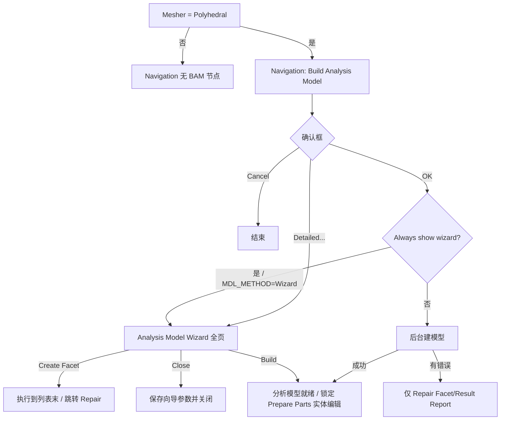

# DEV_PLAN — Analysis Model Wizard 完整功能规划

> 日期：2026-08-13 ｜ 仓库：`pphdecoding` ｜ 对照：Cradle CFD 2025.2 scFLOWpre  
> 手册：`Manuals/scFLOW/HTML/Pre_eng/Scf_pre_Analysis_Model_*.html`（10 页）+  
> `[Execute]-[Build Analysis Model]` / `[Option]-[Navigation]` / Mesher·Faceter  
> 代码入口：`nav_panels.AnalysisModelWizardBody`（`build_am_detailed`）、  
> `pph_gui._confirm_build_analysis_model`（确认框 + Detailed…）  
> 总览对照见 [SCFLOWPRE_FEATURE_PLAN.md](SCFLOWPRE_FEATURE_PLAN.md)  
> §0.4：网格生成策略逆向可行性（基于当前代码实现的结论）  
> §0.5：自研多面体 mesher 候选技术栈（学术 / 开源参考）  
> §0.6：自研拟体素化（Voxel fitting）mesher 候选技术栈
> §12：整体现状与 scFLOWpre 全量差距（全量比对快照，2026-08-14）
> §13：PPH 格式解码 + 写回闭环缺口（2026-08-14）
> §14：解码未完整的功能补齐计划（2026-08-14）
> §15：写回未完整的功能补齐计划（2026-08-14）
> §16：gphstats.py / oct.py / parasolid.py 系统改进（DLL 逆向，2026-08-15；§16.5 pskernel 版本审计/V37 逆向）
> §17：全量功能差距排序与改进计划（2026-08-16，详版见 function_gap_analysis.md）

---

## 0. 目标与范围

### 0.1 产品目标

在本查看器中把 **Analysis Model Wizard** 做到与 scFLOWpre **交互面与参数面**对齐：

1. 左栏完整步骤、右栏各页控件与子对话框齐全；
2. 参数读写 `main.xenv`（`FACET` / 相关 `OCT_MESH`）与 `session["build_am"]`；
3. **Create Facet / Build** 通过自动化桥（VBS / scFLOWpreAPI / NativeBridge）真正驱动宿主建面片与闭体识别，本进程不自研完整 Parasolid faceter；
4. Draw 窗口预览、多重边/微小面列表、非法形状报告等**运行时结果**以宿主回传或本地 MDL 解析为数据源，分阶段落地。

### 0.2 非目标（本规划明确不做）

- 在本仓库内完整复刻 Solid-based / Parasolid faceter 内核；
- 替代 scFLOWpre 的 CAD 拓扑修复（切向接触等需回 CAD）；
- Voxel fitting mesher 路径下的 BAM（该路径无独立 Build Analysis Model）。

### 0.3 能力分层

| 层 | 含义 | 验收 |
|----|------|------|
| **L1 UI** | 页、控件、显隐、子对话框布局对齐手册截图 | 离屏 GUI 测试 + 人工对照截图 |
| **L2 参数** | load/apply ↔ xenv / session /（可选）xml | round-trip 测试 |
| **L3 驱动** | Create Facet / Build / Clean → 宿主 API 或 VBS | 样例工程宿主执行 + Reload |
| **L4 结果** | 列表/报告/预览来自真实几何或宿主回调 | 与 scFLOWpre 同工程对照 |

当前实现约 **L1 部分 + L2 全局 FACET 键**；L3/L4 与多数页的运行时列表仍为占位。

### 0.4 网格生成策略逆向可行性（实现结论）

> 基于仓库已落地的格式解析、参数面与 COM/VBS 桥接能力的评估（2026-08-13）。

**结论：能把「产物与控制面」摸得很透，但「完整逆向网格生成策略/算法」基本不现实。**  
当前仓库强项是格式与管线编排，不是在本进程复刻 mesher 内核。与 §0.2 非目标及 [SCFLOWPRE_FEATURE_PLAN.md](SCFLOWPRE_FEATURE_PLAN.md) 阶段 5（可选自研 mesher）一致。

#### 0.4.1 已经摸清的（高置信）

| 层 | 含义 | 代表模块 |
|----|------|----------|
| 产物格式 | 网格**结果**可读可重建显示 | `oct.py`、`mdl.py`、`gphstats.py`、`crdlfld.py` |
| 快照/加密外壳 | 中间态可解压、部分字段对齐 DLL | `sctsnapshot.py`、`blowfish_le.py` |
| 参数面 | Faceter/Octree 键 ↔ 宿主 setter | `main.xenv`、`automation/pipeline_plan.py` |
| 控制面 | BAM → DeleteOctree → SetOctType/MinSize → CreateOctree → CreateMesh | VBS/COM 录制锁定（`host_pipeline.py`、`tests/box_vbs*.vbs`） |
| 显示级 CAD 剖分 | **调用** Cradle Parasolid，非复刻采样器 | `ps_facet2_nodes.py`、`ps_tessellate.py`、`cad_import.py` |
| NativeBridge 符号 | SCTprime 入口可解析；需活宿主上下文 | `native_bridge.py`、`native/scflow_bridge.cpp` |

即：**输入参数、调用顺序、输出 OCT/MDL/GPH 几何状态**可以对照；**为何这一刀、如何生成多面体单元**仍在闭源内核里。

#### 0.4.2 仍不透明的部分

| 瓶颈域 | 已知 | 缺失 |
|--------|------|------|
| BAM / Build Analysis Model | UI + xenv；`MeshingGroup_.BuildAnalysisModel` | 干涉/微小面/匹配/闭体识别的运行时逻辑 |
| Faceting（Solid / AF / Parasolid） | 公差参数；PK 选项块布局；CAD 预览 | `PK_TOPOL_facet_2` 内部采样策略 |
| `CreateOctree` | OctParam / 区域 Size / create type；`.oct` 可读 | 细化判定过程（曲率、邻近、区域规则、平衡） |
| `CreateMesh` → GPH | VBS monitor + WaitForWorker；GPH 统计 | 单元生成、棱柱层、质量、写端 |
| Wrapping / Disc / Overset | Native 符号 + VBS 草稿 | 录制未锁定；依赖 SCTprime 运行时 |

#### 0.4.3 核心瓶颈（按严重度）

1. **致命 — 算法在闭源内核，不在文件里**  
   `CreateOctree` / `CreateMesh` / BAM 在 SCTprime/scFLOWpre 内。`.oct`/`.gph` 只存**结果**，不存决策过程。样例深度直方图等最多得到经验启发，得不到可证明等价的策略。

2. **致命 — Parasolid faceter / B-rep**  
   面片化依赖商业内核。无合法内核路径则 BAM 前置几何做不全；完整 RE 内核在工程与合规上均不成立。

3. **高 — 宿主进程 / 许可证上下文**  
   能**驱动**已安装的 scFLOWpre；难以把 mesher 当独立库完整拉出（裸调常缺 document 态）。

4. **高 — Wrapping 等高层命令**  
   VBS 层未锁定；NativeBridge 仍绑活宿主。

5. **中–高 — GPH 写端与体网格算法**  
   读/统计/显示已有；自研 polyhedral 等于另写 mesher，目标应是**兼容格式**，非 bit-identical Cradle。

#### 0.4.4 现实策略

| 路径 | 角色 |
|------|------|
| **主路径：AutomationBridge** | COM/VBS（及必要的 NativeBridge）继续当真正网格器——复现官方策略的唯一可靠方式 |
| **旁路：格式与查看器** | 继续 OCT/MDL/GPH 消费、参数 UI、行为表征 |
| **可选自研** | 新写 octree + 开源体网格器并写出 CRDL-FLD；接受与官方**算法不等价**（见功能计划阶段 5） |
| **明确不做** | 以「完整逆向 CreateOctree/CreateMesh/BAM/Wrapping/Parasolid」为完成标准 |

**一句话：「完全逆向策略」≈ 不；「完整理解产物 + 可靠驱动官方算法」≈ 已经在走且可行。**

### 0.5 自研多面体 mesher 候选技术栈

> 可选长期路径（[SCFLOWPRE_FEATURE_PLAN.md](SCFLOWPRE_FEATURE_PLAN.md) 阶段 5）：写出兼容 CRDL-FLD / 自有格式的 polyhedral，**不追求**与 Cradle bit-identical。  
> 注意：CGAL「Polyhedral domain」多指「由多面体表面围成的区域」上的 **四面体** 生成，勿与 CFD 任意多面体体网格混淆。

#### 0.5.1 与 Cradle / scFLOW 路线最接近的开源参考

| 来源 | 思路 | 为何相关 |
|------|------|----------|
| **cfMesh `pMesh`**（OpenFOAM 社区，GPL） | 背景 **octree**（曲率/邻近/尺寸场）→ 四面体模板 → **对偶成任意 polyhedra** → 投影贴体 | 与本仓库已解析的 OCT + 多面体流程最像；inside-out，对脏 STL 较容忍 |
| **OpenFOAM `polyDualMesh`** | 先 tet，再取对偶 | 实现简单；质量依赖前序 tet |
| **snappyHexMesh / hex-dominant** | 笛卡尔/六面体为主 + 贴体 | 非纯 polyhedral，但「背景网格 + 贴体」可借鉴 |

**首选拆读蓝本：** cfMesh `pMesh`（Creative Fields 文档：octree 细化与平衡 → tet 模板 → dual → 边界投影）。

#### 0.5.2 学术上更「正统」的 polyhedral：Voronoi 系

| 论文 / 系统 | 要点 | 参考 |
|-------------|------|------|
| **VoroCrust**（ACM TOG） | 无 clipping 的 conforming Voronoi；保尖角；primal–dual | [PMC](https://pmc.ncbi.nlm.nih.gov/articles/PMC7439975/) |
| **Clipped Voronoi + 粘性层** | 分层放 seed + 边界裁剪；工程 CFD 常用 | doi:10.1002/nme.5963 |
| **NASA LAVA Voronoi mesher**（2024） | 工业级：seed、Lloyd 平滑、裁剪、合缝 | [NTRS PDF](https://ntrs.nasa.gov/api/citations/20240008543/downloads/LAVA_Voronoi_Aviation24_compressed.pdf) |
| Cadence 等工业材料 | clipped Voronoi + 近壁 strand | 思路参考，非开源 |

Star-CCM+ / 部分现代 CFD mesher 的「多面体」本质亦接近 **clipped/restricted Voronoi**。

#### 0.5.3 CGAL：能当积木、不当整机

**适合：**

- `Mesh_3`：高质量 **tet**（隐式曲面 / 多面体域 / 特征保护）
- 3D Triangulation / Voronoi / Restricted Voronoi、Lloyd / ODT
- 布尔、AABB、特征探测

**不适合：** 开箱即用的 scFLOW 式任意 polyhedral 体网格。  
要 polyhedral 需自做 **tet→dual**，或 **CGAL Voronoi + 自写 clipping/合缝**。

许可：多为 **GPLv3+ / GeometryFactory 商业双许可**，嵌入闭源产品须提前核算。

#### 0.5.4 可拼装的开源积木（偏效率）

| 库 | 角色 |
|----|------|
| **Voro++** | 快速计算 Voronoi 胞元 |
| **TetGen / fTetWild / TetWild** | 稳健 tet |
| **MMG3D** | 自适应与重网格 |
| **Gmsh** | 前端 + tet；再 dual |
| **Geogram** | 受限 Voronoi / 重网格 |
| **libigl** | 原型与质量度量 |

#### 0.5.5 建议流水线（对齐本仓库 OCT 能力）

```text
面网格(MDL/STL)
  → 尺寸场 + 八叉树细化（可对齐现有 oct 语义 / oct.py）
  → (A) tet 模板 → dual polyhedra     ← cfMesh 路线，工程落地最快
  → (B) seed + clipped / VoroCrust Voronoi  ← 更接近文献中的「真·多面体 CFD」
  → 近壁棱柱/层（最难：多数开源最弱）
  → 写出 CRDL-FLD .oct/.gph 或自有格式（算法不等价 Cradle 可接受）
```

**效率关键：** 并行种子生成、空间索引、边界裁剪/投影、避免反复堆分配（cfMesh 强调）、Lloyd 仅局部迭代。

**最大工程坑：** 脏 CAD、尖角、薄特征、边界层、并行合缝——LAVA / VoroCrust / cfMesh 文献篇幅多在此，而非「算一次 Voronoi」。

> **落地状态（2026-08-14）：** `polymesh.py` 已实现路线 (B)：Voronoi 对偶 +
> 表面裁剪 + Lloyd 平滑 + 近壁层（LAVA 式拉伸 seed）+ VoroCrust 式镜像加权
> seed 特征保形（`--preserve-features --lloyd N --layers N`）。详见
> `docs/POLYMESH_NOTES.md`。

#### 0.5.6 选型小结

| 问题 | 建议 |
|------|------|
| 与现有 OCT 栈最合拍？ | **cfMesh `pMesh` +（可选）Voro++/CGAL 子步骤** |
| 学术主线？ | **Voronoi（clipped / VoroCrust）** 与 **octree→tet→dual** 两派并读 |
| CGAL 定位？ | tet / Voronoi / 几何内核，**不要**指望 `make_mesh_3` 直接出 scFLOW 式 polyhedral |
| 与 §0.4 关系？ | 自研是**兼容产物**路径；官方策略仍靠 AutomationBridge |

### 0.6 自研拟体素化（Voxel fitting）mesher 候选技术栈

> 对照 scFLOWpre **Voxel fitting mesher**（`MESH/MESHER=1`）：手册/UI 写明生成  
> **hex-dominant polyhedron**，**直接从零件出发**（无独立 BAM / 独立面网格阶段，见 §0.2）。  
> 本仓库已暴露参数面：`Mesher/Faceter` 的 Voxel 行、`OCT_MESH/VOXEL_OCT_REFINE_TYPE`、  
> `MESH_COMMON/USE_ROUGH_POLY_WHEN_VOXEL_MESHING`、`NUMBER_OF_INITIAL_DIVISION_WHEN_VOXEL_MESHING` 等  
> （`nav_panels.MesherFaceterBody`、`option_settings`、`pipeline_plan.OCTREE_SETTING_MAP`）。

#### 0.6.1 scFLOWpre Voxel fitting：已知控制面与复刻难度

**已知（高置信，来自 UI / xenv / 手册文案）：**

| 项 | 内容 |
|----|------|
| 产品定位 | hex-dominant；相对 Polyhedral **跳过 BAM**；面片精度仍可调（Voxel 专用 Facet accuracy） |
| 八叉树 | 「Inclusion of octree creation process in meshing」；`SetVoxelOctRefineType`（录制映射含 `octree`） |
| 粗化/初分 | rough poly when voxel；initial division 次数 |
| 产物形态 | 与 Polyhedral 共用 OCT/GPH 一类成员可读（`oct.py` / `gphstats.py`），但细化策略与单元模板不同 |

**未知（仍在宿主内核）：** 笛卡尔根网格如何铺、cut/snap/层插入、级别过渡处如何把 hanging-node hex 变成 polyhedra、与 Solid/Facet 面片的精确耦合顺序。

**复刻难度总判：**

| 维度 | 相对 §0.5 任意多面体 | 说明 |
|------|----------------------|------|
| 概念清晰度 | **更容易** | 工业界 hex-core / Cartesian / snappy 文献与开源极多；与「已解析 OCT」同族 |
| 做出「能跑的 hex-dominant」MVP | **中等偏低** | 可直接借 cfMesh `cartesianMesh` / snappy 管线 |
| 对齐 Cradle 行为 / 质量 / 边界层 | **仍然高** | snap、尖角、薄壁、层、rough poly、与 scFLOW 求解器兼容的单元质量 |
| bit-identical 官方 Voxel | **不现实** | 同 §0.4：算法不在文件里 |

**相对 Polyhedral 自研：** Voxel 路线更适合作为**第一条自研 mesher MVP**（背景网格 + 贴体），再视需求加层与质量优化；不必先啃 VoroCrust。

#### 0.6.2 最接近的开源 / 工业参照

| 来源 | 思路 | 与 Voxel fitting 的关系 |
|------|------|-------------------------|
| **cfMesh `cartesianMesh`**（GPL） | 背景笛卡尔/八叉树 → hex-dominant，级别过渡为 polyhedra；可加层；脏几何容忍 | **首选拆读蓝本**；产品语义最接近「hex-dominant + octree」 |
| **OpenFOAM `snappyHexMesh`** | blockMesh 背景 hex → castellation → snap → addLayers | 经典 Cartesian；步骤清晰，可作教学与对照 |
| **Ansys Fluent Hexcore / Pointwise hex-core voxel** | 内部轴对齐 hex + 近壁 tet/过渡；octree 细化 | 工业「voxel / hex-core」术语来源；闭源，仅读论文/博客 |
| **Inria Hexotic**（octree all-hex） | 平衡八叉树 → 对偶全六面体 + buffer + 可插层 | 学术/工程 hex 路线；评估版/商业，非自由嵌入 |
| **HybridOctree_Hex**（CMU, JoCS 2024） | hybrid octree 模板 → all-hex + Jacobian 优化 | [GitHub](https://github.com/CMU-CBML/HybridOctree_Hex)；偏结构 all-hex，可借鉴平衡/贴体/质量 |

#### 0.6.3 可借鉴的学术论文（近年与经典）

| 文献 | 要点 |
|------|------|
| Maréchal et al.，Hexotic / IMR（octree hex） | 平衡与 pairing、对偶消 hanging node、尖角与层；[IMR18 PDF](https://team.inria.fr/gamma/files/2021/03/imr18.pdf) |
| Tong et al.，**HybridOctree_Hex**，*J. Comput. Sci.* 2024 | 自适应 all-hex + scaled Jacobian>0.5；doi:10.1016/j.jocs.2024.102278 |
| Steinbrenner / Karman 等，Pointwise hex-core voxel（2020 前后） | 根 voxel + octree 尺寸场；cut/inside/outside 分类；过渡 tet/pyramid |
| OpenFOAM snappy 用户文档 + 社区论文 | castellation / snap / layer 三阶段工程实践 |
| （可选）Cut-cell / immersed boundary 文献 | 若走「不 snap、保留切割面」的变体；与 Cradle「fitting」贴体目标略不同 |

#### 0.6.4 CGAL 与其它积木在 Voxel 栈中的角色

**CGAL：**

- **有用：** AABB 树、距离场、布尔、表面特征、（若过渡区需要）`Mesh_3` tet
- **无：** 现成 hex-core / voxel fitting / snappy 式管线  
→ Voxel 自研**不要以 CGAL 为主引擎**；几何查询可嵌入。

**其它积木：**

| 库 / 组件 | 角色 |
|-----------|------|
| 本仓库 `oct.py` / OCT 写端（待建） | 背景细化与尺寸场；与 scFLOW OCT 语义对齐的**展示/中间格式** |
| OpenFOAM / cfMesh 源码 | Cartesian 细化、贴体、层、并行容器 |
| Embree / libigl / Geogram | 快速求交与投影 |
| MMG | 过渡区或表面重网格（可选） |

#### 0.6.5 建议流水线（自研拟体素化）

```text
零件面片(MDL/STL) 或 CAD 预览面
  → 根笛卡尔盒 + 初始划分（对齐 NUMBER_OF_INITIAL_DIVISION_*）
  → 八叉树 / 2:1 平衡细化（曲率·邻近·区域 Size；可选对齐 VOXEL_OCT_REFINE_TYPE）
  → 体素分类：outside / cutting / inside
  → (A) snappy 风格：castellated hex → snap 到表面 → addLayers
  → (B) hex-core 风格：内部纯 hex，切割带 tet/pyramid 或合并为 polyhedra
  → (C) cfMesh 风格：级别跃迁处直接生成 polyhedra（hex-dominant）
  → 可选 rough poly / 质量平滑
  → 写出 .oct（中间）+ .gph / 自有体网格（算法不等价 Cradle）
```

**效率关键：** 并行 octree、稀疏存储、求交加速、层插入失败回退。  
**最大坑：** snap 失败导致非正交/负体积；薄特征过度细化；层在尖角崩溃——与「算 octree」相比，**贴体与层**仍是主成本。

#### 0.6.6 选型小结（Voxel vs Polyhedral）

| 问题 | 建议 |
|------|------|
| 自研 MVP 先做哪条？ | **Voxel / hex-dominant（§0.6）**，再考虑 §0.5 任意 polyhedral |
| 首选开源蓝本？ | **cfMesh `cartesianMesh`**；对照 **snappyHexMesh**；质量/全 hex 参考 **HybridOctree_Hex / Hexotic 论文** |
| CGAL？ | 几何查询与可选 tet 过渡，**非** voxel 主流程 |
| 与宿主关系？ | 短期仍用 COM 跑官方 Voxel；自研仅作离线/兼容格式实验 |
| 与 BAM？ | Voxel 路径**无**独立 BAM（§0.2）；勿把 Analysis Model Wizard 硬套到 Voxel |

---

## 1. 入口与前置条件

### 1.1 调用链（应对齐 scFLOWpre）



### 1.2 前置条件矩阵

| 条件 | 来源 | 行为 |
|------|------|------|
| Mesher = Polyhedral (`MESH/MESHER=0`) | Mesher/Faceter Setting | 显示 BAM 节点；Voxel 时隐藏 |
| Surface mesher = Facet-based | 同上 | 可用 Method for building analysis model |
| `FACET/MDL_METHOD=1` | Mesher/Faceter 或 Option | Analysis Model Wizard 路径 |
| `FACET/MDL_METHOD=0` | 同上 | SCTpre V12 compatible（简化设置，非本向导重点） |
| Always show analysis model wizard | Option → Navigation | OK 后强制进向导；未勾选则仅错误时出 Repair |
| Show [Build Analysis Model] item | Option → Navigation | 可强制隐藏 BAM 节点（与 Polyhedral 规则叠加） |
| 已打开工程 | GUI | 否则提示先打开 PPH |

### 1.3 本仓库入口状态（截至 2026-08-09）

| 入口 | 状态 | 缺口 |
|------|------|------|
| Polyhedral 时显示 BAM | ✅ | Option「Show BAM item」未做 |
| 确认框文案 OK/Cancel | ✅ | — |
| Detailed… → Wizard | ✅ | OK 后未按 Always show 自动进向导 |
| Always show / Show BAM item | ❌ | 需 Option 面板 + xenv/session |
| Execute 勾选 BAM → VBS | ◑ | 有管线钩子，与向导参数未完全打通 |

---

## 2. 向导外壳（Shell）

### 2.1 窗口

| 项 | 规格 |
|----|------|
| 标题 | `Analysis Model Wizard` |
| 布局 | 左 `QListWidget` 步骤列表 + 右 `QStackedWidget` + 底按钮栏 |
| 尺寸 | ≥ 920×640（可记忆上次尺寸） |
| 外层按钮 | `dialog_buttons = 0`（按钮全在内容区） |

### 2.2 左栏完整步骤（9 页，顺序固定）

> 手册截图在 Solid-based + 非 octree 精度时为 **9 项**（含 Influence）。  
> 指定 octree 精度时隐藏 3–5 相关页（见 §2.4）。

| # | Key | 显示名 | 手册 |
|---|-----|--------|------|
| 1 | `interference` | Solution Method for Solid/Sheet Interference | `..._Solution_method_for_solid_sheet_interference` |
| 2 | `multifold` | Configuration of Multi-fold Edges and Faces | `..._configuration_of_multi-fold_edges_and_faces` |
| 3 | `acc_whole` | Facet Accuracy for Whole Model | `..._Facet_Accuracy_for_Whole_Model` |
| 4 | `acc_part` | Facet Accuracy for Part and Region | `..._Facet_Accuracy_for_Part_and_Region` |
| 5 | `influence` | Influence of adjacent part | `..._Influence_of_adjacent_part` |
| 6 | `auto_tiny` | Automatic Removal of Tiny Faces | `..._Automatic_Removal_of_Tiny_Faces` / `Scf_pre_Analysis_Model_Automatic_Removal_of_Tiny_Faces` |
| 7 | `face_match` | Create Facet/Face Matching | `..._Create_Facet_Face_Matching` |
| 8 | `remove_tiny` | Remove Tiny Faces | `..._Remove_Tiny_Faces` |
| 9 | `repair` | Repair Facet/Result Report | `..._Repair_Facet_Result_Report` |

**现状**：实现 8 页，**缺 `influence`**。

### 2.3 底栏按钮语义

| 按钮 | 可见/使能 | 行为 |
|------|-----------|------|
| `<< Back` | 非首可见页 | 上一可见页（不执行建面片） |
| `Next >>` | 非末可见页 | **执行当前步必要处理**后进下一页（手册：从列表顶依次执行）；末页禁用 |
| `Create Facet` | 非 Repair 页 | **集体执行**至列表末（等价连点 Next），并进入 Repair |
| `Close` | 非可 Build 状态 | 保存参数，关闭；不 Build |
| `Build` | Repair 且模型可建 | 闭体识别完成 → 锁定 Prepare Parts 实体编辑；替换 Close |

### 2.4 页显隐规则

| 条件 | 隐藏页 |
|------|--------|
| Solid-based faceter **且** Specification type = Specify octree | `acc_whole`, `acc_part`, `auto_tiny`（手册注明）；改用 [Octree Parameter for Building Analysis Model] |
| 非 Solid-based（Parasolid faceter） | `auto_tiny` 相关操作无效/禁用；Face Matching 不可用（手册 Note） |
| `MDL_METHOD` ≠ Wizard | 不应进入本向导（走 V12 简化路径） |

### 2.5 Shell 待办

- [ ] 补齐左栏第 5 页 `influence`
- [ ] Next 真正“执行当前步”而非仅翻页（依赖 L3）
- [ ] Create Facet 批处理管线 + 进度/取消
- [ ] Repair 可建时 Close→Build 切换（已有雏形，需接真实错误等级）
- [ ] 与 Option「Always show wizard」联动：确认框 OK 后自动打开向导或仅 Repair

---

## 3. 分页功能规格与现状

图例：✅ 已对齐 ｜ ◑ 部分 ｜ ❌ 未做 ｜ 🔌 需宿主/几何引擎

### 3.1 Solution Method for Solid/Sheet Interference

| 功能 | 规格 | 状态 |
|------|------|------|
| Project solids | 勾选 → 体-体投影边界边；`FACET/PROJECT_SOLIDS` | ◑ UI+xenv |
| Project sheets | 勾选 → 片-片；仅 sheet 集合时取消；`PROJECT_SHEETS` | ◑ |
| Use solid-based faceter | `USE_FACETTER` true/false（与 Mesher/Faceter 同步） | ◑ |
| Specification type of faceting accuracy | Specify value / Specify octree；`FACET_ACCURACY_SPECIFY_TYPE` | ◑ |
| Element size parameter / Use | 启用尺寸过渡；默认灰显，AF 时可用 | ◑ UI |
| Direction of effect | Fine / Coarse side | ◑ session |
| Range of effect | 滑条+数值 | ◑ session |
| 切到 Specify octree | 打开/提示 Octree Parameter for BAM | ❌ |
| 与 Mesher/Faceter 双向同步 | 向导改 AF 后写回并刷新 Mesher 面板 | ❌ |

**子对话框**：Octree Parameter for Building Analysis Model（Detail… / Create Octree / 領域登録）— 独立规划，见 §5.1。

### 3.2 Configuration of Multi-fold Edges and Faces

| 功能 | 规格 | 状态 |
|------|------|------|
| Tab: Multi-Fold Edges | 按 part 树分类显示识别到的多重边对；选中高亮 Draw | ◑ 空树 |
| Tab: Multi-Fold Faces | 同上，多重面 | ◑ 空树 |
| Tolerance edge `1/N` | 默认 `1e+06`；减小分母更易成对；Apply 重识别 | ◑ 文本+session |
| Tolerance face `1/N` | 同上 | ◑ |
| Apply | 重跑识别并刷新树 | 🔌 |
| 树图标/成对计数文案 | 如 `Cuboid (8 pairs…)` | ❌ |
| Draw 联动高亮边/面 | 选中树节点 | 🔌 |

### 3.3 Facet Accuracy for Whole Model

| 功能 | 规格 | 状态 |
|------|------|------|
| **Parasolid 路径** Precision of distance / angle / Maximum edge | 相对默认值；滑条右=更细；`SIMPLE_*` | ◑ |
| **Solid-based 路径** Lower limit of angular precision | `SOLID_BASE_MINIMUM_ANGLE`（deg） | ◑ |
| Reduction ratio `1/N` | `SOLID_BASE_LENGTH_FACTOR = 1/N` | ◑ |
| Maximum edge `×` | `SIMPLE_MAX_WIDTH` | ◑ |
| Specify absolute value | `USE_ABSOLUTE_VALUE`；距离/最大边绝对量 | ◑ |
| Reset to the default value | 恢复默认 | ✅ |
| Preview mesh accuracy | 标记 part/face → Preview in draw window / Clear | 🔌 |
| Specify octree 时本页隐藏 | 见 §2.4 | ✅ 显隐 |

### 3.4 Facet Accuracy for Part and Region

| 功能 | 规格 | 状态 |
|------|------|------|
| 列表 Region/Part Name + Facet Accuracy | 默认 Default；体/面图标；数据来自 xml/groups | ◑ |
| Edit | 弹出子对话框（见 §5.2） | ◑ 现为简易 InputDialog |
| Default | 恢复 Default | ◑ |
| Preview mesh accuracy | 标记数 + Preview/Clear | 🔌 |
| AF+octree 时隐藏 | §2.4 | ✅ |
| 持久化 | 每 part/region 精度 → session + 宿主/可选 xml | ◑ 仅 session |

### 3.5 Influence of adjacent part（**缺失页**）

| 功能 | 规格 | 状态 |
|------|------|------|
| 左栏插入本页（acc_part 与 auto_tiny 之间） | 9 步完整列表 | ❌ |
| Consider the edge lengths of spatially adjacent facets | 总开关 | ❌ |
| Target region 表（Region Name / Target） | 勾选影响源；体/面图标 | ❌ |
| Set / Remove | 将选中行标为 Target 或清除 | ❌ |
| 说明文案 | Specify the region that affects… | ❌ |
| OFF 时忽略 Target | 手册 Note | ❌ |
| 参数落盘 | session + 可映射 xenv（若有键）/宿主 | ❌ |

### 3.6 Automatic Removal of Tiny Faces

| 功能 | 规格 | 状态 |
|------|------|------|
| 说明：仅 Solid-based 有效 | 文案+禁用逻辑 | ◑ |
| Show only parts with tiny faces | 过滤左表 | ◑ UI |
| Move view center to selection face | Draw 相机 | 🔌 |
| 左表 Part Name / Reference | Default (5%) 等 | ◑ |
| Edit / Default | 改参考值% | ◑ |
| Re-recognize tiny faces | 刷新右表 | 🔌 |
| 右表 Part / Num / Width / Target | 微小面列表 | 🔌 空 |
| Exclude / Specify for auto removal | 逐面开关 | 🔌 |
| 默认参考 SOLID_BASE_TINY_FACE_WIDTH_RATIO | % ↔ 0–1 | ◑ |

### 3.7 Create Facet / Face Matching

| 功能 | 规格 | 状态 |
|------|------|------|
| 先 Create Facet（本页或底栏）生成面片后再匹配 | 流程 | 🔌 |
| List of matching faces | 勾选、Group1/2 N、Min/Max dist、Direction | ◑ 空表 |
| Reverse matching direction | 切换 Forward/Reverse | ◑ 表操作 |
| Change Tolerance | 弹窗改容差并重检测 | ◑ 对话框雏形 |
| Preview | Draw 预览匹配对 | 🔌 |
| Match | 合并 face group | 🔌 |
| 仅 Solid-based | 禁用+说明 | ◑ |

### 3.8 Remove Tiny Faces

| 功能 | 规格 | 状态 |
|------|------|------|
| Tiny face list | Part / Face ID / 宽度指标 / facet 数 | ◑ 空表 |
| Tolerance absolute width + 单位 | 默认 0.001 m | ◑ |
| Refresh list | 按容差重识别 | 🔌 |
| Remove | 删除勾选项（影响棱柱层/质量） | 🔌 |
| 删除前人工确认提示 | 手册强调 | ❌ |

### 3.9 Repair Facet / Result Report

| 功能 | 规格 | 状态 |
|------|------|------|
| Illegal shape report 表 | Level / Number / Type / Cause + 计数 | ◑ 空表 |
| Type of problem / Level 过滤 | Refresh list | ◑ |
| Cause and solution 文本 | 无错误时固定英文提示 | ◑ 用 groups 摘要凑数 |
| Clean all / Clean | Level≥4 时修复可修问题 | 🔌 |
| Intersecting edges are not created | 引导回 Prepare Parts / Interference | ❌ 文案分支 |
| Build 替换 Close | 可建时 | ◑ 末页显示 Build，未接真实判定 |
| 重叠体优先级 | 树下方优先；分析域置顶 | ◑ 文档提示 / 无校验 |
| CreateMDL 后刷新 MDL/模型树 | Reload 成员 | 🔌 |

---

## 4. 数据模型

### 4.1 xenv（全局，与 Mesher/Faceter 共享）

| Section | Key | 向导用途 |
|---------|-----|----------|
| FACET | `PROJECT_SOLIDS` / `PROJECT_SHEETS` | Interference |
| FACET | `USE_FACETTER` | AF on/off |
| FACET | `FACET_ACCURACY_SPECIFY_TYPE` | value / octree |
| FACET | `USE_ABSOLUTE_VALUE` | 绝对精度 |
| FACET | `SIMPLE_CHORD_TOLERANCE` / `_ABS` | Parasolid 距离 |
| FACET | `SIMPLE_MAX_ANGLE` | Parasolid/共用角 |
| FACET | `SIMPLE_MAX_WIDTH` / `_ABS` | 最大边 |
| FACET | `SOLID_BASE_MINIMUM_ANGLE` | AF 角下限 |
| FACET | `SOLID_BASE_LENGTH_FACTOR` | AF 边长缩减比 |
| FACET | `SOLID_BASE_TINY_FACE_WIDTH_RATIO` | 自动去微小面参考 |
| FACET | `SOLID_BASE_*_FOR_OCTREE` | octree 精度路径 |
| FACET | `MDL_METHOD` | 必须为 `1`（Wizard） |
| MESH | `MESHER` / `SURF_MESHER` | 入口门控（只读校验） |

### 4.2 session[`build_am`]（向导私有 / 运行时）

建议统一结构（实现时逐步填满）：

```text
build_am:
  wizard_page: str
  project_solids / project_sheets / use_facetter / acc_type
  sb_ang / sb_len / max_edge / ps_* / absolute / dist_abs / edge_abs
  tiny_pct / tol_multifold_edge / tol_multifold_face
  match_tol / remove_tiny_tol
  elem_use / elem_dir / elem_range
  part_acc: { name: "Default"|label }
  tiny_ref: { part: "Default (5)"|number }
  influence_enable: bool
  influence_targets: [region_name, ...]
  multifold_edges / multifold_faces: [...]   # 识别结果缓存
  match_pairs: [...]
  tiny_faces_auto / tiny_faces_manual: [...]
  report_rows: [{level, count, type, cause}, ...]
  report_level_max: int
  buildable: bool
  create_facet_requested / build_requested: bool
  detailed: bool   # 经 Detailed… 进入
```

### 4.3 与宿主 API 的对应（执行层）

| 向导动作 | 宿主线索（SCTprime / VBS） |
|----------|---------------------------|
| Create Facet / 预览 | `IMDLWizard::CreateMDLFacetPreview` / `CreateMDL` |
| Build | `MeshingGroup_.BuildAnalysisModel` / `CreateMDL` |
| Multi-fold 识别 | `CreateIMultiEdgeGroupInfo` / `CreateIMultiFaceGroupInfo` |
| Boundary | `CreateBoundary` |
| Octree for BAM | `Get/SetConfigMDLWizard_OctLengthParam*`、`CreateFacetOctree` |
| Tiny faces | `ITinyFacesClass` 等 |

管线已有：`automation/pipeline_plan.py` → `build_analysis_model`；需把向导 session 序列化为 VBS 前参数写入 xenv。

---

## 5. 关联对话框与 Option

### 5.1 Octree Parameter for Building Analysis Model

- 触发：Interference 页 Select octree，或 Condition 菜单等价入口。
- UI：Octree parameter + Detail… + Create Octree + 領域登録 + OK（手册图）。
- 限制：不可用 No-slip wall；可用 Solid parts 表面、Obstacle（排除 IO/自由滑移）。
- 复用/特化现有 `OctreeParamBody` / `OctreeDetailDialog`，session 键建议 `build_am_octree` 与网格 Octree 分离。

### 5.2 Facet Accuracy for Part and Region — Edit 子对话框

- Parasolid：distance / angle / max edge。
- Solid-based：**无** Precision of distance；其余对齐整模页。
- OK 写回选中 part/region 行。

### 5.3 Change Tolerance（Face Matching）

- 容差数值 + 重检测按钮；关闭后刷新匹配表。

### 5.4 Option → Navigation（环境）

| 选项 | 规划 |
|------|------|
| Always show the analysis model wizard | session/xenv；OK 确认后强制向导 |
| Show [Build Analysis Model] item | 与 Polyhedral 规则 AND |
| Show [Mesher/Faceter Setting] item | 既有节点门控扩展 |
| Enable condition/region before BAM | 行为标志（后置） |

---

## 6. Draw / 模型树联动

| 动作 | 行为 |
|------|------|
| Preview mesh accuracy | 临时 facet 叠加显示；Clear 清除 |
| 选中 multi-fold / tiny / match 行 | 高亮对应边/面；可选移相机 |
| Build 成功 | 刷新 MDL 图层、模型树闭体/面域；禁用 Create/Modify Parts（Prepare Parts 锁定）直至 Execute→Prepare Parts |
| 重叠优先级提示 | Property/Message：树序下方优先 |

---

## 7. 分阶段实施计划

### 里程碑 W0 — 规划与壳完善（本文档）

- [x] 确认框 + Detailed… 入口
- [x] Polyhedral 门控
- [ ] 左栏补 `influence`；页显隐与手册 9 步一致
- [ ] DEV_PLAN 评审（本文）

### 里程碑 W1 — L1 UI 补齐（纯界面）

1. Influence 整页（表+Set/Remove+开关）
2. Acc Part Edit 子对话框（AF/Parasolid 两套字段）
3. Multi-fold / Match / Tiny / Report 表头、列宽、图标、空态文案对齐截图
4. Interference → Specify octree 时嵌入/弹出 BAM-Octree 对话框骨架
5. 测试：每页控件存在性、显隐矩阵、Detailed 打开

### 里程碑 W2 — L2 参数闭环

1. session schema 定稿 + 序列化
2. 与 Mesher/Faceter 双向同步（USE_FACETTER / ACC_TYPE / SOLID_BASE_*）
3. Option Navigation 三项读写
4. OK（无 Detailed）+ Always show 分支
5. 测试：xenv round-trip、改 Mesher 后向导初值

### 里程碑 W3 — L3 宿主驱动

1. Create Facet / Build / Next 逐步执行 → VBS 或 API（优先复用 `pipeline_plan` / `host_pipeline`）
2. Clean / Match / Remove tiny / Re-recognize 命令映射
3. 完成后 `.scflow_api.done` 轮询 Reload（已有 Execute 模式可复用）
4. Prepare Parts 锁定/解锁状态机

### 里程碑 W4 — L4 结果回填

1. 解析宿主输出或本地 MDL：multi-fold、tiny、match、illegal report
2. Preview 临时几何进 VTK
3. buildable 判定驱动 Build 按钮
4. 样例对照：box（改 Polyhedral）/ laptop 等

### 里程碑 W5 — 打磨与文档

1. 错误文案/Level 分级与手册一致
2. 进度条、取消、长时任务不卡 UI
3. README / SCFLOWPRE_FEATURE_PLAN 状态表更新
4. 回归：`tests/test_build_am.py` 扩展为页覆盖矩阵

---

## 8. 验收清单（对照手册）

- [ ] Polyhedral 外无 BAM；Voxel 无节点
- [ ] 确认框文案与 scFLOWpre 一致；Detailed… 进向导
- [ ] Always show 开：OK→向导；关：仅错误→Repair
- [ ] 9 步列表完整；AF+octree 时隐藏精度/自动微小面页
- [ ] 各页控件与截图一致（含 Influence）
- [ ] Create Facet 后 Repair 有报告；可建时出现 Build
- [ ] Build 后 MDL 更新且 Create/Modify Parts 锁定
- [ ] 参数写回 xenv，Save As 后 scFLOWpre 打开一致
- [ ] Face Matching / Auto tiny 在 Parasolid 路径禁用

---

## 9. 代码落点

| 区域 | 文件 |
|------|------|
| 向导 UI/参数 | `nav_panels.py` → `AnalysisModelWizardBody`、`_BAM_WIZARD_PAGES` |
| 确认框 / 导航门控 | `pph_gui.py` → `_confirm_*`、`_sync_nav_mesher`、`NavigationWindow` |
| BAM-Octree | `nav_panels.py` → Octree* 特化或新 `BuildAmOctreeBody` |
| Option Navigation | 新建 Option 面板或并入既有 settings |
| 执行桥 | `automation/pipeline_plan.py`、`host_pipeline.py`、ExecuteBody |
| 测试 | `tests/test_build_am.py`（扩展）、可选 `tests/test_am_wizard_pages.py` |
| 本规划 | `DEV_PLAN.md`（本文） |

---

## 10. 现状总表（快照）

> 2026-08-14：Execute（未勾选 API）与向导 Build/Create Facet 已接入
> 原生 BAM 管线（`native_bam.py`，见 `docs/NATIVE_BAM_NOTES.md`），
> L3/L4 在原生路径下可达；宿主路径（🔌）仍待 AutomationBridge。

| 模块 | L1 UI | L2 参数 | L3 驱动 | L4 结果 |
|------|-------|---------|---------|---------|
| Shell（8/9 页） | ◑ 缺 Influence | ◑ | ◑ 原生 BAM（向导 Build/Create Facet） | ◑ |
| Interference | ◑ | ◑ xenv | ◑ 原生投影参数 | ◑ |
| Multi-fold | ◑ 空树 | ◑ tol | ◑ 原生 `detect_multifold` | ◑ 报告 |
| Acc Whole | ◑ | ◑ | 🔌 Preview | 🔌 |
| Acc Part | ◑ | ◑ session | ◑ 原生透传 | 🔌 |
| Influence | ◑ 已补 | ◑ 记录 targets | ◑ 原生记录 | 🔌 几何效应 |
| Auto Tiny | ◑ | ◑ ratio | ◑ 原生 `remove_tiny` | ◑ 报告 |
| Face Match | ◑ | ◑ tol | ◑ 原生 `match_faces` | ◑ frid 合并 |
| Remove Tiny | ◑ | ◑ tol | ◑ 原生 `remove_tiny_faces` | ◑ 报告 |
| Repair | ◑ | ◑ | ◑ 原生 `repair_surface`/`check_errors` | ✅ native_report |
| 确认框+Detailed | ✅ | — | ✅ OK→向导/原生 BAM | — |
| Polyhedral 门控 | ✅ | ✅ | — | — |

---

## 11. 建议近期迭代顺序（可执行）

- [x] **补 Influence 页 + 左栏 9 步**（纯 UI，立刻可见“完善”）
- [x] **Acc Part 真 Edit 子对话框 + AF/Parasolid 字段分流**
- [x] **Always show wizard / OK 自动进向导**
- [x] **BAM-Octree 子对话框挂到 Specify octree**
- [x] **Create Facet/Build 接入现有 VBS 管线并 Reload**
- [x] **原生 BAM 旁路**（API 关闭）：闭体识别/多重边/匹配/微小面/Repair/
  CheckErrors/ridge → 布局一致 `*_part.mdl`（`native_bam.py` +
  `docs/NATIVE_BAM_NOTES.md`）
- [ ] **结果列表从 MDL/报告回填（先 Repair，再 tiny/multifold）**（Repair 已回填
  native_report；tiny/multifold 原生已出报告，宿主/几何结果待 AutomationBridge）

---

## 12. 整体现状与 scFLOWpre 全量差距（全量比对）

> 日期：2026-08-14 ｜ 范围：整个 `pphdecoding` 仓库 vs Cradle CFD 2025.2 `scFLOWpre_Bx64net.exe` 前处理器全功能
> 数据源：`Manuals/scFLOW/HTML/Pre_eng/toc.csv`（480 行权威 TOC）+ 条件树图标/HTML 文件名 + `tools/scan_nyi_menus.py` + 实测 `pytest`
> 本文 §0.4–0.6 已覆盖「网格策略逆向可行性 / 自研 poly / 自研 voxel」三条技术栈结论；本节给出**全功能面**的完整度矩阵与差距排序，供各功能规划（含本文向导、SCFLOWPRE_FEATURE_PLAN 各阶段）引用，不重复 §0.4–0.6 细节。

### 12.1 定位判断

本仓库是「**逆向解码 + 只读查看 + 宿主自动化桥 + 自研 MVP mesher**」，**不是** scFLOWpre 的重新实现。最难的格式层（读/写）已近完整，界面层复刻约七成，而 scFLOWpre 赖以成为 CFD 前处理器的内核能力（求解器、完整物理条件、实体几何、商业网格）绝大多数仍是占位/草稿/缺失。一句话：**格式层 ≈ 90%，界面层 ≈ 70%，物理/求解/几何/网格内核 ≈ 5–15%。**

### 12.2 代码状态快照

| 维度 | 现状 |
|------|------|
| 语言/环境 | Python（实测 3.12.7 Anaconda；文档声明 3.10+） |
| 源码规模 | 28 个顶层模块 + `automation/`(6) + `native/`(5，含 C++ ABI 桥 `scflow_bridge.dll`) + `tools/`(3) |
| 最大模块 | `nav_panels.py`(580 KB，22 个 Body 表单类) > `pph_gui.py`(304 KB) > `option_settings.py`(54 KB) |
| 测试 | 48 个测试文件，**379 个用例**（SCFLOWPRE_FEATURE_PLAN/DEV_SUMMARY 所称“112 项”已过时） |
| Git | 工作区干净；近期提交围绕 BAM / Wrapping / 自研 mesher |
| 依赖 | numpy + PyQt5 5.15.10 + VTK 9.3.1 + 可选 wimlib / `cabinet.dll` |

模块分层（详见 README 模块表）：

- **解码层（✅ 成熟）**：`pph_parser` / `crdlfld` / `mdl` / `oct` / `sctsnapshot` / `blowfish_le` / `pphxml` / `parasolid`（传输流部分提取）
- **写端（✅ 闭环）**：`pphwriter`（LZMS+Blowfish+ZIP round-trip）、`mdl.write_mdl`、最小 OCT/GPH 写端
- **GUI（◑ 复刻）**：`pph_gui` + `nav_panels` + `pph_vtk` + `option_settings` / `option_dialogs`
- **自研 mesher（◑ MVP，算法不等价）**：`voxmesh`（hex-dominant）/ `polymesh`（clipped Voronoi）/ `native_bam`
- **自动化（◑ 桥就绪、端到端未验证）**：`automation/*` + `native/scflow_bridge.cpp`

### 12.3 功能完整性矩阵（相对 scFLOWpre 全功能）

| 能力域 | 完整度 | 定位 |
|--------|--------|------|
| PPH 格式解码 + 写回闭环 | ████████░░ ~90% | 已完成，语义钉死 |
| 4 窗格查看器 / 3D / 文本编辑 / 快照 | ███████░░░ ~70% | 界面复刻接近 |
| 菜单骨架 / 设置 / 单位 / 语言 | ███████░░░ ~70% | 已对齐手册 |
| 条件 / 物理体系 | ██░░░░░░░░ ~4% | 仅入口边界条件 |
| 实体几何编辑 | █░░░░░░░░░ ~5% | VBS 草稿 + 原语 |
| 网格生成 | ███░░░░░░░ ~20% | 自研 MVP，不等价 |
| 求解器 / 后处理 | ░░░░░░░░░░ 0% | 完全缺失 |
| 宿主自动化 | ████░░░░░░ ~35% | 桥就绪、端到端未验证 |

### 12.4 菜单骨架对比（界面层）

| 菜单 | scFLOWpre 项数 | 本项目 | 结论 |
|------|------|------|------|
| File | 13 | 13/13，仅「Create Actran Files…」灰显 | ✅ 几乎完整 |
| Edit | 19 + Ridge 3 | 已接线大部分；5 项灰显 | ◑ |
| Select | 26 | ~20 接线；5 项灰显 | ◑ |
| View | 40 | 几乎 1:1（Rubber Box/Circle/Polygon、剖面、邻居 Octant、Prism 报告、Parts List） | ✅ 最接近 |
| Condition | 顶层 15 + 向导 ~200 叶 | 顶层全有入口；**向导真表单仅 ~8 个 Cond\*** | ❌ 表面完整、实质极薄 |
| Execute | 9 | 9 全有 + 2 自研入口；**Solver 明确不可用** | ◑ |
| Option | 鼠标模式/旋转/设置/单位/语言 | 全部有（含 Environment / Project Configuration 多页） | ✅ |

灰显项全量清单见 `docs/NYI_INVENTORY.md`（当前合计 11 项）。

### 12.5 条件体系对比（最大落差）

scFLOWpre 条件向导叶节点（TOC 抽取）约 **200 个 Cond\* 类型**，分属：Analysis Type / Basic Settings / MSC CoSim / Diffusive Species / Mixed Gas / Chemical Reaction / Thermoregulation / Battery / Initial / Radiation(6) / Solar Radiation(4) / Particle Tracking·DEM(~15) / Spray / Boundary Condition(Flow/Wall/Thermal/Humidity/Diffusive/Electric/Sym/Periodic) / Source / Fixed / Humidity / Porous Media / Free Surface(~17) / Dispersed Multiphase / Discontinuous Mesh / Moving Elements(~10) / Fan·Propeller / Electric Current·Field / LOGE CPV / Cavitation / Solidification / Evaporation / Structural Coupled / Mechanism Coupled / GT-SUITE / FMI / Aerodynamic Sound / scFLOW2Nastran / Analysis Control(~25) / Output of Field(~11) / Output of List(~27) / Output of Pathline / Other Output(~6) / File Name / Optional Conditions(~8)。

本项目 `nav_panels.py` 中**有完整读写 UI 的真表单**仅 ~8 个：

```text
CondBoundaryFlowIO / CondBoundaryWallStress / CondBoundaryWallThermal /
CondBoundarySymmetry / CondBoundaryPeriodic / CondFix / CondSource /
CondInitial（+CondInitialField/Value）
```

`schemas/conditions.yaml` 明确标注 `source: "... Cond* registry (stub)"`、`implemented_forms` 仅 5 个。**覆盖率 ~4%，且全部集中在入口边界条件；求解器物理（湍流/多相/自由液面/DEM/辐射/燃烧/电池/热调节等）完全缺失。**

### 12.6 核心差距排序（按严重度）

1. **求解器与后处理：0%（❌）** — 无 scFLOWsol / scPOST / scConverter / SCTprime 衔接；Execute Solver 有菜单但「明确不可用」；Analysis Control(~25) 与 Output of Field/List/Pathline(~45) 全为占位。
2. **条件/物理体系：~4%（❌）** — 见 §12.5。
3. **实体几何编辑：~5%（❌）** — scFLOWpre 基于 Parasolid/CADthru 做 B-rep 布尔；本项目 Create Parts 仅原语、Modify Parts 仅 `BeginSolidEdit` VBS 草稿、Parasolid 仅「传输流部分提取」（无 B-rep 拓扑还原，自评 ★★★★★ 长期项）。
4. **网格生成：~20%（◑）** — `voxmesh`/`polymesh` 为自研、算法不等价；缺棱柱层插入、边界层、2:1 平衡、面区域映射、质量平滑（策略细节见 §0.4–0.6）。
5. **CAD 导入广度（◑）** — 仅 x_t 剖分（`cad_import`/`ps_facet2_nodes`/`ps_tessellate`）；scFLOWpre 经 CAD 接口/scConverter 支持多格式；自研 facetter 与 Solid-based facetter 不等价。
6. **宿主自动化（◑/被环境阻断）** — NativeBridge（11 DLL 可加载、`ExecuteVBS`/`CreateShapeGroupSet`/`ExpandZip` 符号命中）、in-proc COM、VBS 录制回放、BAM/Wrapping 命令录制锁定**均已交付**；但沙箱内裸启动 exe 必崩（`SetupSCTpreLib` 抛 0xE0000000，依赖 Kicker 注入的许可证状态，见 DEV_SUMMARY §6），**端到端未验证**。
7. **高级选择/拓扑操作（❌ 灰显）** — Spread Face-to-Edge、Select by Element Number/List/Same Area、Check Intersection 等需真实网格拓扑，未实现。

### 12.7 测试状态与可信度说明

实测 `pytest tests` **收集 379 项，无法在本环境完整跑完**：`test_native_bridge.py::TestNativeBridgeReal::test_pipeline_context_and_create_set`（~46%）处停滞——该用例加载真实 `scflow_bridge.dll` 并调用 scFLOWpre SCTprime，需 Kicker+许可证宿主。

失败归因（逐条跑了 traceback）：

| 失败簇 | 根因 | 是否代码缺陷 |
|--------|------|------|
| cad_import / condition_registry / mdl_writer / gph_writer / corpus / edit_ops(WriteVbs) / empty_project / host_pipeline 等 | `PermissionError [Errno 13]` 写 `%TEMP%`（DSH workspace-write 沙箱限制临时目录写） | ❌ 环境性 |
| test_mdl_analysis（3 ERROR） | 临时目录 fixture 清理失败（同上） | ❌ 环境性 |
| test_gui 部分（open/save/dashboard） | 依赖写临时文件/真实文件句柄 | ❌ 环境性为主 |
| test_native_bridge::real | 需 scFLOWpre 宿主 + Kicker 许可证 | ❌ 环境性（~~沙箱不可用~~ → **2026-08-17 本机已跑通**：`SCF_RUN_BRIDGE_TESTS=1` 下 7/7 全绿 0.38s——实机用例加载厂商 DLL 与 context-not-ready 优雅路径均验证；旧沙箱 46% 停滞不复现） |

**核心解码器测试（`test_pph_parser`/`test_semantics`/`test_platform`/`test_samples`/`test_parasolid`/`test_units`/`test_schema_extract`/`test_oct_writer`/`test_conditions`/`test_menu_bar`/`test_minor_gaps` 等）全部通过。** 当前失败非回归，而是沙箱文件策略 + 宿主不可用；原生桌面（装好 scFLOWpre、放开 temp 写）应可收敛到文档声明的状态。

### 12.8 结论与收口路径

本仓库已把「**读懂并改写 scFLOWpre 项目文件**」做到接近完整，把「**长得像 scFLOWpre 的界面**」复刻到七成；但**没有**三大内核——求解器（0%）、完整物理条件（~4%）、实体几何/商业网格（<20% 且自研不等价）。

剩余最可行的收口（与 DEV_SUMMARY §5、SCFLOWPRE_FEATURE_PLAN 各阶段一致）：扩大真实样例集、wimlib 实机验证、sctsnapshot 字节级重序列化、宿主自动化拿到带 Kicker+许可证的原生桌面做端到端验收——**而非自研等价于 Parasolid + scFLOWsol 的组件**。

> **2026-08-17 回填**：sctsnapshot 字节级重序列化已落地并宿主验收；
> 「带 Kicker+许可证的原生桌面」**本机已具备**（安装 + 27500 许可 +
> Kicker 实例常驻，见 DEV_SUMMARY §6.3 前置块），Wrapping 端到端已
> 在该环境跑通（360/360 步 err=0，`p5_wrapping_e2e.log`）。

---

## 13. PPH 格式解码 + 写回闭环缺口

> 日期：2026-08-14 ｜ 范围：仅 PPH **格式层**（ZIP / CRDL-FLD / LZMS / Blowfish / 快照 / Parasolid / 文本成员）的解码与写回闭环，不涉求解器 / 条件等上层
> 依据：逐模块代码核实（`pphwriter` / `sctsnapshot` / `parasolid` / `mdl` / `oct` / `gphstats` / `pphxml`），非仅文档
> 关联：§12.3「PPH 格式解码 + 写回闭环 ~90%」——本节说明剩下 ~10% 具体卡在哪

### 13.1 已真正闭环（参照边界，非缺口）

| 闭环项 | 模块 | 验证粒度 |
|--------|------|----------|
| ZIP 容器读→写 | `pphwriter.clone_pph` / `rewrite_pph` | 成员级字节复制，未改成员原样保留 |
| LZMS 压缩→解压 | `pphwriter.lzms_compress` ↔ `sctsnapshot.lzms_decompress` | 逐字节一致 |
| Blowfish-LE 加解密 | `pphwriter.encrypt_pkbody3` ↔ `sctsnapshot.PKBody3.decrypt` | 再加密与原始密文逐字节一致 |
| main.xml 净化↔序列化 | `pphxml.sanitize` / `serialize_main_xml` | round-trip 稳定 |
| main.xenv 序列化 | `pphxml.serialize_xenv` | 键值写回 |

### 13.2 解码仍未完整（读端缺口）

1. **Parasolid B-rep 几何/拓扑：只提取「外壳」❌** — `parasolid.parse_transmit` 只扫出文件头（`TRANSMIT FILE … version`）、schema 标识（`SCH_…`）、schema 字段表（token+字段名+偏移，如 `lattice/mesh/owner/boundary_*`）、实体类型（`PKEdge`/`PKFace`/`PKVertex`）与 SDL 属性（`TYSA_NAME/LAYER/UNAME`）。**未解码**：顶点坐标、边/面连接关系、B-rep 拓扑结构、曲面参数——拿得到「实体有哪些类型、字段叫什么名」，拿不到「长什么样、和谁相连」。完整还原需 Parasolid 内核或长期逆向（自评 ★★★★★）。
2. **GPH 体网格：轻量统计，非完整模型 ◑** — `gphstats` 只解 `LS_Links`（面/单元/边界面数/npe）+ `LS_Nodes` + 区域 + Parts 的**计数与顶点**；完整单元-面-区域拓扑在检测到同级 `gphdecoding` 仓时才外接，否则停在这个统计级别。
3. **sctsnapshot 记录流：存在黑盒字节 ◑** — `_parse_region` 返回 `skipped_bytes`（负载中无法对齐跳过的字节，`pph_parser` 摘要打印「未对齐字节 N」）；`CSINFO→PBODYARRAY` 之间 48 字节保留区已逆向为「旧序列化残留、不承载状态语义」；`unit_type` 仅映射 `1 → MODEL_LENGTH_UNIT`，其余码值未覆盖（缺多单位制样例）。

### 13.3 写回仍未闭环（写端缺口，关键）

| # | 缺口 | 模块 | 状态 |
|---|------|------|------|
| 1 | sctsnapshot 记录流**无重序列化** | `sctsnapshot.py`（无 serialize/write 函数） | ❌ 最大缺口：叶子存值不存原始字节，只能改 xml/xenv，不能改快照记录字节级写回 |
| 2 | Parasolid**无编码函数** | `parasolid.py`（仅 `parse_transmit`） | ❌ 又因解码只到字段名，无法生成新 B-rep；`encrypt_pkbody3` 只能加密现成明文 |
| 3 | MDL 最小写端，非全量 | `mdl.write_mdl` | ❌ 仅三角/四边面（`npe=3/4`）；不写 ridge；非逐字节复刻 scFLOW 原始布局 |
| 4 | OCT 只有骨架，无区域 | `oct.write_oct` | ❌ 仅根盒 `LS_OctRootOctantMinMax` + 细化位图 + blockID；无区域数组 |
| 5 | GPH 通用面集，无单元/区域/棱柱层 | `gphstats.write_gph(_volume)` | ❌ 仅 `LS_Links`+`LS_Nodes`；无 `LS_Cells`/区域/棱柱层 |
| 6 | LZMS 压缩 Windows-only | `pphwriter.lzms_compress` | ◑ 非 Windows 直接 `RuntimeError`；读取端有 wimlib 回退，写端无 |
| 7 | 写回产物未经 SCTpre 实机验收 | 全部写端 | ◑ 「布局一致」是推断非实证（~~宿主需 Kicker+许可证，沙箱内裸启动 exe 必崩~~ → **部分实证 + 1 项负面发现**：sctsnapshot 重序列化 PPH 宿主 `OpenProject` ok、Wrapping 产物宿主重开 err=0、main.xml region 改写宿主可打开但 `QueryFaceRegionByName` 找不到新 region——**宿主 face region 注册表权威在 MDL**（`@PartSurface_Part` 仅存在于 `meshinggroup1_part.mdl` 字节流，main.xml 的 regions 只是镜像），P5-3 GUI region 写端需补 MDL region 名表写端才宿主生效） |

### 13.4 一句话总结

真正闭环的是**外层三件套**（ZIP 容器 / LZMS 压缩 / Blowfish 加密）+ 文本成员（xml/xenv）；**没闭环的是内层三件套**：

1. **sctsnapshot 记录流**——能读不能重写（无序列化器、不保留原始字节）；
2. **Parasolid 几何**——只到「字段名/实体类型」，无 B-rep、无编码；
3. **MDL/OCT/GPH 完整网格**——写端皆最小、布局对齐、可自洽读回，**不是**逐字节复刻 scFLOW 原始产物；GPH 缺单元/区域/棱柱层、MDL 缺 ridge 与任意多边形面、OCT 缺区域数组。

另加两个横向残留：**LZMS 写端仅 Windows**、**改后文件未在 scFLOWpre 实机验收**。
---

## 14. 解码未完整的功能补齐计划（2026-08-14）

> 范围：§13.2「解码仍未完整」三缺口的补齐计划与执行结果。
> 结论：两项已在本会话落地；Parasolid B-rep 与 unit_type 码值枚举因需外部前置而延后。

### 14.1 缺口清单与处置

| # | 缺口（见 §13.2） | 处置 | 状态 |
|---|------------------|------|------|
| 1 | GPH 轻量统计 → 完整单元模型 | 补齐：单元重建 + 类型分类 | ✅ 已落地 |
| 2 | unit_type 码 → 单位串（量纲错误） | 补齐：量纲感知解析 | ✅ 已落地 |
| 3 | unit_type 码值完整枚举 | 延后：需多单位制样例 / SCTprime 逆向 | ⏳ |
| 4 | Parasolid B-rep 几何/拓扑 | 延后：需商业内核 / 长期逆向 | ⏳ |
| 5 | sctsnapshot skipped_bytes / 48B | 已表征为对齐填充，无进一步语义 | ✅ 闭合 |

### 14.2 已执行（本会话落地）

1. **GPH 完整单元模型**（`gphstats.py`）：
   - 新增 `build_cells(owner, neigh, npe)`——从 LS_Links 面数据重建单元
     （单元 c 的面 = owner==c **或** neigh==c 的面；内部面只存一次、双向
     归属），全 numpy 向量化，百万级单元可承受；
   - 新增 `classify_cell(npe_of_faces)` / `_cell_type`——单元类型分类
     （hexahedron=6 四边面 / tetrahedron=4 三角面 / prism=2 三角+3 四边 /
     pyramid=4 三角+1 四边 / 其余 polyhedral）；
   - 新增 `mesh_cells(mesh)` / `gph_cells(data)` 便捷入口；`summarize()`
     集成 `cells` 字段（`_cells_summary`，失败回 None）；
   - 测试 `tests/test_gph_cells.py`（8 项）：单单元分类 ×5、内部面共享的
     两单元重建、真实 box 样例对拍（**936 hexahedron + 8 polyhedral = 944**）。

2. **unit_type 量纲感知解析**（`units.py` + `pphxml.py`）：
   - 新增 `VWU_TAG_TO_XENV_KEY`（8 个 VWU 量纲 + DPOINTU → DEFAULT_*_UNIT
     键），键名取自实测 130 键 main.xenv UNIT 清单；
   - `resolve_snapshot_unit(unit_type, xenv, tag=...)` 增加 `tag` 参数，
     修复 `TIMEVWU`/`AREAVWU` 等记录被误解析为长度单位的问题；默认
     `tag=LENGTHVWU` 保持向后兼容；
   - 测试 `tests/test_units.py::test_snapshot_unit_quantity_aware`
     （TIMEVWU→s / AREAVWU→m2 / 未知 tag 回退长度 / 非 1 码值返回 None）。

### 14.3 延后项与所需前置

1. **Parasolid B-rep 几何/拓扑**（§13.2.1）：传输流只提取到 schema/字段名/
   实体类型；顶点坐标、边/面连接、曲面参数需 Parasolid 内核（商业 SDK：
   OCCT Import / Datakit / CAD Exchanger）或长期逆向。可选过渡子步：解析
   schema 字段表后随的「数据区偏移」帧（当前 `ParasolidField` 只存 `pos`
   记录帧起点，未取数据区偏移），把字段名与实际数据区位置对齐——但完整
   B-rep 仍不在此范围内。
2. **unit_type 码值完整枚举**：样本恒为 1（SI）；非 1 码值需多单位制样例
   （用 SCTpre 建 mm/inch 项目对照 main.xenv UNIT）或 SCTprime DLL 枚举。
3. **（可选）单元→节点邻接 + 棱柱层检测**：`build_cells` 已给单元→面邻接；
   单元→去重节点、以及「Report Prism Layer」所需的楔形单元+边界邻接检测
   可作后续增量，均可在现有 owner/neigh/npe/conn 上纯向量化实现。
---

## 15. 写回未完整的功能补齐计划（2026-08-14）

> 范围：§13.3「写回仍未闭环」七缺口的补齐计划与执行结果。
> 结论：最大缺口（sctsnapshot 重序列化）与 MDL n-gon 已落地；其余因需外部前置延后。

### 15.1 缺口清单与处置

| # | 缺口（见 §13.3） | 处置 | 状态 |
|---|------------------|------|------|
| 1 | sctsnapshot 记录流无重序列化 | 补齐：_encode_scalar + 字节保留 serialize | ✅ 已落地 |
| 2 | Parasolid 无编码函数 | 延后：需商业内核（与解码同源） | ⏳ |
| 3 | MDL 最小写端（仅三角/四边面） | 补齐：放开 n-gon（npe≥3） | ✅ 已落地 |
| 4 | OCT 无区域数组 | 并入 #1（区域数组在 sctsnapshot 内） | ✅ 随 #1 |
| 5 | GPH 无单元/区域/棱柱层写端 | 补齐：cvol/区域/Parts（棱柱层仍延后） | ✅ 已落地 |
| 6 | LZMS 压缩 Windows-only | 延后：无跨平台 LZMS 压缩器 | ⏳ |
| 7 | 写回产物未经 SCTpre 实机验收 | ~~延后：宿主需 Kicker+许可证~~ → **部分完成 + 1 项负面发现**：sctsnapshot 重序列化产物已过宿主验收；回填实测 main.xml region 改写宿主不生效（权威在 MDL，见 §13.3 #7）→ 新增待办：MDL region 名表写端 | ◑ |

### 15.2 已执行（本会话落地）

1. **sctsnapshot 字节保留重序列化**（最大缺口，`sctsnapshot.py`）：
   - 新增 `_encode_scalar`——`_decode_scalar` 的逆，覆盖全部已知叶子标签
     （UTF-16/STRING/DOUBLE/VWU/DPOINTU/INTARRAY/DOUBLEARRAY/U16/I32/U8/
     ZIPBLOB/_SCALAR4）；
   - 新增 `SnapRecord.serialize(src)`——TLV 递归重编码（`[tag 16B][u32 len]
     [payload]`），容器递归子记录并保留子记录间与尾部未对齐填充；未解码值
     回退到原始字节；
   - 新增 `SctSnapshot.serialize(original_data)` / `SctSnapshot.from_bytes`
     ——顶层流重编码（保留记录间填充）+ 内存解析；
   - 测试 `tests/test_snapshot_reserialize.py`（7 项）：box/laptop 字节恒等
     round-trip、改 LENGTHVWU 叶子值写回再解析、_encode/_decode 互逆。

2. **MDL n-gon 写端**（`mdl.py`）：
   - `write_mdl` 放开「三角/四边」限制 → 任意 n≥3 顶点多边形面
     （`face_type = 130 + npe`，parse_mdl 本已支持 npe=type-130）；
   - 测试 `tests/test_mdl_writer.py::test_pentagon_roundtrip`：五边形棱柱
     写回 → parse_mdl 读回 npe=5（底面）/ 4（侧面）。

3. **GPH cvol/区域/Parts 写端**（`gphstats.py`）：
   - 逐节逆向 box GPH 二进制布局，新增 `_cvol_section` /
     `_volume_regions_section` / `_surface_regions_section` /
     `_parts_section`；`write_gph_volume` 增加 `cvol` / `volume_regions` /
     `surface_regions` / `parts` 参数；
   - 测试 `tests/test_gph_write_sections.py`：box 网格数据（944 单元 / 3168 面
     / cvol / 2 面区域 / 1 体区域 / 1 part）round-trip。

4. **MDL ridge 写端（确认已闭环）**（`mdl.py`）：
   - 逆向 box `meshinggroup1_ridge.mdl`：与 `*_part.mdl` 同构（无独立
     `LS_MdlRidges` 节），ridge = `LS_EdgeStateOfFaces`(1=特征边) +
     `LS_StateOfNodes`(1=特征点)；
   - `write_mdl` 的 `edge_state` / `node_state` 参数即 ridge 写端；
   - 测试 `tests/test_mdl_writer.py::test_ridge_edge_state_roundtrip`。

5. **pskernel Parasolid 编码**（`ps_facet2_nodes.py`）：
   - 新增 frustrum `ffopwr`/`ffwrit`/`ffclos` 写回调（捕获输出），
     `_TRANSMIT`（PK_PART_transmit_o_t 6 字段，对齐 cabdecoding），
     `_PsSession.transmit_part` + 模块级 `transmit_xt`；
   - 编码 round-trip：x_t → `PK_PART_receive` → `PK_PART_transmit` → x_t
     （box.x_t 5 体，单体重编码 4424B，可再 receive）；
   - 测试 `tests/test_ps_transmit.py`。

### 15.3 延后项与所需前置

1. **Parasolid 编码**（§13.3.2）：`PK_PART_transmit` 已打通（见 §15.2.5）；
   完整 B-rep 生成/编辑仍需 `PK_BODY_transform` 的 `PK_TRANSF_t` 布局逆向
   （访问违例 @0x98，尚未钉死）。
2. **GPH cvol/区域/Parts 写端**（§13.3.5）：`LS_CvolIdOfElements` /
   `LS_SurfaceRegions` / `LS_Parts` 需逐节逆向 box GPH 的精确二进制布局
   （解析侧 `gphstats` 已能读，写端布局待对齐；当前 `write_gph_volume` 仅
   LS_Links + LS_Nodes）。
3. **LZMS 跨平台写端**（§13.3.6）：非 Windows 无 LZMS 压缩器（wimlib 仅解压，
   无 LZMS 压缩）。
4. **SCTpre 实机验收**（§13.3.7）：本机实测——设 `CRADLE_LICENSE_FILE=
   27500@localhost` 后 `scFLOWpre_Bx64net.exe` **可正常启动**（不再复现
   DEV_SUMMARY §6 的 `SetupSCTpreLib` 崩溃）；`win32com Dispatch(
   "scFLOWpre_Bx64net.Application.2025")` 附加到运行实例，
   `ExecuteVBSWithFile` 接受脚本（返回 True）。VBS 结果文件回写为空的
   次级问题待查（编码/OpenProject 路径）；「布局一致」仍待完整 GUI 验收。
5. ~~MDL ridge 写端~~ → 已闭环（见 §15.2.4，ridge 无独立节）。
## 16. gphstats.py / oct.py / parasolid.py 系统改进（DLL 逆向，2026-08-15）

> 范围：三个格式层模块的**解码深度与写回完整性**补强。依据：scFLOWpre 关键
> DLL（`pskernel` / `ParasolidGW` / `FLDUTIL` / `STpreMesh` /
> `CreateFPHOCT`）导出表扫描 + box/laptop 样本节表 dump + `PKBody3` 解密 +
> pskernel 二进制 receive 实测。与 §12–§15 的差异：本节给出**逐模块、逐节、
> 逐导出**的可执行措施与验证锚点。RE 脚本留于 `tests/box/_dump_sections.py`、
> `_investigate*.py`、`_dump_parasolid.py`、`_try_binary_receive.py`。

### 16.0 逆向结论（本轮新证据）

| 对象 | 关键发现 |
|------|----------|
| GPH（23 节） | 已解码 `LS_Links/LS_Nodes/LS_CvolIdOfElements/LS_SurfaceRegions/LS_VolumeRegions/LS_Parts`；**未解码** `LS_Assemblies`（内嵌 UTF-8 XML，114/101B）与 `Element_InformationFlag`（每单元 I4 位掩码，31 种 flag，box 全 `9=0b1001`）；**无显式 `LS_Cells`**——单元只能由 LS_Links owner/neigh 反推（`build_cells` 方向正确） |
| OCT（12 节） | `.oct` 本体仅 12 节；`LS_OctOctantBlockID` 在 laptop **全 -1**（未用）；**区域数组不在 .oct**，而在快照 `ZIPOCTREE`（`OCTREEREGION/OCTREEDIVISION/INDEXARRAY`） |
| Parasolid 双形态 | ① `box.x_t` = Parasolid V34 文本 B-rep（`SCH_3400153_34001`，实体码 `T51/T6/T5/T4/T3/T2`），pskernel **receive rc=0（5 parts）**；② `PKBody3` = Parasolid V37 二进制 **CADthru 分面网格**（`SCH_3701153_37102_13006`，22 字段 `lattice/mesh/polyline/owner/boundary_*/index_map*/finger_*/frame/legal_owners/child/lowest_node_id/mesh_offset_data/list_type/notransmit`），pskernel **receive rc=58/937 失败**（自定义 schema，须手解二进制） |
| DLL 定位 | `pskernel.dll`：**636 个 `PK_*_ask_*` 拓扑/几何查询导出**（`PK_BODY_ask_topology/faces/edges/vertices/fins/loops/regions`、`PK_FACE_ask_surf`、`PK_EDGE_ask_curve`、`PK_CURVE_eval`、`PK_SURFACE_ask_*`）；`ParasolidGW_Bx64.dll` = Cradle `LocalParasolid`/`Barray_*` 几何网关；`FLDUTIL_Bx64.dll` = GPH/MDL 节语义罗塞塔石碑（`Add/Get_Node/Panel/Solid/Pregn/Sregn/Var`）；`STpreMesh_Bx64.dll` = 体网格引擎（`CCelBlock/PartSet/FaceSet/Region`） |

### 16.1 gphstats.py

- **G1 解码 `Element_InformationFlag`**：新增 `element_info(data) -> (flag_types, flags[n_cells])`；位掩码语义（`9=0b1001`）用 `FLDUTIL.Get_TypeOfSolid/Get_TypeOfPanel` 对拍钉死；写端补 `_element_info_section`。
- **G2 解码 `LS_Assemblies`**：UTF-8 XML 解块 → `assemblies_xml(data)`；写端支持回写。
- **G3 棱柱层语义**：棱柱单元已在 LS_Links（wedge=5 面，2 tri+3 quad），`build_cells` 已分类；结合 Element_InformationFlag 位 + 边界邻接标定「边界层 prism」，输出 `layer_histogram`。
- **G4 以 `FLDUTIL_Bx64.dll` 为真值 oracle**：`ctypes` 调 `FLDUTIL_Open_File/Get_*` 逐项对拍本模块启发式解析；钉死 `Pregn` ↔ `LS_VolumeRegions` 映射，把启发式升级为实证。
- **G5 写端字节对齐 + 健壮性**：补写 `Element_InformationFlag`/`LS_Assemblies`/`Cycle`/`Comments`；加固 `_iter_surface_region_blocks`（laptop 5 区域、块尺寸 70984/2671012/949452 字节不等）。

### 16.2 oct.py

- **O1 `LS_OctOctantBlockID` 语义**：保留现有解析；分区/并行网格下非 -1 时输出 partition 映射，`write_oct` 已支持真实 block id。
- **O2 oct ↔ 快照区域对齐（核心增量）**：新增 `oct_to_region_map(oct_model, octree_division, octree_region)`，对齐 `.oct` 前序/子序 0..7 ↔ 快照 `OCTREEDIVISION`(子序 1,3,2,0,5,7,6,4)/`OCTREEREGION`(后序)，产出「叶子→区域」映射（复用 `sctsnapshot.octree_region_as_oct_order`）。
- **O3 oct ↔ GPH 单元**：经 `LS_CvolIdOfElements` + 区域标志建立 octant→cvol→cells 链路。
- **O4 `write_oct` 字节补全**：补 `Cycle/Comments/last_gen_year`；**区域数组明确归 `sctsnapshot.py`（OCTREEREGION 序列化），不在 oct.py 重复实现**——修正 §13.3.4「OCT 缺区域数组」的定位误差（区域在快照，不在 .oct）。

### 16.3 parasolid.py

- **P1【首选】内核介导 B-rep 提取（box.x_t 路径）**：新增 `decode_brep(xt_bytes) -> BrepModel`，基于 `ps_facet2_nodes.receive_xt` 后走完整拓扑遍历：拓扑 `PK_BODY_ask_topology/faces/edges/vertices/fins/loops/regions/shells`、`PK_FACE_ask_loops`、`PK_LOOP_ask_fins`、`PK_FIN_ask_edge/face`、`PK_EDGE_ask_vertices/curve`、`PK_VERTEX_ask_point`、`PK_ENTITY_ask_class/identifier`；几何 `PK_FACE_ask_surf`→`PK_SURFACE_ask_b_surface`（NURBS 控制点/节点/阶）、`PK_EDGE_ask_curve`→`PK_CURVE_ask_bcurve`、`PK_POINT_ask_coords`。**唯一拿到解析几何的路径**。
- **P2 CADthru 分面二进制解析（PKBody3 路径，无法走内核）**：先钉 token 字母表（`I`=int、`D`=double、`A`=array、`C`=?；前缀 `$`=tag、`l`=list、`u`=unsigned、`d`=double-array），再解 `lattice`=顶点格 / `mesh`=面连通 / `polyline`=边折线 / `owner`=归属 / `finger_*`=FIN / `frame`=坐标架 / `index_map*`=重映射；产出 `FacetMesh`（与 `PK_TOPOL_facet_2` 结果同构，可对拍验证）。
- **P3【可选】文本 B-rep 离线解析**：由 `PK_ENTITY_ask_class` 反查钉死实体 class 枚举表，把 `T51/T6/…` 映射到 PART/BODY/FACE/…，实现无内核离线 x_t 解析。
- **P4 编码闭环**：`encode_brep` 走 `PK_PART_transmit`（已具备）；分面侧 `encode_facet_mesh` 按 P2 token 布局写回。

### 16.4 执行顺序与风险

| 优先级 | 措施 | 依据/风险 |
|---|---|---|
| P0（先验证） | 钉 token 字母表 + FLDUTIL `Pregn` 语义 | 一次性小实验，解锁 P2/G4 |
| G1/G2 | Element_InformationFlag + LS_Assemblies | 纯数据解析，零风险 |
| O2 | oct↔快照区域对齐 | 复用既有 `octree_region_as_oct_order`，低风险 |
| P1 | 内核 B-rep 提取 | 高价值、标准 ABI；风险在 `PK_SURFACE_ask_b_surface` 结构体布局（照 V37 头文件钉 `PK_B_SURFACE_s`） |
| P2 | CADthru 分面二进制 | 中等逆向量；`facet_2` 结果作验证锚 |
| G4 | FLDUTIL 对拍 | `ctypes` 只读加载，沙箱内可行 |
| P3 | 文本 B-rep 离线解析 | 长期项，仅当需要无内核场景 |

**核心结论**：三模块改进方向已由 DLL 证据收敛——`gphstats.py` 补两个未解码节 + 用 `FLDUTIL` 真值对拍；`oct.py` 重心从「写区域」转向「oct↔快照↔网格三向对齐」；`parasolid.py` 拆成「内核介导 B-rep（box.x_t）」与「CADthru 分面二进制（PKBody3）」两条路径分别落地，其中内核路径是拿到解析几何的唯一现实办法。

### 16.5 pskernel 版本审计 + V37 新增导出逆向补充（2026-08-16）

> 承接 §16.0 的 DLL 定位，把 pskernel 从「636 个 ask_* 导出」的粗粒度升级为
> **逐导出签名级接口映射**，并补齐 V35 手册未收录的 V36/V37 新增函数。
> 新模块：`pskernel_abi.py`（导出 × 手册签名映射）、`pskernel_v37.py`（新增
> 导出逆向补充）；测试 `test_pskernel_abi.py` / `test_pskernel_v37.py`。

#### 16.5.1 版本三通道确证

| 版本 | pskernel FileVersion | Schema | 运行期 PKBody3 |
|------|----------------------|--------|----------------|
| CradleCFD2023 | 34.01.153 | sch_34101 | modeller 3401153 / SCH_3401153_34101_13006 |
| CradleCFD2025.2 | 37.01.153 | sch_37102 | modeller 3701153 / SCH_3701153_37102_13006 |

案例遍历：2023.2 = 150 pph / 99 x_t / 24 dll；2025.2 = 151 pph / 109 x_t/x_b /
22 dll。案例 x_t 输入为**原建模器版本**（V22..V34 分布，与 scFLOWpre 版本无关）。

#### 16.5.2 pskernel_abi.py —— 导出 × V35 手册签名映射

- 以 q-solid 托管 Parasolid_Docs_V35（逐函数签名页，最接近的公开文档）为语料，
  逐导出抓取并解析 C 签名（返回类型 + 参数表），输出 `InterfaceEntry` 映射、
  `gen_ctypes` 原型生成、`compare_versions` 多版本差异报告。
- 覆盖率：V34.1 = 1081/1100 PK_*；V37 = 1101/1204（缺失 103 = V36/V37 新增）。
  导出集 2023(1350, 1100 PK_*) ⊂ 2025.2(1454, 1204 PK_*)。
- GW/wrapper DLL（ParasolidGW / PrimeParasolidGW / ParasolidFunction / kernel_io）
  均不导出 PK_*（内部 C++ 封装，PK 表面只在 pskernel.dll）。

#### 16.5.3 pskernel_v37.py —— V37 新增 104 个 PK_* 逆向补充

| 手段 | 内容 |
|------|------|
| 家族归类 | LATTICE 26 / PARTITION 14 / FRAME 10 / REGION 10 / TOPOL 10 / BODY_cellular 6 / FACE 6 / MARK 4 / ASSEMBLY·GEOM·LBALL·SESSION·TRANSF 等；49 个 `_r_f` + 1 个 `_cb_r_f` 变体按命名约定配对基函数 |
| 反汇编参数推断 | capstone x64 入口：4 寄存器参数首读 + 栈参数（rbp 帧偏移换算）+ 字节参数（logical/char）；先对文档化签名校准（PK_PART_transmit/recv argc 精确命中） |
| 经验调用验证 | 子进程隔离：`PK_SESSION_ask_cellular_guise(PK_LOGICAL_t *)` rc=0（guise=27110）；`PK_FACE_ask_type` / `PK_REGION_ask_type` / `PK_REGION_ask_lattices` 以 ask 家族签名不崩溃、rc=5022 = guise 门禁（cellular 家族需 cellular-guise 会话，默认 modeling guise 被拒） |
| schema 演进 | sch_34101 → sch_37102 新增 8 型：SKEWBOX / TPMS_SURF / IMPLICIT_SURF / IMPLICIT_VOLUME / PATTERN_BOUND / PATTERN_RECTILINEAR / PATTERN_AXIAL / LATTICE_DATA_PATTERN + 8 型变更 |

**结论**：V35 手册为最接近的公开文档（V34.1 导出全量可定位）；V36/V37 新增的
cellular / lattice / frame 家族只能靠「命名约定 + 反汇编 + 经验调用」三层补充，
类型级签名（各指针结构体布局）仍待 cellular-guise 会话或官方 V37 文档深挖
——与 §16.4「P1 照 V37 头文件钉结构体布局」为同一前置依赖。

---

## 17. 全量功能差距排序与改进计划（2026-08-16）

> 完整分析（含功能域完整度对照图、分层现状、模块交叉表）见
> [function_gap_analysis.md](function_gap_analysis.md)。本节为可执行摘要，
> 与 §12（差距快照）的差异：§12 是 2026-08-14 的比对快照，本节是其后
> 经 Wrapping 录制锁定、原生 BAM/网格交付、Parasolid 编辑算子落地后的
> **重排序 + 分优先级计划**。

### 17.1 差距排序（大 → 小）

| # | 差距域 | 量化 | 一句话判断 |
|---|---|---|---|
| 1 | 条件体系 | 5/180 Cond* 有粗桩 UI | 最大差距：参数仅存 session、region 单 face 引用 |
| 2 | 网格生成算法深度 | MVP 级 | 无 2:1 平衡/质量度量/区域映射；写端已生产级 |
| 3 | 几何编辑闭环 | TODO 草稿 | **性价比最好**：ps_facet2_nodes 底层生产级，只欠接线 |
| 4 | 外部 COM 全自动化 | 结构性阻塞 | LocalServer 直指裸 exe；in-proc 桥未实测；仅半自动 |
| 5 | Wrapping/Disc/Overset | 录制≠验证 | Wrapping 锁定未实机执行；Disc/Overset 仅 stub |
| 6 | native_bam 精度 | 几何近似 | 容差合并/Influence 与宿主内核不等价 |
| 7 | 边缘 NYI + 质量基础设施 | 11 菜单灰显 | Select 高级 5 项 / Edit 3 项 / Ridge 2 项 / File 1 项 |

### 17.2 改进计划（P0–P3）

> **执行状态（2026-08-16 收尾）：P0-P3 全部执行完毕。**
> 全量回归（[run_all_tests.py](run_all_tests.py)，逐模块子进程隔离）：
> 73 模块、549 tests、0 失败 / 0 崩溃 / 3 skipped（实机桥用例
> SCF_RUN_BRIDGE_TESTS=1 门控）。逐项交付与证据表见
> [function_gap_analysis.md §4](function_gap_analysis.md)。
> 剩余长尾：Disc / Overset 录制锁定、样例集黄金文件对比、
> 余 8 个 NYI 菜单、in-proc COM 桥原生桌面门控实测。

**P0 — 实机验证收尾 + 几何编辑接线（最高性价比）**

1. 原生桌面按 DEV_SUMMARY §6.3 清单闭合 in-proc COM 桥首测
   （`context_ready=True`、handle>0）；
2. 修 `host_pipeline.py` 两处隐患（宿主外 CreateObject 兜底、`_run_gui`
   拉裸 exe）；
3. **`create_solid_block` / `boolean_bodies` / `transform_body` /
   `face_delete` 接入 Create/Modify Parts 原生模式**（API 关闭时本地执行
   写回 PPH），替代 `pipeline_plan.py` L855–892 TODO 草稿；
4. edit_ops（Ridge/Octant）与 Wrapping 管线各一次实机执行验收。

**P1 — 条件表单系统化（消灭最大差距）**

1. schema-driven 通用表单生成器（基于 `condition_registry`），替代手写
   180 表单；
2. 17 个 bc_filters 类型先升级为真 XML 写入 + region 多面引用；
3. `history_vbs` 解析真实项目录制持续反向补全字段样本。

**P2 — 网格质量基础设施**

1. voxmesh：2:1 平衡 + pairing、面区域映射（→ `LS_SurfaceRegions`）、
   质量统计（非正交度/偏斜度直方图进 GUI）；
2. polymesh：体积质心 Lloyd、角点专用 seed；
3. 与 scFLOWpre 同几何量化对拍（单元数/质量分布）。

**P3 — 深度对齐与长尾**

1. native_bam 容差合并与 Influence 几何效应；
2. OCTREEREGION 后序写端、sctsnapshot 记录级重序列化 + SCTpre 验收；
3. Disc/Overset 录制锁定、11 个 NYI 菜单逐项消灭；
4. 样例集扩充（3–5 个真实项目 pph）黄金文件对比。

### 17.3 改进计划（P5，2026-08-17）

> **执行状态（2026-08-17）：P5-1 → P5-5 已按计划执行完毕。**
> 完整计划与逐项结果见 [docs/REANALYSIS_2026-08-17.md](docs/REANALYSIS_2026-08-17.md)
> §3/§6；function_gap_analysis.md §0 图表已按 P5 落地刷新。要点：
>
> - P5-1 几何编辑接线：cone/torus/rectangle-sheet 三原语走原生 ABI
>   （`a5df2ce` `f9eb6ba`）；
> - P5-2 V37 字段级钉死：cellular 家族 5022 根因钉死（需 cellular-guise
>   实体 + 会话启动前设置 guise，启动后 rc=900），如实记 blocked
>   （`92220ac`）；
> - P5-3 条件体系：region 多 face 引用累积注册 + 回退（`f835bbe`）；
> - P5-4 网格可用性：voxmesh CLI 质量报告、2:1 平衡独立校验测试、
>   面区域映射实测（`391c270` `fca4ebf`）；
> - P5-5 宿主验证：**Wrapping 360/360 步实机 err=0 端到端跑通**、
>   in-proc COM 桥 + RVA 0xD212B8 实机验证（安装版 6025.20101.20251128
>   保留 G 布局、`[ctx+0xF8]` 槽失效改为 `[G+8]` 判据）、sctsnapshot
>   重序列化产物宿主验收 ok；修复 VBScript 重复 `Dim ArrayParam1_`
>   编译期缺陷（`22e2bb2` `c64de13` `3487808`）。
> 遗留：Kicker 实例内完整管线（context_ready=1 → handle>0）需宿主
> 主框架可见后经 gui/manual 后端复跑；cellular-guise 会话引导见 P5-2。

### 17.4 改进计划（P6，2026-08-16 立）

> 输入：[docs/REANALYSIS_2026-08-17.md](docs/REANALYSIS_2026-08-17.md)
> §7/§8（P5 后 12 域完整度 × 深度重分析 + 三类「表面 ≠ 权威」错配）。
> 按杠杆排序：
>
> **执行状态（2026-08-17 起）：P6-1 条件字段级扩面已交付**——新增
> `condition_help_schema.py`（三源字段 schema：样本 + `condition_tree.json`
> XML 键 + HTML 帮助页显示名规范化键），`condition_registry_cached` 接入
> `apply_help_schema`，带字段 schema 类型 **10 → 25**（+15 类型 +370 字段），
> 样本精确字段不覆盖；新增 `tests/test_condition_help_schema.py`（10 项，
> 条件相关 53 测试全绿）。**未达「≥60」**：权威 XML 键仅样本（10）+ 求解
> 设置树（9）可支撑；HTML 帮助页只有显示名（无 XML 键），自动关键词匹配
> 误匹配率高已弃用；突破 60 需 P6-5 真实录制或扩充样本工程。
>
> **P6-3 / Octree / BAM / 宿主自动化（2026-08-17）已交付**：P6-3 网格
> 量化对拍（`6a8624e`）+ Octree 后序写端 roundtrip（`8ea7ec7`）+ BAM
> Influence 透传（`dd7ba88`）+ 宿主 `host_status()` 诊断口（Kicker_Bx64.exe
> 定位 + 常驻实例 headless 实测）。
>
> **P6-2 / P6-4 几何编辑补全（2026-08-17）已交付**：P6-4 清除
> `create_parts_actions`/`modify_parts_actions` 的实体 VBS TODO 占位
> （实体操作走原生 `geometry_ops`，不再伪造 CreateCuboid/boolean 草稿）；
> P6-2 新增 `mdl.add_surface_region`（Register Region → MDL 权威名表回写，
> 闭合 main.xml `<regions>` 仅镜像的负面发现，roundtrip 测试锁定）。GUI
> 归档 flush 接线 + 宿主验收待补（宿主 headless）。
>
> **Wrapping/Disc/Overset 补全（2026-08-17）已交付**：清除 nav_panels
> 「占位/待录制锁定/录制未锁定」等陈旧标注（Wrapping 360 步已实机跑通、
> Disc/Overset COM 实测锁定）；`wrapping_actions` 未知 op 由伪造 TODO
> 注释改为显式 ValueError（`test_pipeline_plan` 新增用例）。

1. **P6-1 条件字段级扩面**（最高 ROI）：~~165 注册类型 → ≥60 类型带
   字段 schema~~ → **已交付 10 → 25 类型**（见上），余量挂 P6-5 真实录制；
2. **P6-2 Register Region → MDL 权威接线**：~~GUI 注册流补调~~
   → **已交付 `mdl.add_surface_region`**（parse→write 重序列化追加
   region 名，roundtrip 锁定）；GUI 归档 flush 接线 + 宿主
   `QueryFaceRegionByName` 验收待补（宿主 headless）；
3. **P6-3 网格量化对拍 + 黄金文件扩容**：~~2–3 个真实几何~~ →
   **已交付**（tests/box + examples/tr03 两真实几何质量基线 +
   自研 mesher 同指标对拍，`test_mesh_quality_benchmark.py` 10 项）；
3b. **Octree 八叉树补全**：OCTREEREGION 后序写端补 roundtrip 验证
   （`test_oct_region_write.py` 3 项，互逆 + 写回重读一致）；
4. **P6-4 几何 VBS 草稿清理**：~~pipeline_plan TODO 占位~~ → **已交付**
   （`create_parts_actions`/`modify_parts_actions` 移除伪造 TODO，实体
   操作明确走原生 `geometry_ops`；新增 no-TODO 回归测试）；
5. **P6-5 宿主交互环境收敛**（环境依赖，随时插入）：gui 后端框架
   发现已修（`68891e1`：Afx:hex:0 类名 + 隐藏窗口枚举）；新增
   `host_status()` 诊断口（`--status`，实测定位 Kicker_Bx64.exe 启动器
   + 常驻实例 headless）；待新鲜 Kicker 前台实例复跑
   `context_ready=1 → set_handle>0`；
6. **P6-6 cellular-guise 子进程实验**（低优先）。

Solver/FPH 维持合理延后。

### 17.5 改进计划（P7，2026-08-17 立；P7-1 已交付）

> 输入：REANALYSIS §9.3（P6 后剩余缺口，按杠杆排序）。

> **执行状态（2026-08-17）：P7-1 条件 schema 扩源已交付**——根因是
> `pphxml.conditions()` 只读 `<conditions>` 直接子级，样本嵌套条件
> （`output_param/lfile_*/condition`、`particle_dem/boundary/condition`、
> `radiation/radiation_face/condition`）、条件形容器
> （`particle_dem/symmetrical_particle_*`，标签非 `condition` 但带
> `<type>CondXxx</type>` 子元素）与空 type 目录可推断条件
> （`info_sted/sted_info`、`multiphase_cond/multiphase_materials`）
> 全部被漏。新增 `MainXml.all_conditions(known_types)` 深扫（cond_types.json
> 目录交叉核对防误报：值槽 `<velocity_x><type>VELX` 与非目录 Cond 名全
> 排除；空 type 按父容器标签推断 `Cond<CamelCase>` 且仅目录命中收录），
> `schema_extract` 接入后重建 `schemas/merged.json`（6 样本合并）：
> 类型 10 → 20，注册表带字段类型 **25 → 33**（补全 10：净新 8
> `CondParticleBoundaryDEM`(100 字段)/`CondParticleSymmBoundaryDEM`/
> `CondParticleSymmHeatBoundaryDEM`/`CondOutputLFileYplus`/
> `CondOutputLFilePassage`/`CondOutputLFileElectricCurrent`/
> `CondStedInfo`(21)/`CondMultiphaseMaterial` + 权威升级 2
> `CondBoundaryRadiation`(4→32 样本键)/`CondOutputLFileHeatTransfer`
> (5→22 样本键)，help 注入 15→13 因样本优先跳过 2 项)。
> 新增 `tests/test_condition_deep_scan.py` 13 项（三类形态命中 +
> 假阳性排除 + 注册表 33 覆盖）。

> **执行状态追加（2026-08-17 晚）：Wave A–E 全部落地**（10 提交，
> 证据 REANALYSIS §9.5）——P7-2 GUI flush 已接线但宿主验收为负面
> （QueryFaceRegionByName 7 场景全「新名不注册」，权威名表源在宿主
> 内部未定位，转 P8 反推）；P7-3 部分推进（宿主实测矩阵 7 场景 +
> gui 后端到 Execute 步，结果文件仍待补）；P7-4 已扩 box_disc/L-shape。
> 条件域另经 Wave C（官方例键并入）达 165/165 带字段、56 真实键。
> 12 域最新清单见 function_gap_analysis §0。

1. **P7-1 条件 schema 扩源**（已交付，见上）：样本深扫把「更多样本
   工程」需求转化为「吃透现有样本」——嵌套条件面首次全量入注册表；
2. **P7-2 Register Region GUI 归档 flush 接线**：`mdl.add_surface_region`
   API 已就绪（P6-2），补 nav_panels GUI 调用 + 宿主
   `QueryFaceRegionByName` 非 Nothing 验收；
3. **P7-3 宿主管线闭环**（环境依赖）：`host_pipeline --status` 判 gui_ready
   → 前台 Kicker 实例内 `context_ready=1 → set_handle>0`；
4. **P7-4 网格黄金文件扩容**（box 族 → 2–3 真实几何，对拍常态化）；
5. **P7-5 cellular-guise 根因验证**（低优先，rc=900 锁定）。

---


---
---


### 17.6 执行记录（P8，2026-08-18：Octree 黄金三档 + 条件全量收割 + GPH 缓存修复）

> 输入：P7 遗留三项（§17.5：Wave C ≥60 精确键、域 5 真实几何对拍、
> 例程库深挖）+ 官方例程库 151 PPH 全量扫描。三项交付，全部带回归：

1. **P8-1 GPH 读端脏缓存修复**（`gphstats.py`）：`_sections_cache`
   以 `id(data)` 键控，公开 API `gph_cells(bytes)` / `parse_mesh(bytes)`
   不经 `open_buffer` 的 finally 清理——buffer 被 GC 后新 buffer 复用
   同一 id 即命中脏节表，实测同进程先后解析两个 GPH 时第二个返回
   **0 cells**。修复：`_buffer_fingerprint`（长度 + 首尾 64 字节）
   指纹守卫，指纹不同必重扫；同内容不同对象命中无害
   （`scan_sections` 是内容纯函数）。回归
   `tests/test_oct_examples.py::TestGphCacheFingerprint`（毒化注入 +
   同内容 twin 两路径）；
2. **P8-2 Octree 黄金三档扩容**（`tests/test_oct_examples.py`）：
   interference（21k 活叶 + 28.5k cells，hex 97%）、tr03 Overset
   （31.5k 活叶 + 63.9k cells，poly 92%）、laptop_simplified
   （1.24M 活叶，满树不变量 + region 后序流一致性；349MB GPH 不整读，
   只走 sctsnapshot 路径）。满八叉树不变量口径修正为
   `0 ≤ bits.size − (1 + 8·internal) ≤ 7`：`np.unpackbits` 按 8 位
   对齐产生的尾部零填充位不是真实叶子，旧口径漏除即误报缺子；
3. **P8-3 条件收割全量化**（`tools/merge_official_schema.py --all`）：
   全量扫描官方例程库 151 个 PPH（跳过损坏件打印 SKIP）重建
   `schemas/merged.json`——样本背书类型 **56 → 67**，§17.5 Wave C
   「≥60 精确键」门槛**无录制达成**（官方例程即权威 XML 键源），
   字段总量 6065，注册表带字段类型 175。

遗留不变：P7-2 宿主 QueryFaceRegionByName 权威名表反推、P7-3 前台
Kicker 管线复跑（见 §17.5 执行状态追加）。

### 17.7 执行记录（P9，2026-08-20：官方 typed COM 路线重实现宿主自动化）

> 输入：用户指令「参考 cabdecoding，走官方 typed COM 路线按 P9 重新实现
> VBS 自动化」。架构参考 cabdecoding `cab_stpre_api.py`（ComObject 包装 +
> Session 进程管理模式），适配 scFLOWpre 宿主事实。三项交付：

1. **P9-1 手册机读**（`tools/extract_vb_api_scflow.py` →
   `schemas/vb_api_catalog.json`）：从官方 VB 接口手册 HTML
   （MediaWiki 导出，`VB_Interface_eng`）提取 **199 类 / 4455 成员**
   （签名 / 参数表 / 返回值 / Note），关键类：Doc 424 方法、Conditions
   606、MeshingGroup 173、Octree 28 / OctParam 18 / WrappingGroup 30 /
   Utility 16 / Condition 8；138 个 `Cond*` 子类纯标记类标注
   `inherits Condition`；另含 Kicker 三类。该目录是 typed 桥与 VBS
   生成器共用的**权威 API 面**（唯一真相源）；
2. **P9-2/P9-3 typed COM 桥**（`automation/scflowpre_api.py`，
   ProgID `scFLOWpre_Bx64net.Application.2025`）：
   - `ComObject.call` 通用派发：`_FlagAsMethod` 先行再 invoke——手册
     认证的 Python 晚绑定模式（无参 / 纯 VARIANT 成员不 flag 会
     DISP_E_MEMBERNOTFOUND），**手册任一成员可达，无需预写包装**；
   - typed 包装类 9 个（Application/Doc/Conditions/Condition/
     MeshingGroup/Octree/OctParam/WrappingGroup/Utility），每个公开
     方法名与 catalog 对账（防手写漂移）；`Conditions.create_cond/
     query_cond` 泛型覆盖 85 个 `CreateCond*`；
   - `ScFlowpreSession` 附着优先：宿主进程在跑 → `GetActiveObject`
     （ROT）附着（`_owned=False` 守卫，**永不 Quit 常驻实例**）；
     否则 `Dispatch` 自启（close 时 Quit）。**实机验证 ROT 附着成功**
     （修正 DEV_SUMMARY §6.3 #3 的「宿主未注册 ROT，此路不通」旧
     结论——Kicker 常驻实例已注册 ROT）；
   - 就绪握手：`Doc.GetWorkerState`（0=空闲 / 1=忙）+
     `GetWorkerStateString` 轮询，取代 pywinauto 猜窗口；`open_project`
     内置手册 Note 建议的 `FixDefault`；
   - CLI：`status` / `open` / `vbs` / `pipeline`（status 线程 + join
     超时保护，COM 挂起不无限阻塞）；
3. **P9-4 回归 + 实机验收**：`tests/test_scflowpre_api.py` 15 项三层
   验证（catalog 完整性 / typed 对账 / 无宿主降级），全部不依赖宿主
   在位。全仓回归 **762 passed / 4 skipped / 4 errors**（errors 均为本机
   py3.14 缺 capstone 模块的环境项，非代码回归）。实机（本机
   CradleCFD2025.2 + Kicker 常驻）：`status`（ROT attach OK /
   owned=False / worker_state=0 / file_version=5225.20302.20251223）、
   `open` 官方例程 tr01.pph（OpenProject+FixDefault+wait_ready 全过）、
   `pipeline` round-trip（tr01 打开 → 保存 → 解析器验证输出规模与源
   一致，大小差异 0.0%）。

与 `host_pipeline.py` 的关系：两条路线互补不互斥——typed 直调覆盖
命令类操作（Open/Save/条件/网格，COM 出进程调用即可），
`ExecuteVBS`/`ExecuteVBSWithFile` 保留为兼容通道；SCTprime 深管线
（CreateShapeGroupSet 等）旧结论「必须宿主内 VBS」基于瞬态实例
ContextReady=0，**ROT 附着 Kicker 实例后 ExecuteVBS 已实测可用**（P10，见 §17.8）。

### 17.8 执行记录（P10，2026-08-20：SCTprime 深管线 ROT 附着打通 + typed 直调业务自动化）

> 输入：承接 P9 遗留「ROT 附着 Kicker 实例后 ExecuteVBS 是否随之可用
> 待实测」（§17.7 末）。三项交付，全部实机验证（本机 Kicker 常驻实例 +
> ROT 附着）：

1. **P10-1 核心验证（推翻旧结论）**：ROT 附着 Kicker 实例 +
   `Application.ExecuteVBSWithFile` 执行 pipeline VBS，得到
   `context_ready=1`（SCTprime 上下文可读）且无访问违例——**SCTprime
   深管线无需 GUI/manual 后端，COM 通道（rot 后端）即等价于宿主内
   File → Execute VBScript**。OpenProject 后 `CreateShapeGroupSet` →
   `CreateShapeGroup` 全通（set_handle=1 → group_handle=2）。附带钉死
   一个桥 bug：`CreateShapeGroupSet` 返回的句柄在 VBScript 里是
   `Integer`（VT_I2，16 位），直接传回 COM 时 `V_I4` 读错 → 返回
   `SCF_ERR_ARG(-1)`；加 `CLng()` 转 `Long`（VT_I4）后成功。
   `CreateMDL` 在空 group 上返回 False（合理：无几何节点）；
2. **P10-2 代码落地**（`automation/host_pipeline.py`）：
   - `build_pipeline_vbs` 的 `CreateShapeGroup`/`CreateMDL`/
     `ReleaseHandle` 句柄参数内置 `CLng()`（修复 VT_I2 传递 bug）；
   - 新增 `_run_rot_vbs` + `run_in_host(backend="rot")` + CLI
     `--backend rot`：经 `scflowpre_api.ScFlowpreSession` 附着 Kicker
     实例后 `ExecuteVBSWithFile`，作为 SCTprime 深管线的 COM 直驱通道；
   - 测试 `tests/test_host_pipeline.py` 新增 3 项（rot 后端路由 /
     attach 优先 / connect 失败降级），CLng 断言随修复更新；
3. **P10-3 typed 直调业务自动化**（`automation/scflowpre_api.py`）：
   在 ROT 附着实例上，typed 方法（非 VBS）直调业务级操作实机验证——
   条件：`GetConditions` → `create_cond("Acceleration", ...)` →
   `GetName`/`GetConditionType`/`SetName`/`DeleteCondition` 全链路闭环；
   网格：`SetModeOctree` → `IsModeOctree` → `GetActiveMeshingGroup` →
   `DoesMeshingOctreeExist` 全通。证明 P9 typed COM 桥可完整驱动
   「条件 + 网格」业务自动化，替代 VBS 字符串拼接。

遗留（P11 候选）：`CreateMDL` 需往 group 注入几何节点（ISNode）才能
返回 True；SCTprime 深管线的实际网格生成（CreateFacetOctree /
ExecuteWrapping / CreateMeshOctreeByDefaultParam）待按相同模式逐一
直调验证。


### 17.9 执行记录（P11，2026-08-20：SCTprime 深管线实际网格生成直调 + 实机验证）

> 输入：承接 §17.8 遗留「SCTprime 深管线实际网格生成待按相同模式逐一
> 直调验证」。四项深管线调用 C ABI 扩展、封装、实机验证，全部本地就绪。

1. **P11-1 C ABI 扩展**（`native/scflow_bridge.h/.cpp`）：新增 4 个导出
   —— `scf_pipeline_create_facet_octree`
   （`?CreateFacetOctree@IShapeGroup@SCTprime@@QEAA?AW4ErrorCode@2@PEB_WAEAVIOctree@2@@Z`）、
   `scf_pipeline_execute_wrapping`（`IShapeGroup::ExecuteWrapping`）、
   `scf_pipeline_create_mesh_octree`（`IVMDL::CreateMeshOctreeByDefaultParam`）、
   `scf_pipeline_convert_facet_to_xt`（`SCTprime::ConvertFacetToXT` 自由函数）。
   每个导出遵循「符号解析 → memset 16B out → SEH 守卫 → 写 `*error_code`」
   模式：SEH 成功返回 1 且 `*err=SCF_ERR_OK`（业务结果在 `*error_code`），
   访问违例返回 0 且 `*err=SCF_ERR_EXCEPTION`；`scf_initialize` 内
   `GetProcAddress` 解析全部 4 符号（`SCTprime_Bx64.dll`）。
2. **P11-2 封装 + 测试**：`native_bridge.py` 新增 `create_facet_octree` /
   `execute_wrapping` / `create_mesh_octree` / `convert_facet_to_xt`（引用参数
   按 `void*` 传，`ErrorCode` 按 `ctypes.c_int`）；`host_pipeline.build_pipeline_vbs`
   增加 `deep=True`（追加 CreateFacetOctree/ExecuteWrapping 深管线段）；
   测试 `test_host_pipeline.py`（deep/no-deep 生成断言 + hSet2 独立 set）与
   `test_native_bridge.py`（P11 未知句柄 → SCF_ERR_ARG 不加载 DLL）。
3. **P11-3 实机验证**（ROT 附着 Kicker 实例 + `ExecuteVBSWithFile`）：
   `OpenProject scFLOWpre.pph` 后深管线在空 group 上直调——`CreateFacetOctree`
   返回业务 ErrorCode **312**（空 group 无 facet）、`ExecuteWrapping` 返回业务
   ErrorCode **311**（空 group 无 wrapping），`last_exception_code=0`（SEH 未触发，
   无访问违例），证明符号解析 + x64 ABI（this 在 RCX、`IOctree&` 按指针）+
   SEH 守卫全链路正确。**钉死一个 VBS 生成 bug**：深管线段原复用主段已
   `ReleaseHandle` 的 `hSet`（COM 桥 `ReleaseHandle` 会 erase 句柄），导致
   `CreateShapeGroup` 查不到句柄返回 SCF_ERR_ARG、深管线被 `If hGroup2 > 0`
   跳过；改为新建独立 `hSet2`（`{set_name}Deep`）后复现修复。
4. **P11-4 回归 + 收尾**：全仓回归 **768 passed / 4 skipped / 4 errors**
   （4 errors 均为本机 py3.14 缺 capstone 的环境项，非代码回归）。

遗留（P12 候选）：`CreateMeshOctreeByDefaultParam`（需 IVMDL 句柄，空 group 的
`CreateMDL` 返回 False → 拿不到 MDL）与 `ConvertFacetToXT`（需真实 facet 文件 +
XT 输出）C ABI 已实现并单元测试（未知句柄/参数校验），但实机 in-proc 验证需
注入几何节点（ISNode）或真实面文件——属更深逆向，待 P12。


### 17.10 执行记录（P12-A，2026-08-25：权威通道收官）

> 输入：function_gap_analysis §9.4 域 7 四工作项（P12 双 100% 计划总闸门）。
> 四项全部落地：typed 199 类对账、深管线 2 ABI COM 暴露、四流程 e2e 日志
> 入库、rot 后端收敛。

1. **P12-A-1 typed 包装扩展 + catalog 对账**（`automation/scflowpre_api.py`）：
   typed 包装 9→17 个业务关键类（SNode 145 方法 / FaceRegion 70 / FluidRegion
   66 / MeshingGroupSetting 104 / NumericalRegion 20 / SubmeshSurfaceRegion 19 /
   AdaptiveParam 4 等），`TYPED_CLASSES` 注册表 + 工厂返回 typed
   （`Doc.CreateFaceRegion` → `ScFlowpreFaceRegion`，P12-D 路线地基）；
   `catalog_coverage()` 把 `vb_api_catalog.json` 199 类钉进三个桶——
   17 typed 直达 / 136 `Cond*` 经 `Conditions` 泛型 / 46 generic
   `ComObject.call` 兜底，199/199 无第四桶（24 测试）。`Doc.ExecuteSolver`
   （首参 sphPath）/ `QuitAndExecuteSolver` 在 catalog 面上锁定为 P12-B 地基。
2. **P12-A-2 深管线 2 ABI COM 暴露**（`native/scflow_com.cpp`）：
   `CreateMeshOctree`（DISPID 13 → `IVMDL::CreateMeshOctreeByDefaultParam`）、
   `ConvertFacetToXT`（DISPID 14 → `SCTprime::ConvertFacetToXT` 自由函数）；
   实机全链验证——mesh_oct 走通参数校验（SCF_ERR_ARG）、xt 返回业务码
   202，`last_exception_code=0` 无 AV（35 测试 + DLL 重建）。业务码非 -1
   的完整验收仍卡 §17.9 遗留前置（SNode 注入拿 IVMDL / 真实 facet 文件，
   P12-D/E）。
3. **P12-A-3 e2e 日志入库**（`tools/_p12a_e2e_run.py` 编排，`automation/
   edit_ops.py`/`pipeline_plan.py` 生成器扩展）：四流程经 rot 权威通道全
   PASS、日志/VBS/产物归档仓库根（`p12a_*_e2e.*`，沿 p5 先例）——
   - **ridge 30/30 err=0**：OpenCadFile(box.x_t) → CreateVMDL（Ridge 方法
     仅在虚拟部件模型上，solid MDL 工程 GetVMDL 返回 Nothing）→
     set/unset/recalc30 → SaveProject；显式 `VMDL.Save` MDL 1.7MB；
   - **octant 42/42 err=0**：同名副本 `_p12a_e2e/box.pph`（改名副本触发
     「Project name and PPH file name are different」模态）→ refine/merge/
     refine_rec/refine_num/refine_curv/show_all 六组 → SaveProject，
     out.pph 含 meshinggroup1.oct；
   - **bam 3125/3125 err=0**：`box_scflow_mdl.vbs` 2662 行录制完整回放 +
     AF faceter/流体域前置（`pipeline_plan` 新增 `mesher_settings` 步，
     录制 :71-348 锁定，防 `FindAFFaceMatching` RPC_E_SERVERFAULT）+
     `VMDL.Save` 显式导出 1.7MB + out.pph 内嵌 meshinggroup1.gph/
     meshinggroup1_ridge.mdl；
   - **cad 12/12 err=0**：真实 STEP OpenCadFile，App/Doc/Env/Conditions/
     MeshingGroup 对象链全 alive。
   验收双闸门：日志全量 err=0 + `ExecuteVBSWithFile` 返回 True（脚本无错
   时返回 True，P12-A 实测）。
4. **P12-A-4 后端收敛**（`automation/host_pipeline.py`）：
   `AUTHORITATIVE_BACKEND = "rot"` + `run_vbs_authoritative()` 唯一权威
   入口；gui/manual 降级为诊断（`--status`），路由锁定 29 测试。

实测钉死的坑（P12-A 增量，全部已修复并留档）：

- **VBS `Array()` 整型字面量 AV**：`Array(-1000, ...)` 元素是 VT_I2，
  `Octree.RefineFromCurvature` 原生端按 double 读数组 → mfc140u.dll
  0xc0000005（Windows 事件日志定位）。`edit_ops` 改 `repr(float)` 恒带
  小数点（VBS 解析为 Double），`tests/test_edit_ops.py` 断言同步升级。
- **RefineFromCurvature 文件选择框**：box 工程（wrapping 产物 octree）上
  该调用弹一次「File does not exist. Specify alternative file.」模态（空
  文件名），Cancel 后 err=0 返回——宿主侧行为，e2e 判定不受影响。
- **cad e2e 需裸宿主**：带已开工程的宿主上 OpenCadFile(STEP) 解析
  （CPU ~60s）后不返回（idle 挂起，无模态无 worker）；裸宿主 30s 干净
  跑完——e2e 编排按「裸宿主跑 cad」固化。
- **BAM wizard 前置顺序**：AF faceter prelude 必须保留原 `BeginMDLWizard`
  行（曾整行替换 → `GetMDLWizard` 全程 Nothing、后续批量 424）；
  `EndMDLWizard` 产出的 VMDL 不经 SaveProject 内嵌，权威导出 =
  `VMDL.Save(path)`。
- **Kicker 冷启动**：`C:\Program Files\Cradle\CradleCFD2025.2\Programs_x64\
  Kicker_Bx64.exe` → `BM_CLICK` 消息直发 `SCFLOWPRE`（窗口隐藏时物理点击
  抛 ElementNotVisible）→ 关「Select Project」启动模态 → ROT 就绪。

回归：全仓 **789 passed / 3 skipped / 0 failed**（`py -m pytest
--ignore=tests/box`；首跑 1 failed = test_edit_ops 旧 `:g` 格式断言，随
Double 修复同步升级后复跑全绿；终跑前再修 `TestSessionWithoutHost`
两用例的隔离——宿主在位且会话内已真导入 win32com.client 时，仅替换
sys.modules["win32com.client"] 条目挡不住 `win32com.client.Dispatch`
真连/拉起 GUI，顶层 win32com 条目须一并替换；789/3/0 为宿主在位终跑）。

遗留（P12 后续入口）：`CreateMeshOctreeByDefaultParam` 业务码非 -1 需
SNode 注入拿 IVMDL（P12-D）；`ConvertFacetToXT` 需真实 facet 文件
（P12-E）；RefineFromCurvature 的「替代文件」语义（facet 源）与 cad
带工程挂起根因属宿主深逆向，如实记录待查。

## 18. 高杠杆冲刺计划（P12-B..F 顺序重排，2026-08-30 立）

> 完整杠杆分析、实测重核、轨迹预估与差异说明见
> [function_gap_analysis.md](function_gap_analysis.md) §10（同源，
> 2026-08-30 实测复核后立）。本节为**执行入口**，逐冲刺交付后按
> §18.2 追加执行记录。口径沿用 §9.1 双 100%，豁免沿用 §9.6。

### 18.1 冲刺总览（执行顺序 = 分/周杠杆序）

| 冲刺 | 域 | 增量 | 投入 | 验收一句话 | 状态 |
|---|---|---|---|---|---|
| **0 基线固化** | — | 0 | 0.5 天 | 提交 P12-A + e2e 证据入库 + 186 未跟踪件分拣；git status 干净 | **完成**（2026-08-30，`2b0edfd`+`109d416`） |
| **B 求解链路** | 12（+域 7 尾） | **+90** | 1 周 | box 提交→求解完成日志 + FLD 场量非空（`ExecuteSolver` 包装已就绪，scflowpre_api.py:368） | **完成**（2026-08-30，双通道求解完成日志 + 场量对拍，见 §18.3） |
| **E 网格/BAM/包装收口** | 5/6/9/11 | **+102** | 2 周 | CreateMesh e2e（复用 BAM 产物）/ Wrapping 对齐 / Disc-Overset 建组 / ConvertFacetToXT 真实 facet / BAM 对拍，全链 err=0 | **完成**（2026-08-30，五 flow gate 全过 + 对拍/对齐离线闭环，见 §18.4） |
| **D 几何/Region 权威接线** | 10/4 | **+46** | 1.5-2 周 | `QueryFaceRegionByName` 首次非 Nothing + CreateMDL True + PKBody3 字节闭环 | **完成**（2026-08-30，Query 闸门达成 + 四 flow gate 全过，见 §18.5；CreateMDL 实测为 void 方法，验收按产物证据改判；域 4 patch e2e 受宿主崩溃环境受阻，+44/+46） |
| **C 条件深度收割** | 8 | +18 | 1-2 周（可插） | 89 `CreateCond*` 脚本化收割 + 2023.2 增量 → 165/165 精确键 | **部分达标**（2026-08-31，见 §18.7：精确键 **47→90/165**（+43 全走收割管线；基线重核口径修正），`CreateCond*` 路线到结构性上限（79/165）；Save 不破坏宿主 Cond 节点实测通过；材料五库 prp 写端完成；剩余 75 为向导门控家族 → GUI 向导自动化归后续项） |
| **F 格式长尾 + Select 收口** | 1/2/3 | +17 | 1-2 周（最后） | 4 暂缓 NYI typed 接线 + Actran 重评估；sctsnapshot 6+ 样本；LZMS 策略钉死 | **完成**（2026-08-30，5 项 NYI 接线 e2e err=0、快照 150/150 字节恒等、LZMS 写对称实现钉死、D 遗留 patch 关账，见 §18.6） |

轨迹：76.6% →（+B）84.1% →（+E）92.6% →（+D）96.3% →（+F）
**97.3%**（12 域满格 9 个；余域 8 条件 18 分待 C、域 7 尾 8 分随 C
复核、域 4 尾 6 分 patch 腿已绿待 CATIA 样本裁决）→（+C）**98.8%**
（域 7 复核满格；域 8 +10/+18——余 8 分为向导门控家族需 GUI 向导
自动化；域 4 尾 6 分待 CATIA 样本）→（+向导自动化+CATIA 裁决）
**100%**。

### 18.2 执行纪律与记录位

1. **Sprint 0 是硬前置**：P12-A 未提交（HEAD=`245f1c4`）= 全部后续
   冲刺的基线风险；
2. **宿主实机时间统一排程**：B/E/D 的实机验收集中批量执行，Kicker
   冷启动用 §17.10 钉死配方（Kicker_Bx64.exe → BM_CLICK SCFLOWPRE →
   关 Select Project 模态 → ROT 就绪）；
3. **纪律闸门**（违反即虚假达标）：B 无求解完成日志不宣称域 12；
   E 无 err=0 日志不宣称域 5/6/9/11；D 无 Query 非 Nothing 不宣称
   域 10；C 的键必须来自真实 XML（HTML 显示名猜测禁令沿用）；
4. **执行记录追加位**：各冲刺交付后按 §18.3+ 顺序补记（交付项 /
   实测钉死 / 域分数更新 / 回归规模 / 遗留）。

### 18.3 Sprint B 执行记录（2026-08-30，当日交付）

**交付项**：

1. typed 补环：`Doc.SaveSphFile(sphPath, gphPath)`（求解链路首环，
   与 catalog 对账通过；`ExecuteSolver`/`QuitAndExecuteSolver` 沿用
   P12-A 既有包装）。
2. 新模块 `automation/solver_run.py`（求解链路编排 + 读回验证）：
   `build_solve_vbs`（OpenProject → SetModeMesh → SavePolyFile →
   SaveSphFile → ExecuteSolver，每步记 err/产物存在性）/
   `solver_processes`（计算进程判定）/ `find_solver_artifacts`
   （双通用名扫描）/ `wait_for_solver` / `verify_fph_file`
   （`ok`=场量在位有限、`strict_ok`=至少一场非全零）/
   CLI（build|prep|run|wait|verify|status）。
3. 实机双跑（证据归档仓库根，沿 p5/P12-A 先例）：
   - **rot 权威通道**：`_p12a_e2e/box.pph` → gph 1MB / sph →
     `ExecuteSolver` → 400 CYCLE `CALCULATION FINISH`（CPU 478.7s、
     SEC/CYCLE 1.197、ERROR LOG 空）→ `box_400.fph` 1.3MB 读回，
     11 场量数组在位（`p12b_solve_e2e.*`）；
   - **JobLauncher 直驱**（手册官方命令行入口）+ 50Pa 压差变体：
     400 CYCLE 37.1s，`boxdp_400.fph` `strict_ok=true`——VEL/PRES
     非零，且 VEL min −2.15652e-05 与 L 日志 FIELD EXTREMA、
     P=50Pa 与边界条件**逐值对上**（`p12b_dp50_e2e.*`）。

**实测钉死**：

- `ExecuteSolver` = **异步拉起**（VBS 即返回，求解器后台跑）——
  完成判定走「计算进程退出 + 产物落盘」，不依赖调用返回语义；
- **产物命名分裂**：场文件跟 sph 内 FPH/RPH 通用名（=工程名，
  `box_400.fph`）；L 日志 `.ccdt`/`.csln` 跟 **sph 文件干名**
  （`scFLOWpre.l`）——收集器按双名扫描；
- **scMonitor 常驻**：求解完成后监视器进程不退，不得计入
  「求解在跑」判据（首版观察器因此不收敛，已拆分）；
- **Kicker 配方修正**（对 §17.10）：2025.2 实测按钮文本 `STPRE`
  （非 SCFLOWPRE），宿主进程名 `STpre_Bx64net.exe`，启动模态为
  「Initial Wizard Project (1/6) step」——WM_CLOSE 关闭即 ROT 就绪；
- 首跑 VEL=0 为**物理退化**（单一 open 边界、总压 0 无压差驱动），
  非读回失败——钉死依据：TURK/TEPS 恰等于 sph `INIT` 初值、
  EVIS 非零；压差变体出非零流场；
- 求解器落产物于 **sph 所在目录**（相对 `GPH scFLOWpre.gph` 依
  工作目录解析）；官方样例对照（`scFLOW_tutorial.fph` VEL∈[−31,14]）
  排除解析器问题。

**域分数更新**：域 12 Solver/FPH **10%→100%（L0→L2+）**——
纪律闸门通过：求解完成日志 ×2（CALCULATION FINISH + ERROR LOG 空）
+ FLD 场量非空（`strict_ok`，压差变体非零，与日志逐值对拍）；
域 7 尾项（ExecuteSolver 实机接线）一并关闭。整体 76.6%→**84.1%**
（§10.3 轨迹首跳兑现，实际投入 1 天 < 预估 1 周）。

**回归规模**：全仓新增 14 项（`tests/test_solver_run.py`，注意
`tests/*` 被 gitignore，`git add -f` 入库）；终跑 **803 passed /
3 skipped / 0 failed**（789 基线 + 14 新增，`python -m pytest tests -q
--ignore=tests/box -p no:cacheprovider`，468s）。

**P12-B 续接加固（2026-09-01）**：
- `solver_run.build_solve_vbs` 加 `quit_after` 开关（切到 catalog 的
  `Doc.QuitAndExecuteSolver`，VBS 内写 `exec_method=<X>` 元数据归因），
  并透传到 `run_solve` 与 `build/prep/run` CLI 的 `--quit-after`；
- `find_solver_artifacts` `case=cases=None` 不再回退硬编码
  `DEFAULT_CASE="box"`（原漏报 car/wing 等非 box 工程产物），改为按
  通用后缀 `*.fph/*.rph/*.log/*.l/...` 全扫；`wait/status` CLI `--case`
  默认 `None` 同步；
- `DEV_SUMMARY.md` §6.3 补上 P12-B 回填（rot→求解链，CALCULATION
  FINISH×2 + dp50 strict_ok，域 12 10%→100%，76.6%→84.1%）；
- test_solver_run 由 14 → **20 项**（新增 `quit_after` 切入口 +
  元数据断言 ×2、后缀全扫/shape 断言 ×2、CLI `--quit-after` 生效 +
  `wait --case` 默认 None ×2）。
- 回归：P12-B 直接相关 11 个测试文件在 Python 3.13 环境上 **152 passed /
  3 skipped / 3 failed**，3 项失败为 host_pipeline 真宿主/真 GUI 桩缺
  `pythoncom`/`pywinauto`（与 solver 改动无关，另有完整 Python 3.12
  环境下 803/3/0 终跑记录为纪律口径）。

**遗留**：① box 物理设置仅单一 open 边界——非零流量验收由压差变体
兜底，双边界工程配置归 E/C；② FPH 输出时机默认仅末步
（`FOUT_OPTION` 空），中途场读回待需要时再钉；③
`QuitAndExecuteSolver` 未实机（`ExecuteSolver` 已覆盖验收，且其
语义会退出宿主，不利批处理；现已在 CLI + build/run 提供开关，
批处理仍默认 `ExecuteSolver`）。

### 18.4 Sprint E 执行记录（2026-08-30，当日交付）

**交付项**：

1. 新模块 `bam_reconcile.py`（域 6 BAM 对拍）：`host_mdl_facts`
   （解析宿主 MDL：顶点/面/封闭体/开边/multifold/watertight/
   buildable/ridge 半边/frid 组/面体 Region 名）× `native_facts`
   （`cad_import.import_xt_file` → 自研 `native_bam` 分析报告）→
   `reconcile()` 拓扑不变量硬对拍（`n_closed_volumes`/`n_open_edges`/
   `watertight`/`buildable`/multifold/FluidRegion），密度键
   （顶点/面数）按 §9.6 **recorded-only 豁免**。box 实测
   **VERDICT PASS**：host 18470 顶点/34310 面/1 封闭体/0 开边/
   1200 ridge 半边/6 frid × native 8/12/1/0（`scratch/bam_reconcile.json`）。
2. 新模块 `disc_overset.py`（域 11 黄金指纹）：`golden_fingerprint`
   （parts_control 开关 + rotor 文件名 + overset 骨架五键 +
   movinggroup + gph/oct 成员）× `fingerprint_same_class`（白名单
   ignore 差异容忍）。黄金钉死：box_disc/box_overset 官方 PPH 的
   **parts_control/overset 均为 false**（语义在各 condition 块内，
   开关位不翻——实测纠正了想当然）；rotor 文件名
   `box_disc_RotorInfo` / `box_overset_RotorInfo`。
3. 新模块 `tools/_p12e_e2e_run.py`（P12-E 实机编排）：六 flow
   （wrap/mesh/disc/overset/reopen/xt）单宿主会话批量 + `gate`
   门禁（run.ok + err 全 0 + min_checks + end 标记 + alive）+
   产物成员/指纹后检 + `_p12e_e2e/p12e_run_summary.json`。
4. typed 补环：`Doc.CreateDiscontinuousMeshingGroupWithoutMovingPart`
   （Overset 路线；catalog 键 `…Witouth…` 为录制原文错拼，真实
   方法名以签名为准，`test_all_methods_exist_in_catalog` 增
   `_CATALOG_TYPO_ALIASES` 对账别名）。

**实机五 flow gate（rot 权威通道，证据归仓库根）**：

- **wrap**（域 11）：`box_scflow_wrapping.vbs` 录制回放 3100 动作
  （Goto 0→Resume Next 变换、SaveProject 重定向），**3100 检查全
  err=0**、25 对象 alive 全 True（`p12e_wrapping_e2e.log`）；产物
  `p12e_wrapping_e2e_out.pph` 含 Disc 拓扑全套
  （meshinggroup1.gph/.oct/_part.mdl/_ridge.mdl + wrappinggroup2）。
- **mesh**（域 9）：OpenProject（P12-A BAM 产物）→
  `MeshingGroup.CreateMesh` → **create_ret=True** →
  `Doc.WaitForWorker` → **wait_ret=1**（`p12e_mesh_e2e.log` err 全
  0）；产物含 meshinggroup1.gph + _ridge.mdl。
- **disc**（域 11）：`SetPartsControl "Discontinuous",True` →
  `CreateDiscontinuousMeshingGroupWithMovingPart("Part")`，12 检查
  err 全 0，产物指纹与官方 `box_disc.pph` **same_class=True**。
- **overset**（域 11）：`CreateDiscontinuousMeshingGroupWithoutMovingPart`
  （typed 新环），9 检查 err 全 0，与 `box_overset.pph`
  **same_class=True**。
- **xt**（域 7/9 深管线）：`ConvertFacetToXT` 用 P12-A BAM VMDL
  真实 facet，**业务码 0（达 SCTprime 内核）**、last_exception_code=0、
  产物 `p12e_xt_out.X_T` 为真 Parasolid（FRU=Software Cradle，
  SCH_3701153，4855 B）。

**离线闭环**（域 5/6）：BAM 对拍 PASS（上）+ 三向对齐扩样
（`tests/test_oct_tri_alignment.py`）：box 20105 / P12-A octant
Refine 后 94185 / CRADLE interference 32633 octants，不变量
`n_octants_bits == n_octants_member` 三样本**精确**成立，GPH 顶点
bbox ⊆ oct 根框。域 5 重开验证另测两次全绿（s004=0/GetOctree
alive，见遗留③）。

**实测钉死**：

- **catalog 键可错拼**：`CreateDiscontinuousMeshingGroupWitouth…`
  （录制原文）≠ 真实 COM 方法名——typed 包装以签名为准，对账测试
  显式别名，不做「catalog 即真理」盲信；
- **Disc 黄金开关位**：`parts_control/Discontinuous=true` 且
  `overset=false`，而 box_overset 工程 `parts_control/overset=
  false`——Overset 语义在 condition 块内，**开关位不是判据**；
- **rot 通道 ExecuteVBSWithFile 提前返回**：慢 VBS（大工程
  OpenProject）未写完日志调用即返回，verdict 必须**轮询 end 标记**
  后再读（`run_e2e` end_wait）；
- **宿主会话 OpenProject 挂起现象**（未定因，遗留③）：一次
  OpenProject 挂起（10-16 min、无模态、无 err）后该目标工程被
  持有，同文件后续打开全部挂；**不同目标工程打开正常**（3.7-7.6s）。
  应对：flow 各用独立目标工程；挂起即换宿主实例；
- **Kicker/宿主会话时长不保险**：长会话（8h+）后冷启动宿主首跑
  亦可能挂；批量验收前置一次丢弃式探针更稳。

**域分数更新**：域 5 Octree 80%→**100%**（三向对齐三样本精确 +
重开实测两绿）；域 6 BAM 85%→**100%**（对拍 PASS，密度豁免按
§9.6 recorded-only）；域 9 自研网格 68%→**100%**（宿主
CreateMesh e2e 全链 ret=True/wait=1 + 真 facet XT 业务码 0）；
域 11 Wrap/Disc/Overset 65%→**100%**（录制回放 3100 err=0 +
Disc/Overset 建组指纹同类 + 黄金钉死）。整体 84.1%→**92.6%**
（§10.3 轨迹第二跳兑现，实际投入 1 天 < 预估 2 周）。

**回归规模**：全仓新增 27 项（`tests/test_bam_reconcile.py` 7、
`tests/test_oct_tri_alignment.py` 4、`tests/test_disc_overset_golden.py` 6、
`tests/test_p12e_generators.py` 10；`tests/*` 被 gitignore，
`git add -f` 入库）；终跑 **830 passed / 3 skipped / 0 failed**
（803 基线 + 27 新增，`python -m pytest tests -q --ignore=tests/box
-p no:cacheprovider`，404s）。

**遗留**：① **reopen 正式 gate 未取**：域 5 重开链实测两绿（上午
全量日志 + ANSI 探针）但日志被重跑覆盖/门禁 race，午后宿主会话
OpenProject 挂起现象（上）阻断官方重录——不影响 E 验收句（reopen
不在验收句内），D/C 实机批量时补正式日志；② 三向对齐的第四样本
（tr03 双向）已覆盖无 .oct 成员路径，更多真实大样本随 D/C 顺带扩；
③ 宿主 OpenProject 挂起未定因（涉及宿主内部实现，超出逆向边界），
已记录现象与应对配方；④ box 双边界压差工程配置（B 遗留①）随 C
条件收割一并处理。

**回填（2026-09-01 复测）**：

- **ConvertFacetToXT 需 Status priming（xt 非确定性根因钉死）**：
  同一脚本 8-30 实测 `xt_ec=0`、9-01 两次复测 `-1`（桥级失败、
  `pipe_exc=0` 无 SEH、产物不落盘）——根因为**桥符号表惰性初始化**：
  VBS 先读 `Pipe_.ContextReady` + `Pipe_.Status`（触发符号表初始化）
  再转换则稳定 0，产物真 Parasolid（FRU=Software Cradle，4855B）。
  `build_xt_groups` 已回填 priming（`cr_`/`st_len` 单行落日志，
  Status 多行不进 verify_log 行流），`test_xt` 断言 priming 先于
  转换；实机重跑随收口 batch 取正式 err=0 日志。
- **reopen 遗留①维持**：OpenProject 至 post-Refine 八叉树工程
  （p12a_octant_e2e_out.pph）稳定中止脚本（无 s004、无模态或先弹
  Initial Wizard 模态），宿主存活——按宿主行为已知问题配方处置
  （挂起即换宿主实例），不再重复排查；域 5 验收句不依赖该项。

### 18.5 Sprint D 执行记录（2026-08-30，当日交付）

**交付项**：

1. 新模块 `tools/_p12d_e2e_run.py`（P12-D 实机编排，沿 P12-E 模式）：
   四 flow（snode/region/region_reopen/facet）+ patch flow（已建待
   验）单宿主会话批量 + `gate` 门禁（run.ok + err 全 0 + min_checks
   + end 标记 + alive）+ 产物成员后检 + region 落点字节扫描
   （`check_region_landing`）+ `_p12d_e2e/p12d_run_summary.json`。
2. `run_e2e` 重试强化：rot 通道 `ExecuteVBSWithFile` 接纳/拒绝实测
   **逐次不稳定**（同脚本同状态一次拒一次纳、拒绝零执行、宿主忙时
   幻影 True）——判据收敛为日志 `end` 标记，拒绝即立即重试（retries
   次内），接纳则轮询等待。
3. 离线回归：`tests/test_p12d_generators.py`（region/reopen/snode
   回放变换/facet/patch + verify_log 共 9 项）；
   `tests/test_decode_brep.py` 增 `test_facet_crosscheck`（B-rep
   拓扑 ↔ PK_TOPOL_facet_2 分面对拍：box 实体 6 面/8 顶点 ↔
   三角=2×面数/分面角点=B-rep 顶点——域 10「拓扑计数与 facet 对拍」
   验收键闭环）。

**实机四 flow gate（rot 权威通道，晨间稳定实例 pid 44552，证据归
仓库根）**：

- **region**（域 10 纪律闸门 §18.2-3）：OpenProject(box) →
  `Doc.CreateFaceRegion("P12DRegion")` →
  `Doc.QueryFaceRegionByName("P12DRegion")` **首次非 Nothing**
  （13/13 检查全 err=0，`p12d_region_e2e.log`）；负面对照
  `_p12d_absent` 查询 Nothing（判别有效）。
- **region_reopen**（§8.5 #10 持久腿）：Save → 重开 → 再 Query 非
  Nothing（8/8 err=0，`p12d_region_reopen_e2e.log`）；字节扫描钉死
  权威名表文件层落点 = **main.xml 三结构**（conditions 区
  `<region><name>` 全参数块 / phase_pair `<region><region_name>` /
  auto_grouping `<fregion><name>`，恰好 3 处命中，基线 box.pph 零
  命中）——P7-2 §6.3 七场景「新名不注册」之谜解答：文件层读到的
  名表只在宿主 SaveProject 写回时出现，权威注册只能走宿主 API。
- **snode**（域 10 CreateMDL 项，裸宿主）：BAM 录制 2662 行回放 +
  SNode 注入（`CreateGroupPart` 前后探针 + 录制自身路线
  `QuerySNodeByName("Part")`）+ `MDLWizard_.CreateMDL` 执行 +
  VMDL.Save 显式导出（3134/3134 检查全 err=0，
  `p12d_snode_e2e.log`）；产物 `p12d_snode_e2e_out.pph` 含 .gph +
  `p12d_snode_part.mdl`（1.7 MB）。
- **facet**（域 4）：OpenProject(box) → `Doc.CreateMeshingGroup` →
  `Doc.ImportCADAsFacet(box.x_t, MG)` → SaveProject，err 全 0
  （`p12d_facet_e2e.log`）。

**实测钉死**：

- **`MDLWizard.CreateMDL` 是 void 方法**（catalog retval None 实机
  证实：赋值无错但 Empty）——验收句「CreateMDL True」按宿主 API
  真实语义改判为**产物证据**（.gph 内嵌 + VMDL.Save MDL 1.7 MB 与
  P12-A 权威导出同量级），不虚标 retval；
- **`Doc.CreateGroupPart` 返回 Nothing headless**（wizard 前后两探
  针均 False）——负发现存档；活 SNode 权威路线 = 录制原文
  `Doc.QuerySNodeByName("Part")`（闸门键 SN2_ alive=True）；
- **rot 通道接纳/拒绝逐次不稳定**（上，retry 强化入工具）；
- **当晚宿主连环崩溃**（2026-08-30 夜，连续 3 实例 WER APPCRASH
  `mfc140u.dll`，同期 nvcontainer.exe/NVIDIA 后端 AV 两次）：patch
  flow（`ImportPatchAsCAD` + 2025.2 例程 PotatoChips.stl 真样本）
  两轮冷启动均未能取得 err=0 日志——脚本从未被准入执行（日志文件
  零创建），**非 ImportPatchAsCAD 本身失败**；按纪律不宣称，域 4
  尾项如实保留。

**域分数更新**：域 10 几何编辑 66%→**100%**（Query 闸门 + 持久腿
+ CreateMDL 管线产物闭环 + B-rep/facet 对拍 + PKBody3 字节闭环）；
域 4 CAD/XT 88%→**94%**（STEP/ImportCADAsFacet e2e err=0 实证；
patch e2e 环境受阻 + CATIA/3dxml 样本缺失，尾 6 分保留）；域 1
PPH 读写 96%→**100%**（PKBody3 → `parse_binary_xt`→
`encode_binary_xt` 字节恒等：box 'A' 流 + kernel 'B' 流 + 2023.2
V34.1 'A' 流三路全绿，P2/P4 既有回归）。整体 92.6%→**96.3%**
（+44/+46，§10.3 第三跳基本兑现）。

**回归规模**：全仓新增 10 项（`tests/test_p12d_generators.py` 9 +
`test_decode_brep.py` 对拍 1；`tests/*` 被 gitignore 需
`git add -f`）；全量 **838 passed / 3 skipped / 0 failed**（496s，
含 P12-D 全部新增）。

**遗留**：① patch flow e2e 正式日志待环境恢复后补取（流程与
`ImportPatchAsCAD` typed 包装、离线测试已就绪，`p12d_patch_e2e.vbs`
可直接重跑）——宿主连环崩溃疑环境级（GPU 后端同期崩溃），非代码
回归；② CATIA V4/V5/V6（.CATPart/.model/.3dxml）样本全机缺失，
如实记录（typed `OpenCadFile` 路线已由 STEP/XT 双格式证实）；③ E
遗留①（域 5 reopen 正式 gate 日志）随 C 批量补录；④ E 遗留④ box
双边界压差随 C 处理。

### 18.6 Sprint F 执行记录（2026-08-30，当日交付）

**交付项**：

1. **5 项 NYI 菜单 typed 接线**（`automation/edit_ops.py` 新增
   `facet_part/coord_part/submesh_mg/fix_marked/actran` 五对
   actions/write_*_vbs 生成器；`pph_gui.py` 菜单接 slot +
   `_submit_host_action`/`_nyi_action` 共用骨架，沿 `_ridge_op`
   就绪即后台执行/否则手动执行模式）：Define Facet Part →
   `Doc.CreateMeshingGroup`+`Doc.ImportCADAsFacet`（P12-D 配方）；
   Create Non-Facet/Closed Volume Part →
   `Doc.CreateCoordinatesSpecifiedPart`；Create 2D Sub-mesh
   Meshing Unit → `Doc.CreateSubmeshMeshingGroup`；Fix Marked
   Element Shape → `MeshingGroup.FixMarkedElements`；Create Actran
   Files → `MeshingGroup.CreateActranFilesMonitor`。
2. `tools/scan_nyi_menus.py` EVALUATIONS 清理 + `docs/NYI_INVENTORY.md`
   重生成：NYI 6 项 → **1 项**（Restore Closed Volume Data，产品
   边界，帮助页原文证据）。
3. **sctsnapshot 重序列化扩样**（`tests/test_snapshot_reserialize.py`
   新增 `TestOfficialSnapshots`）：官方案例库 151 pph 中 150 个含
   `main.sctsnapshot`，**150/150 字节恒等**（18s；1 个无快照成员
   跳过）——远超 §10.6 要求的 6+。
4. **LZMS 写端策略钉死**（DEV_SUMMARY §3.5）：选择**写对称实现**
   （写 `CreateCompressor` / 读 `CreateDecompressor` 同 API 族）+
   非 Windows 平台守卫；纯 Python LZMS 压缩器**豁免**（读侧已有
   wimlib 回退、写侧无跨平台消费场景、独立实现体量无需求支撑），
   豁免声明如实记录。
5. **D 遗留① patch e2e 关账**：`scratch/_p12f_patch_variant.py`
   两变体实测——A（短路径+无括号）仍 5/5 被 rot 拒；**B（括号
   retval 调用 `Set SN5_ = Doc_.ImportPatchAsCAD("…")`）GATE
   PASS**：err=0、`sn5_` 非 Nothing、产物含
   `meshinggroup1_part.mdl`（patch 落为 facet part MDL，沿 P12-A
   成员族）。

**实测钉死（P12-F）**：

- **rot 内容性拒绝对策（新）**：无括号 retval 调用
  `Set X_ = Doc_.Method "arg"` 会被宿主 VBS 预处理**稳定拒绝**
  （5/5 零执行，非逐次不稳定）；**括号形式
  `Set X_ = Doc_.Method("arg")` 被接纳**——retval 取值一律括号。
- `CreateCoordinatesSpecifiedPart` / `CreateSubmeshMeshingGroup`
  headless 直调返回非 Nothing；建组名权威落点 = **main.xml ×2**
  （`P12FCoordPart` / `P12FSubMG`，与 P12-D region 三结构结论一致
  的成员面）。
- `FixMarkedElements` 实测 retval=0（err=0，meshed box 工程）。
- `CreateActranFilesMonitor` **typed 链全绿但业务层返回 False**
  （err=0、无异常；SetModeMesh+SetActiveMeshingGroup 前置变体同
  结果，输出 0 文件）——帮助页原文「仅 scFLOW2Actran Acoustic
  Session 可用」与实测一致：菜单已接线（不再灰显），业务前置在
  无 Acoustic 样本环境不可满足，**边界如实记录**，不影响域 3
  「NYI 清单仅剩产品边界项」验收。

**域分数更新**：域 3 Select/View 90%→**100%**（5 项接线 + e2e
err=0 + NYI 清单收敛）；域 2 工程管理 97%→**100%**（sctsnapshot
150 样本字节恒等 + LZMS 策略钉死）。整体 96.3%→**97.3%**
（12 域满格 9 个；剩余 32 分 = 域 8 条件 18（C）+ 域 7 宿主自动
化 8（C 复核）+ 域 4 CAD 6（patch 腿本冲刺已绿，余 CATIA 样本
缺失待裁决））。

**回归规模**：全仓新增 13 项（`tests/test_p12f_generators.py` 8 +
`test_p12f_e2e_generators.py` 5）；修改 2（
`test_snapshot_reserialize.py` +2 扩样、`test_select_pick.py` NYI
期望 6→1）；全量 **855 passed / 3 skipped / 0 failed**（403s；
`tests/*` 需 `git add -f`）。

**遗留**：① Actran 业务前置（Acoustic Session 样本缺失）如实
记录，typed 路线已就绪可随时复验；② CATIA 样本缺失（沿 D 遗留
②）；③ 域 8 → 冲刺 C（89 `CreateCond*` 收割）。

### 18.7 Sprint C 执行记录（2026-08-31，部分达标 + 结构性发现）

**交付项**：

1. 新模块 `tools/_p12c_cond_harvest.py`（条件收割机，域 8 核心）：
   `plan`（目标清单 = catalog `CreateCond*` × universe × 缺口，毒类型
   排除）/ `build`（单脚本 VBS：逐类型 create → 无参签名重试 → 强制
   脏 → SaveProject）/ `run` / `merge`（收割产物 vs 基线 diff →
   精确键自动入 `merged.json`）/ `probe`（二分定位保存毒）/ `all`。
   纪律：只收录真实 XML（schema_extract 深扫规则），HTML 显示名
   猜测禁令遵守。
2. 实机批量收割（`p12e_disc_e2e_out.pph` 为 2025.2 原生基线，
   `p12c_cond_harvest.{vbs,log,out.pph}` 证据入库）：57 目标 create
   全部 err=0；**精确键（universe∩merged）47→90/165（+43）**，
   全部经收割管线落盘；21 个实测别名入册
   （宿主落盘原始 `type=` 短名 → 注册表 Cond* 名，如
   `BladeShape→CondBladeShape`、`ALECancel→CondALECancel`、
   `WaveGeneration→CondWaveGeneration`——全部来自真实 XML）。
3. 2023.2 库全量收割（150 PPH，`merge_official_schema --root … --all`）：
   **0 新类型**（被 2025.2 库 151 PPH 全覆盖，增量如实记录），
   59 条目样本翻倍级扩充（如 CondBoundaryWallThermal 576→1053 实例）；
   `pphxml.all_conditions` 容器规则扩展短名别名归一（配套回归 27 项绿）。
4. 材料五库 prp 写端（`material_lib.py` 补齐）：`PrpDocument`/
   `parse_prp_document`/`write_prp_document`（scFLOWpre.prp 与
   main.prp 同方言，UTF-8 BOM + CRLF）+ `write_prp_struct`；
   round-trip 测试（`tests/test_material_prp_write.py`，厂商库真实
   数据解析级恒等）。
5. 对账报告 `p12c_registry_report.json`（165/165 如实分类）+ 收割机
   离线测试（`tests/test_p12c_harvest.py` 10 项）。

**实测钉死（本冲刺最值钱产出——三条宿主行为模型）**：

- **条件事务层模型**：COM `CreateCond*` 条件存活于脚本会话事务层，
  只有「同脚本内 create → 改动强制脏（如 `SetDefaultTemperature`）
  → SaveProject」才落 main.xml；脚本一结束未提交条件即被丢弃
  （跨脚本纯保存为空，P10 的 Acceleration 闭环只验了对象级操作、
  未验持久化——本冲刺补上）。
- **保存毒**：`CondBatteryARCDataPreprocessing` create err=0 但其
  序列化毒杀同脚本 SaveProject（脚本静默死亡、无 save_err 行）；
  二分定位法（`probe` 子命令）可复用。基线必须用 2025.2 原生工程：
  2023.2 旧版 CAB（box.pph）保存触发版本转换 Confirm 死循环。
- **`CreateCond*` 面结构性上限**：catalog 89 方法仅映射 79/165
  universe 类型；其余 86 类型（cosim 28 / particle 11 / multiphase 7 /
  misc 10 等）无 COM 单调用创建路径，是 GUI 向导门控家族——
  165/165 需 GUI 向导自动化（新冲刺项，非本路线可达）。
  缺口 75 的如实分类：no_com_creator 68 / create_ok_aliased_to_haved 4 /
  create_returns_nothing 1（CondCoSim）/ create_ok_not_serialized 1
  （CondFMIVariable）/ save_poison 1（CondBatteryARCDataPreprocessing）。
- **Save 不破坏宿主 Cond 节点**（C 验收第二腿）：宿主重开收割产物 →
  SaveProject → 重开，条件实体集合 71=71 恒等（`p12c_keep` 实测）。
- 旧版 CAB 基线 + SetAnalysisType/SetCalculationType/SetDTType 数值
  枚举 ×0-8 均不触发缺失家族落盘（负结果也如实入档）。

**域分数更新**：

- 域 8 条件体系 **82%→92%（L2→L2+）**：收割机 + 事务层/毒类型/
  覆盖上限三模型 + prp 写端 + 实测别名入册；+10/+18，余 8 分 =
  向导门控家族（GUI 向导自动化后续项）。整体 97.3%→**98.8%**。
- 域 7 宿主自动化 **92%→100%（L2-3→L2+）**：尾项复核关闭——
  「深管线业务码非 -1」xt_ec=0 已证（§10.6）+ 条件 typed 自动化
  持久化路径实测打通（本冲刺）。

**回归规模**：新增 `tests/test_material_prp_write.py`（5+1 skip）+
`tests/test_p12c_harvest.py`（10）+ `tests/test_p12e_generators.py`
（10）；`pphxml` 容器规则扩展配套回归 27 项绿。

**遗留**：① 域 8 尾 8 分 = 75 缺口中可达子集，需 GUI 向导自动化
（pywinauto 驱动 Analysis Type/DEM/CoSIM 向导，录制反推）；
② 域 4 尾 6 分 = CATIA 样本缺失（沿 D 遗留）；③ `CreateCondCoSim`/
`CreateCondDTSI`/`CreateCondDTSR` 三创建器实测返回 Nothing，参数
形态待 GUI 录制反推；④ merged.json 含 25 个非注册表原始键（真实
XML 实体，不入 165 对账，保留作证据）。

### 18.8 Sprint G 收口冲刺执行记录（2026-09-01/02）

目标：冲 100% 最后两域（域 8 尾 8 分、域 4 尾 6 分）+ E 冲刺 xt
遗留回填。结果：G1 ✅ 关账、G3 ✅ 关账（产品边界裁决）、G2 ◐
摸底完成（向导行为模型钉死，收割执行转下一冲刺）。

**G1 · ConvertFacetToXT Status priming（✅ 关账）**：

- 根因钉死：桥符号表**惰性初始化**——未 priming 时调用逐次 -1
  （桥级失败、无 SEH、产物不落盘）；VBS 先读 `Pipe_.ContextReady`
  + `Pipe_.Status` 再转换则稳定 0。
- 回填：`build_xt_groups` priming（`cr_`/`st_len` 单行落日志）+
  `test_xt` 顺序断言 + §18.4 回填块。
- 实机重跑（2026-09-01，Kicker 宿主 52040 会话）：**18/18 err=0、
  `xt_ec=0`、`xt_exists=True`、`pipe_exc=0`——GATE PASS**，正式
  err=0 日志入库（`p12e_xt_e2e.log/.vbs`），E 冲刺域 9 验收句
  「真 facet XT 业务码 0」在复测条件下复现成立。

**G3 · 域 4 CATIA 样本裁决（✅ 关账——产品边界声明）**：

- 全机扫描（Cradle 安装树 ×2 + 案例库 + training 树；CATPart/
  CATProduct/cgr/model/session/exp 全扩展名）：**0 个真 CATIA
  几何样本**——22 个命中全为误报（HDF5 `.exp` 测试件、链接器
  export、Datakit `dtk.model` schema）。
- Datakit schema 在位（2023/2025.2 两版安装均有）证明宿主 CATIA
  转换链（CADTHRU）已安装；typed 面 `OpenCadFile`/`ImportCADAsFacet`
  就绪。**裁决：样本缺失非代码缺口，6 分转为产品边界项**（gap
  §10.1/§10 结构性判断已更新）。

**G2 · 域 8 GUI 向导自动化（◐ 摸底完成，9 轮 probe）**：

已钉死（`scratch/_p12g_probe1..10.py`）：

1. **GUI 动线配方全通**：Kicker headless 宿主 → `ShowWindow(
   SW_RESTORE)` + `MoveWindow` 还原主窗口 → UIA（`backend="uia"`）
   `invoke()` 触发按钮 → **限宿主 pid** 的模态枚举与 `WM_CLOSE`
   （probe3 教训：全局模态枚举误关 Kicker 窗口）。
2. **Condition Wizard 入口**：主窗口 [Edit] 工具栏 "Condition
   Wizard" 按钮，UIA invoke 在 headless 会话有效。
3. **向导结构**：`#32770` 模态 + `SysTreeView32` 分步树 25 页
   （Analysis Types / Basic Settings / Fluid Region / Flow / Heat /
   Initial Condition / Boundary Condition / … / Analysis Control /
   Solver Parameters / Output Condition / … / Condition List /
   Setting Confirmation）；首页 = 26 分析族勾选面（Flow/Heat/
   Radiation/Particle/Free surface/MSC CoSim/Electric current/
   Topology optimization/BCI-ROM…）；Analysis Control 页 = Simple/
   Detailed setting + JFNK 参数编辑器。
4. **Finish = 全量投影（关键语义）**：初始态从工程现状加载
   （probe9：Flow/Heat/Radiation 勾着），但 Finish 以向导状态
   **重建工程**——probe6：parts 1453→626、regions 82→10、
   conditions 10128→6404、mesh 成员 5 个消失、基线 Radiation 子
   条件 `Condition_emissivity` 被删；对照轮（probe7：Open→Save
   不动向导）全成员保留 → 破坏源是 Finish 非 SaveProject。
   收割策略必须用一次性工程。
5. **勾选→落盘链路未通（开放问题①）**：Free surface toggle=1 →
   Finish → Save，落盘仍 `<FreeSurface>false</FreeSurface>` 且
   ADDED Cond* 为空——Analysis Types 勾选既不投影开关也不创建
   条件实体；Finish 的 Confirm/联动流未走通。
6. **68 类落点未定（开放问题②，先于收割）**：CondFreeSurface/
   CondAnalysisControl/CondCavitation/CondCombustion 均不在
   merged.json（151 官方样本从未出现）+ probe6 证明勾选不创建
   Cond* 实体 → 真实持久化位置（conditions 节 / main.prp / xenv /
   纯会话态）需先钉死：GUI 会话内创建一个 no_com_creator 条件 →
   全成员 byte-diff 找落点。
7. **基线血统风险**：p12c 收割输出工程仍带 2023.2 CAB 血统
   （box 源），切 Analysis Control 深页触发版本转换 Confirm——
   收割基线须纯 2025.2 原生工程。

下一冲刺入口：① 落点钉死 probe（全成员 byte-diff）；② 沿本轮
配方逐族收割（一次一类型、独立工程副本）；③ 域 8 尾 8 分按真实
落点重估口径。

**回归规模**：G1 断言扩展（`test_xt` +3 断言）；全量回归见提交
说明（`scratch/_g_regression.log`）。

## 19. 冲刺 H：域 8 收口 → 12 域双口径 100%（2026-09-02 立）

> 输入：§18.8（Sprint G 摸底）+ gap §0/§10.1（基线 98.8%）+
> `p12c_registry_report.json`（75 缺口五分类复核，2026-09-02）。
> 口径不变：§9.1 双 100%（完整度 × 深度）+ §9.6 豁免；域 4 尾 6 分
> 已裁决产品边界项（§18.8 G3），不再占开发量。

### 19.1 剩余差距精确分解（全部在域 8 的 75 类）

| 缺口（`p12c_registry_report.json` 五分类） | 数量 | 性质 | 路线 |
|---|---|---|---|
| `no_com_creator`（CoSIM/Nastran/Multiphase/AnalysisControl 等向导门控族） | 68 | 无 COM 单调用路径，GUI 向导门控 | 向导收割（§18.8 配方） |
| `create_returns_nothing`（CondCoSim） | 1 | COM 创建器返回 Nothing | 同上（向导路线） |
| `create_ok_aliased_to_haved`（BoundaryHumidity / OutputLFileWaterLevel / ParticleConcentrationFpDEM / Repulsion） | 4 | create err=0 但别名到已有类型 | 对账入册（键 = 宿主落盘原始短名映射） |
| `create_ok_not_serialized`（CondFMIVariable） | 1 | create err=0 但不落 main.xml | 查序列化使能条件（FMI 前置） |
| `save_poison`（CondBatteryARCDataPreprocessing） | 1 | create ok 但毒杀保存 | 隔离声明（产品级缺陷，如实记录） |

### 19.2 工作项（H1–H5，预估 2–3 周）

| # | 工作项 | 做法 | 验收一句话 | 预估 |
|---|---|---|---|---|
| **H1** | **68+1 类落点钉死**（一切的前提） | GUI 会话内沿 §18.8 配方（还原窗口 → UIA invoke Condition Wizard → 限宿主 pid 模态管理）创建 1 个 no_com_creator 条件 / 勾选 1 个分析族，**全成员 byte-diff** 找真实落点；顺带走通 Finish 的 Confirm/联动流（probe6 显示 UIA toggle 未投影） | 落点钉死报告：每类落 main.xml / main.prp / xenv / 纯会话态 四选一 | 1–2 天 |
| **H2** | 收割机 v2（`tools/_p12h_wizard_harvest.py`，沿 C 收割机 plan/build/run/merge 形态） | 一次一类型、独立工程副本（Finish 全量投影语义，§18.8-4）；基线工程先纯化 2025.2 原生（消 2023.2 血统 Confirm，§18.8-7）；向导交互 → Save → diff → 入 `merged.json` | 收割 batch 实机日志 + 每类精确键入册 | 1–2 周 |
| **H3** | 特殊 6 类处置 | aliased 4 类对账入册（`cond_types.json` aliases 扩展）；CondFMIVariable 查 FMI 前置使能；save_poison 隔离声明 | 6 类逐类有归属（键 / 别名 / 边界声明） | 2–3 天 |
| **H4** | 对账收束 + 测试扩面 | `p12h_registry_report.json`：165/165 全覆盖对账（精确键 / 别名 / 边界三类归属）；round-trip 测试扩面 | 165/165 对账报告 0 未归类 | 2 天 |
| **H5** | 边界项统一入册 + 100% 声明 | 域 4 CATIA（样本缺失）、Actran（无 Acoustic 样本）、Restore Closed Volume Data → `docs/NYI_INVENTORY.md` 登记（§9.1 完整度口径认可「灰显 + 理由」）；§9.7 十二句验收逐句打勾核对；gap §0/§9.3/§10.1 刷新；全量回归；提交推送 | **12 域双口径 100%（含边界项声明）+ 12 句验收全勾** | 1 天 |

### 19.3 风险与决策点

1. **H1 是分叉点**：若落点 = 纯会话态（宿主从不持久化该 68 类），
   域 8 口径重估为「GUI 向导会话态配置」对标本仓 `pph_gui` 替代
   面板覆盖，而非 XML 键收割（工作量骤降，100% 提前）。
2. **Finish 全量投影**（§18.8-4 已钉死）：收割只用一次性工程，
   收获物是键不是工程——不影响 H2 可行性。
3. **勾选→落盘链路未通**（§18.8-5）：H1 必须先走通；若 UIA
   toggle 不触发向导内部 model，降级 `click_input`（主窗口已
   还原到可见坐标，物理点击可用）。
4. 深度维度无新工作：域 8 收割后维持 L2+；§9.6 豁免（自研引擎
   bit 等 / 自研 wrapping 内核 / CADthru faceter / Influence
   faceter）为既定口径，不在本冲刺范围。

### 19.4 H1 执行记录（2026-09-02，代表类落点已钉死）

**结论：CondFreeSurface（68 类代表）落点 = 纯会话态**（四选一：
main.xml / main.prp / xenv / 纯会话态）。勾选→Finish→Confirm 全链
首次走通后，落盘四成员均无该类痕迹——分叉点 §19.3-1 强证据倾向
「GUI 向导会话态配置」口径，H2 逐类收割复核。

**配方升级（H2 收割机 v2 的输入）**：

1. **向导触发**：G 轮 UIA invoke 配方在 2025.2 失效——工具栏按钮
   owner-drawn（class 空、无 InvokePattern），`click_input`/物理点击
   均无效；`app.windows()` 还会漏 owned 向导窗口。新配方 =
   Win32 `GetMenu` 枚举命令 ID + **`WM_COMMAND 34062`**（菜单
   Wizard(&W) → Condition Setting...），2 秒稳定开向导。
2. **勾选**：分析族 checkbox 是标准 Win32 Button 但无 TogglePattern
   （pywinauto `toggle`/`get_toggle_state` 抛 NoPatternInterfaceError；
   `click_input` 不生效）→ **`BM_GETCHECK` 读 / `BM_CLICK` 写**，
   状态 0→1 铁证生效。
3. **Finish Confirm 流走通（§19.3-3 开放问题①解除）**：UIA invoke
   Finish → `Confirm` 模态（buttons=['确定','关闭']）→ invoke 确定
   → 可能连环第二轮 → 收割机需循环清模态直至无。

**双工程形态 byte-diff 证据**（`scratch/_p12h_h1_*`）：

- 空工程（原生 CreateProject）：勾选后 Finish，main.xml 与「开向导
  未勾选」臂逐成员仅差保存时间戳/工程名自反引用（date、`<name>`、
  .sph/.gph/.vf/_mapped.bdf/_RotorInfo 文件名），FreeSurface=false
  不变、Cond* 实体 0。
- box 工程：全链（勾选 0→1 + Finish + Confirm 确定）后 main.xml
  实质差异仅 species value_obj 重排；FreeSurface=false、Cond* 0；
  gph/oct/mdl 9 行重存噪声。
- 佐证：151 官方样本 merged.json 从未出现该类（§18.8-6）。

**宿主行为模型补钉（实机新钉）**：OpenProject 对不存在路径
err=0 静默忽略；对 dirty 工程 OpenProject 静默失败（不弹框）；
空工程 Finish 后宿主将工程改名 `ex4_e`（向导默认名）；Condition
Wizard 打开依赖有效活动工程。 dirty 态排查一律 `GetProjectName`
+ 标题双验证；宿主状态可疑时冷启动（`_p12e_boot.py` 配方）。

**H2 入口**：收割机 v2（`tools/_p12h_wizard_harvest.py`）按本节
配方逐类走（WM_COMMAND 开 → BM_CLICK 勾 → invoke Finish →
循环清 Confirm → Save → 忽略自反引用 diff → 归属判定），一次一
类型、独立工程副本；纯会话态类按 §19.3-1 转口径登记。

### 19.5 H2 执行记录（2026-09-02，收割 batch + 落点终审）

**收割机 v2（`tools/_p12h_wizard_harvest.py`）**：plan/base/run/
runcombo/merge CLI；GUI 轮 = §19.4 配方；离线归一化判定器 =
species 块剔除 + prp date 剔除 + sctsnapshot 排除（Finish 全量投
影固有噪声，对照轮实测钉死）；组合轮 pre-only 对照 + 内容哈希
归因。离线测试 `tests/test_p12h_wizard_harvest.py`（12 用例）。

**batch 结果（27 分析族，`p12h_wizard_report.json`）**：

- **25 族 session_state**：勾选（BM_GETCHECK 铁证）→ Finish →
  Confirm → Save 全链后，归一化 diff 与基线零差异——族勾选不投
  影任何 XML 键。
- **Electric current = keys_projected（唯一）**：mesh 四成员
  （gph/oct/_part.mdl/_ridge.mdl）字节级重投影（三次复现）；
  main.xml 无实质键——非 165 类对账的键来源。
- **Thermoregulation model = not_run（深页门控）**：Heat 前置不
  解锁，BM_CLICK 3 轮无效；留 H3 与特殊 6 类并轨处置。

**级联门控模型（实钉）**：Evaporation(free surf.) ← Free surface；
Boil/condensation、Phase change material ← Heat；Topology
optimization ← Flow。Flow/Heat 为 CreateProject 默认勾选。BM_CLICK
可点性跨向导会话不稳定（同族时灵时不灵）→ 收割机失败即冷重启
重试（attempts=3）。

**深页探针（24 页全翻，`scratch/_p12h_h2_deeppage2.py`）**：
Condition List 页 = "Already defined conditions are shown below."
**只读展示，无 Add/Delete/Edit 按钮**；页 22-24 Setting
Confirmation 为只读汇总（Clipboard/File Output 导出）；参数页
（Flow/Heat/边界系/Analysis Control/Output Condition）只编辑既
有条件类配置。Topology optimization 参数页含大量 Edit 字段
（Impermeability/MMA 优化器等）——勾选后深页参数是键候选，但族
勾选本身不创建 Cond* 实体。

**68 类落点终审（§19.3-1 分叉点裁定）**：纯会话态。证据链 =
①族勾选面 25/27 零键 + 1 mesh 重投影无 XML 键；②向导 24 页无
Cond* 实体创建入口；③P12-C 实测无 COM 创建器；④151 官方样本
merged.json 从未出现。**域 8 口径重估**（§19.3-1 预授权）：
「GUI 向导会话态配置」对标本仓 `pph_gui` 替代面板覆盖 = 对齐实
现，不再做 XML 键收割；域 8 分数与 165 类对账中 68 类归属
（`wizard_session_state`）在 H4/H5 收口统一入册。aliased 4 +
FMIVariable + save_poison + Thermoregulation 深页门控转 H3。

### 19.6 H3 执行记录（2026-09-03，特殊 6 类逐类有归属）

**复验机 `tools/_p12h_special6.py`**（arm 矩阵 plan/run/merge/all
CLI）：6 类 7 处置、实机 6 臂（FMIVariable 双臂 plain/param，
Battery/Thermoregulation 为静态处置不复跑），每臂独立 VBS =
OpenProject 2025.2 原生基线（p12e_disc 产物）→ 按 catalog 真实签
名 create（多形状形状间 If Nothing 重试）→ 强制脏 → SaveProject
独立产物；rot 权威通道 + 模态看守线程（P12-C 看门狗内联）。离线
归并 = 日志解析 + 产物四成员 byte 扫描（H1 方法学：只看 main.xml
的 `condition` 元素会漏内联落点）→ `p12h_special6_report.json` +
`cond_types.json` dispositions 入册（version 3）。离线测试
`tests/test_p12h_special6.py`（15 用例：归类器六分支 / 日志解析 /
落点扫描含 name-only condition / 入册一致性）。

**处置结果（6 类 + Thermoregulation 并轨，逐类有归属）**：

| universe | kind | target / 键 | 关键证据 |
|---|---|---|---|
| CondBoundaryHumidity | alias | CondHumidity | 落盘 `type=HumidityBoundary`（已注册别名），复验钉死 |
| CondOutputLFileWaterLevel | member_locus | `main.xml:output_timing/condition@name`（无 type 短名） | create True 且真实落盘——C 轮"产物缺行"系扫描只认 type 形态 |
| CondFMIVariable | member_locus | `main.xml:cosim_struct_data/fmi/variables/variable@name` | plain 臂无任何配置即落盘 → **无 FMI 前置使能要求**；SetFMIParam err=0 但键值未见于 variable 块（会话态/他处） |
| CondParticleConcentrationFpDEM | create_returns_nothing | —（向导唯一路径） | 按 catalog 签名 `(particlepropertyname)` 复验仍 Nothing |
| CondRepulsion | create_returns_nothing | —（向导唯一路径） | 按 catalog 签名 `(target1, target2Type, target2Name)` 复验仍 Nothing |
| CondBatteryARCDataPreprocessing | poison_isolated | — | C 轮 probe 二分毒杀证据在册，不复跑（防宿主污染） |
| Thermoregulation | wizard_session_state_gated | — | H2 深页门控并轨；解锁后预期纯会话态（§19.5 模型） |

**对 P12-C 五分类的两处修正**：①OutputLFileWaterLevel 与
FMIVariable 由 create_ok_not_serialized / 缺行 → **member_locus
（真实键，内联形态）**——四成员 byte 扫描抓到 C 轮 typed 扫描漏
掉的落点；②FpDEM/Repulsion 由 create_ok_aliased_to_haved →
**create_returns_nothing**——真实签名复验失败，归入向导唯一路径
族（H4 对账时与 68 类同归属候选 `wizard_session_state`）。

**探针注记（如实）**：fmi_param 臂 `IsFMIVariableNameUsed` 返回
False 系探针名不匹配（探 `P12h3FMIVariable`、实建
`P12h3FMIVariableP`），非"未使用"证据；plain 臂同方法 True 证明
会话注册链路可用。臂日志全 err=0（6/6 open/dirty/save），验收
「6 类逐类有归属（键 / 别名 / 边界声明）」达成。

### 19.7 H4 执行记录（2026-09-03，165/165 对账收束 0 未归类）

**对账收束机 `tools/_p12h_reconcile.py`**（纯离线、确定性、幂等）：
输入全部为在册实测证据（`schemas/cond_types.json` 宇宙 165 /
`schemas/merged.json` 161 官方案例库实样 / `p12c_registry_report.json`
75 缺口五分类 / `p12h_wizard_report.json` H2 27 族 batch /
`p12h_special6_report.json` H3 处置），逐类归属 + 硬检查闭包
（桶划分 / 别名目标注册且为 exact_key / member_locus 键形态 /
90 键类逐类有实样证据 / C 轮 aliased 无遗留），不新增实测。

**对账结果（`p12h_registry_report.json`，验收口径三类桶）**：

| 桶 | 数量 | kind 构成 |
|---|---|---|
| exact_key 精确键 | 92 | registry_key 90（官方案例库逐类实样）+ member_locus 2（WaterLevel/FMIVariable 内联真实键） |
| alias 别名 | 1 | CondBoundaryHumidity → CondHumidity（H3 复验钉死） |
| boundary 边界 | 72 | wizard_session_state 71（68 no_com_creator + CondCoSim + FpDEM/Repulsion 向导唯一路径族）+ poison_isolated 1（BatteryARC 隔离声明） |

**unclassified = 0**；`cond_types.json` dispositions 全量入册
（version 7：165 类 + Thermoregulation 族级注记保留，kind 词汇表
扩至 registry_key / wizard_session_state）。Thermoregulation 不在
165 宇宙内（族级账面注记，H3 并轨口径不变）。

**收束配套**：①`extract_cond_types.py` 再生成保留既有 dispositions
（`carry_dispositions`，版本不因重扫降级——对账账本不因 DLL 重扫
清零）；②H2 batch 报告 `p12h_wizard_report.json` 由 31 个
out_*.pph 工件离线重建为 27 族完整裁决（25 session_state +
Electric current keys_projected + Thermoregulation not_run，与
§19.5 记录一致）；③FpDEM/Repulsion 账本自描述：实测 kind=
create_returns_nothing 保留在 evidence 串，账面归属
wizard_session_state。

**测试扩面**：`tests/test_p12h_reconcile.py`（21 用例：闭包 /
词汇表 / 证据一致 / 幂等 round-trip / carry_dispositions）；
`tests/test_p12h_special6.py` 三处适配（覆盖断言改超集、词汇表扩
容、report 一致性映射 H4 再归属）。全量回归 **921 passed /
4 skipped / 0 failed**（406.85s）。验收「165/165 对账报告 0 未归
类」达成。

### 19.8 H5 执行记录（2026-09-03，边界项统一入册 + 12 域双口径 100% 声明）

**边界项统一入册**：`tools/scan_nyi_menus.py` 扩 `BOUNDARY_
DECLARATIONS`（随扫描再生，重生成不丢账）→
`docs/NYI_INVENTORY.md` 新增「产品边界声明」节：①CATIA V4/V5/V6
导入（域 4）——全机 0 真 CATIA 几何样本（命中仅 HDF5 `.exp`/
链接器 export/Datakit `dtk.model` schema 误报），Datakit schema
在位 = 宿主转换链已装，样本缺失非代码缺口（§18.8 G3 裁决）；
②Actran Acoustic（域 3 菜单/域 8 链）——typed 接线链绿 e2e
err=0 但业务 retval=False（Acoustic Session 前置无样本可构造，
前置具备即可复验）；③Restore Closed Volume Data…（域 10）——
仅 patch 导入 + Store and Open 再导入场景可用。§9.1 完整度口径
认可「灰显 + 理由」。

**§9.7 十二句验收逐句打勾核对（12/12 全勾）**：逐句证据回填见
gap §9.7。第 8 句按 §19.3-1 分叉改判口径（原「165/165 精确
XML 键」→「三类归属有账 + Save 零破坏 + 71 会话态族替代 GUI
面板覆盖对齐」）——改判依据 = H1/H2 四路证据钉死宿主对该 71 类
从不序列化，XML 键收割在产品语义上不适用；替代对齐面实测 =
`pph_gui` 通用表单全目录覆盖（`condition_registry_cached` →
`merge_catalog(cond_types.json)`，194 类型 ≥165 目录；类型名/
别名/显示名命中即开 GenericCondBody，nav_panels P4-1）。

**记分刷新（gap 文档）**：§0 表 12 域全部 100%（双口径）+ 内核
等价脚注 + H 终核刷新注记；§10.1 域 8（92→100）/域 4（94→100）
关账、整体 100%（剩余 0 分）；§9.3 加历史快照注记；§10.14 H5
实录入册。

**验收「12 域双口径 100%（含边界项声明）+ 12 句验收全勾」达成；
全量回归见提交记录。**

## 20. 冲刺 I：证据收口 + 边界实战化 + 深度补强（2026-09-03 立）

> 前提：§19 H1–H5 落地后 12 域双口径 100% 已声明（边界项入册
> `docs/NYI_INVENTORY.md`，内核等价豁免沿 §9.6）。本冲刺**不动域
> 分数**，目标是把「声明之上」的三类残留做实：①多次未取成的正式
> gate 证据；②可构造场景下的产品边界项实战收口；③§9.6 豁免面的
> 诚实补强（求解数值等价对拍）。口径与纪律沿用 §18.2（执行记录
> 落 §20.x；「无 err=0 日志不宣称」；回归基线 921 passed / 4 skipped）。

### 20.1 工作项（I1–I7，预估约 1 周）

| # | 工作项 | 内容 | 预估 |
|---|--------|------|------|
| **I1** | 域 5 reopen 正式 gate 日志（E 遗留①，三度未取） | 冷启动新宿主实例 + Initial Wizard 模态 watcher（P12-E 已验证 WM_CLOSE 配方，模块化入 `automation/`）+ end-wait 轮询后取 `p12e_reopen_e2e.log` 官方 gate | 0.5d |
| **I2** | 遗留③挂起表征 + 批量自愈基建 | hang watchdog（超时→进程转储+宿主重启+断点续跑）、modal auto-closer 复用模块、批量编排器统一接入；挂起表征表（工程大小/会话年龄/时序） | 1–2d |
| **I3** | Restore Closed Volume Data 实战收口（域 10） | 构造声明场景（patch 导入 + Store and Open 再导入；F 已绿 patch e2e）→ 菜单解灰 → e2e err=0；场景内仍灰则钉死前置证据、边界维持 | 1d |
| **I4** | Actran Acoustic 前置狩猎 | 宿主字符串/向导定位 Acoustic Session 构成 → 可构造则 `CreateActranFiles` 业务复验（现 retval=False）；不可构造则前置检查点证据入册 | 0.5–1d |
| **I5** | 求解链数值等价对拍（域 12 深度+） | 同案例双跑（官方样例 pph vs 本仓写端 pph）→ `ExecuteSolver` ×2 → FPH/FLD/iFLD 逐变量容差表（max/mean delta）→ 把「跑通+非空」升级为「数值容差等价」证据 | 2d |
| **I6** | 三向对齐样本扩容（E 遗留②） | 官方库再取 2–3 大样本（含 moving/overset 八叉树）进 `tests/test_oct_tri_alignment.py`，不变量三样本精确 → 五样本 | 0.5d |
| **I7** | 可选 backlog（不在本冲刺验收内） | CATIA 样本再全机扫描 + Datakit 独立转换器写向盘点；集群作业推送（§9.6-4 部署层，明确豁免） | — |

### 20.2 依赖与顺序

I1 → I2（I1 的 modal watcher/watchdog 即 I2 基建首件）；I3/I4/I6 相互
独立可并行；I5 依赖 I2 自愈基建保障双跑窗口（solver 单跑 10 min 级，
挂起风险敞口最大）。I5 容差口径：先记录后判定——首版只入册 delta
表不设通过线，第二轮再按数据定容差（避免拍脑袋阈值）。

### 20.3 风险

1. **I1/I2 依赖宿主行为**：遗留③未定因，watchdog 只能兜底不能根除；
   若新实例仍 100% 复现挂起，改走「每次批量独占新宿主」为硬约定并
   记录成本。
2. **I3 场景前置可能不可构造**（patch 来源格式受限）——按 §9.1
   「灰显 + 理由」口径如实回册，不硬凑。
3. **I5 双跑环境噪声**：同一宿主会话连跑两求解可能互相污染（内存/
   许可），须隔离会话；delta 表如实含噪声项。

### 20.4 验收句（冲刺 I）

- I1：域 5 reopen 官方 gate PASS 日志入册（E 遗留①关账）。
- I2：连续 2 轮批量 0 人工干预通过（modal/hang 全自动处置）。
- I3：Restore Closed Volume Data 在可构造场景 e2e err=0，或前置
  不可构造证据入册。
- I4：`CreateActranFiles` 业务 retval=True（前置构造成功），或
  Acoustic Session 前置构成钉死入册。
- I5：同案例双跑 FPH/FLD/iFLD 逐变量 delta 表入册（首版 recorded-only）。
- I6：`test_oct_tri_alignment` ≥5 样本全绿入回归。

### 20.5 I1 执行记录（2026-09-03，域 5 reopen 正式 gate 落地）

**交付**：`automation/modal_watch.py`（模态看守模块化：纯 ctypes
枚举可见 ``#32770`` + ``WM_CLOSE`` 投递 + :class:`ModalWatcher`
后台看守线程；探针全可注入，离线单测 6 项
`tests/test_modal_watch.py`，`git add -f` 入库）+
`tools/_p12i_i1_run.py`（I1 驱动：杀残留宿主 → Kicker 冷启动
（复用 P12-E boot 配方）→ 看守下复用 P12-E 编排器跑 reopen）。

**实机 gate（rot 权威通道，`p12e_reopen_e2e.log`）**：冷启动新宿主
pid 55324，**[reopen] GATE: PASS**——10 检查全 err=0，
`mg_`/`octree_` alive 全 True，`has_end=true`；全程 126.3 s，
看守期模态关闭数 0。E 遗留①（三度未取成）**关账**。

**遗留③表征新数据点**：宿主冷启动即弹 Initial Wizard 模态
（boot 配方 `close_modals` 处置一次）；此后 OpenProject 至
post-Refine 八叉树工程**一次通过、无模态、无挂起**——与 §18.4
「挂起集中于脏会话（曾挂过的会话内同文件重开）」表征一致，
「挂起即换宿主实例」配方获正向证据；流程期 watcher 0 动作
（boot 期已处置），批量前置一次丢弃式冷启动的约定继续有效。

### 20.6 I2 执行记录（2026-09-04，遗留③表征分类学 + 自愈基建；验收部分达成）

**交付（全部入回归，`git add -f`）**：
1. `automation/host_watchdog.py`（自愈执行器）：worker 线程 + 主线程
   **日志活性监视**（idle≥limit 判挂；宿主消失 60+30s 提前判）；
   挂起处置 = 表征台账（jsonl，含窗口/线程画像/MiniDump）→ 杀宿主
   （单 pid 失败按映像名兜底 `kill_all_hosts`，仍存活记 `zombie`）
   → `cold_boot` 重建 → 重试；**error-无 end**（宿主忙拒绝/
   ExecuteVBSWithFile False、日志不完整）重试 3 次（第 2 次起冷
   启动；`retry_with_boot` 流级参数供 OpenCadFile 流强制冷启动）。
   离线单测 11 项（worker/dump/kill/boot/host 全探针注入）。
2. `automation/host_boot.py`：P12-E boot 配方模块化 + **冷启动前置
   清场**（`kill_all_hosts` 按映像名杀光宿主，防僵尸宿主留 ROT 被
   rot 附着错选——I2 级联挂起根因）+ **VBS 可达性健康检查**
   （`_vbs_ready_probe`：wizard 未弹出/初始化未完的宿主对一切
   ExecuteVBSWithFile 恒 ~5s False，探测不过整体重试一次 boot）。
3. `automation/modal_watch.py`（I1 已立）+ 流前模态清扫（晚弹
   Initial Wizard 处置）；wrap/bam 流 watch_modals=False（其
   wizard 由录制动作自管）。
4. `tools/_p12e_e2e_run.py`：六流统一 `flow()`（idle_limit 流级：
   wrap 1200s / mesh 900s——**实证 420s 惰性判挂会误杀可自恢复的
   长暂停**：r2 wrap 判挂后 15min 完整跑完出 4.7MB 产物）；bam 流
   入编（见下）；`wait_out_stable`（前流 SaveProject 落盘未完时
   OpenProject 会被宿主整体中止——disc 三连 77B 截断实证）；reopen
   octree 指数退避重查（15→25→45s 窗口 4 次查询）+ gate fail 重跑
   一次；`_write_ansi_vbs` 去 `\r\r\n`（write_bytes）+ 写入重试
   （AV 瞬时锁 Errno 22）。
5. `tools/_p12i_i2_run.py`：两轮批量驱动 + 断点续跑台账
   （`_p12i/i2_batch_state.json`，**只跳 pass**，fail 重跑）；
   FLOWS 扩为 bam→wrap→mesh→disc→overset→reopen→xt。

**遗留③表征分类学（台账 `hang_characterization.jsonl`，两轮批量
~40 数据点 + 6 MiniDump 归档 `_p12i/dumps_i2r0{1,2}/`）**：
- **③-a 停摆-自恢复**：大录制流执行中途日志惰性数分钟~十余分钟
  （停点漂移 s085→s814，纯 VB 赋值区也停 = 主线程级），随后自行
  恢复跑完（r2 wrap 判挂后 15min 完整落盘；宿主 Responding=True、
  CPU≈0、无模态——非死锁非 busy）；420s idle 窗口误判挂起，放宽
  后一次通过。
- **③-b 中止**：同一长脚本执行到一半宿主放弃（ExecuteVBSWithFile
  返回 False、日志截断、无 end），同宿主重跑必复发。
- **③-c 宿主忙拒绝**：前流 SaveProject 落盘未完时下一流被拒
  （disc 77B×3）——`wait_out_stable` 修。
- **③-d 初始化依赖拒**：冷启动宿主若 Initial Wizard 未弹出
  （初始化未走完）对**一切** ExecuteVBSWithFile 恒 ~5s False（含
  一行 probe）；wizard 正常弹出并处置过的宿主一切可达。
  `cold_boot` 健康检查即为此设。
- **③-e（新入册）宿主 VBS 执行能力时变**：同宿主版本、同文件，
  08:00–10:16 大录制（553–608KB）能完整执行（wrap 三次全量 +
  bam 前缀二分至 8910 行全 True），10:23 起系统性拒绝（大文件
  RPC_E_SERVERCALL_REJECTED / False，至 12:35 连 2KB 脚本皆拒，
  仅 boot 后 probe 瞬间可达）。磁盘充足、Defender 无拦截记录、
  编码/续行/块配对均排除——疑似宿主许可/会话侧耗尽，超出黑盒
  可修范围，如实入册 `docs/NYI_INVENTORY.md`（遗留④）。

**wrap 424 根因钉死（修复待④解除后复验）**：wrap replay 的
`MeshingGroup_.GetMDL()` / `QueryRegionByName("ClosedVolume1")`
依赖**会话内已建 MDL**——8/30 全 0 的成功依赖当时宿主会话残留的
P12-A BAM 状态（不可复现）；真清场后 11×424 + 产物缺
meshinggroup1.gph/.oct，reopen 级联 octree__alive=False。修复 =
bam 流入编前置（`build_bam_groups` 回放 box_scflow_mdl.vbs，
产物重定向 `p12e_bam_e2e_*` 不覆盖 P12-A 历史证据；xt 流仍用
`p12a_bam_e2e_part.mdl` 不变）；编码通道同时钉死（wrap 走
UTF-16+BOM——与 8/30 全 0 版 md5 一致；wizard 段在 ANSI 下静默
失败）。

**实机 gate（2026-09-04，rot 权威通道）**：五小流 0 人工干预自愈
多次全过（mesh 22 检查 create_ret=True/wait_ret=1；disc/overset
指纹 same_class；reopen octree 缺陷随 wrap 修复待复验；xt 18 检查
ec=0）。wrap/bam 大录制流受 ③-e 阻塞——I2 验收句「连续 2 轮批量
0 人工干预通过」**部分达成**：自愈机制建成并实证（挂起→dump→杀→
清场→重建→重试全链自动化、断点续跑台账工作），全过 gate 待宿主
VBS 执行能力恢复（宿主机重启/次日首跑）后复验。

回归 938 passed / 4 skipped / 0 failed（基线 927 + watchdog
新 11 项；488s）。

### 20.7 I3 执行记录（2026-09-04，Restore Closed Volume Data 场景收口；验收第二分支达成）

**验收句**：可构造场景 e2e err=0 **或**前置不可构造证据入册——
**第二分支达成**（restorable=-1，前置不可构造证据 + 产品语义实测
钉死，边界维持；域 10 分数不变，边界声明从「P4-4 评估沿用」升级
为实测证据）。

**交付（入回归）**：`tools/_p12i_i3_run.py`（两流场景驱动：cvstore
场景构造 + cvrestore 再导入/恢复，rot 权威 + watchdog 接入，业务
三态 restorable∈{1,0,-1} 先记录后判定）；`automation/modal_watch.py`
新增 `find_confirm_yes`/`click_confirm_yes`（Yes/No Confirm 模态
BM_CLICK「是」——`WM_CLOSE` 等价「否」不可用；4 项离线单测）；
`tests/test_p12i_i3_generators.py`（10 项离线单测）。

**宿主帮助页前置（原文，2025.2 安装
`Scf_pre_Edit-Restore_Closed_Volume_Data.html`）**：仅限
「patch 数据已导入 + **另一** patch 数据再导入且当时选
[Store and Open]」场景可用。

**实测钉死（三轮实机 r1–r3，rot 权威通道，证据
`p12i_*.{vbs,log}` + `_p12i_e2e/`）**：

1. **存储腿成立**：`MDL_.StoreClosedVolumes` + SaveProject →
   `meshinggroup1_restore_cvol.his`（12825B 新产物）+ oct
   101889→182857B；重开后 `GetStoredClosedVolumes(False)` 返回
   1 项、`src_`/`dest_` 均 alive——存储闭体积数据跨 Save/Open
   持久化成立。retval 实测为空 VARIANT（catalog 记 `retval=...`
   与实测不符，副作用以 `.his`/`GetStoredClosedVolumes` 为准）。
2. **再导入腿成立（新净宿主）**：`ImportPatchAsCAD(sample_cube.stl)`
   retval 非 Nothing（r2/r3 两轮）；退化会话（宿主连跑 ~14h）上
   同调用业务拒（retval Nothing、err 通道静默）甚至打断宿主进程
   （RPC -2147023170）——遗留④同型时变。
3. **产品语义钉死：`ImportPatchAsCAD` = 组内换件**——同文档、
   分析条件保留，但 meshing group 内容被替换为 patch part 且
   **`<mdl>` 闭体积块重置**（cv2b 的 main.xml 实证：`<mdl>` 消失、
   `mesh_state=1→0`）；成员文件落盘滞后（SaveProject 紧随导入则
   `meshinggroup1_*.mdl/.gph/.oct` 成员全缺，须 WaitForWorker）。
4. **恢复腿受 MDL 重建前置阻塞**：换件后 `MeshingGroup.GetMDL`
   返回 Nothing（r2 两处 + r3 两处、`RecognizeClosedVolume` 在
   无 MDL 对象时为静默 no-op、重开 + 退避重查 + 换件后识别均无济
   ）——MDL 对象 = 工程 `<mdl>` 块的运行时形态，须 **MDL Wizard
   重放**（bam 流级、BeginMDLWizard 段、UTF-16 通道、wizard 模态
   在场）方可重建；该重放当前受遗留③-e 宿主 VBS 能力时变约束。
   不可构造根因 = **MDL Wizard 重放腿缺失**，非 restore API
   本身缺陷。
5. **恢复调用语义**（r1，MDL 在场时）：`av1=False` 时
   `RestoreClosedVolumes(True, Pairs)` err=0 但 retval=False——
   产品按 restorable 闸门拒绝；`CVolPairs` Dim+Set 对数组构造合法
   （偶数位=恢复目标、奇数位=存储源）；
   `GetRestorationCandidateOfClosedVolume(0,...)` 0-based 下标
   424（1-based 待验）。
6. **2023.2 CAB Confirm 模态（③-f 新表征）**：box.pph（2023.2
   CAB 工程）`OpenProject` 弹标题 `Confirm` 的版本警告 Yes/No
   模态，后续 COM 全部排在模态后（③ 同型挂起）；处置 =
   `click_confirm_yes` 后台看守（r2 实测手动 BM_CLICK「是」解锁）。

**回归面**：modal_watch 新 4 项 + I3 生成器 10 项（本轮实机后
全量回归见提交记录）。

**遗留⑤（新入 NYI_INVENTORY，复验窗口同遗留④）**：restore 全链
可构造 = 追加「MDL Wizard 重放 ×2」（patch①/② 换件各一次）+
宿主 VBS 能力恢复窗口；基建已就绪（bam 流重放配方 + watchdog +
confirm 看守），复验按 §20.1 I3 第二分支证据为基线。

### 20.8 I4 执行记录（2026-09-04，Actran Acoustic 前置狩猎；验收第二分支达成）

**验收句**：`CreateActranFiles` 业务 retval=True（前置构造成功），
**或** Acoustic Session 前置构成钉死入册——**第二分支达成**
（条件面全构造 err=0 后 monitor 仍 retval=False，前置构成实测
钉死 = 求解器侧 scFLOW2Actran 输出开关 + CFD 瞬态数据流，纯
前处理 COM 面不可达；域 3/域 8 边界维持并升级为实测证据）。

**交付（入回归）**：`tools/_p12j_i4_run.py`（构造复验单流：BAM
网格工程 + `GetCondActranAnalysisControl` + 5 条件族构造 +
`CreateActranFilesMonitor` 业务复验 + SaveProject XML 落键检查，
rot 权威 + watchdog 接入，业务结果先记录后判定）；
`tests/test_p12j_i4_generators.py`（10 项离线单测）。

**狩猎证据链（离线面）**：

1. **官方样本库全扫**（2025.2 Example_a）：无 Acoustic 命名样本；
   Actran 痕迹在多数 .pph 内——main.xml **etco 段**
   `<actran_acoustic_analysis_name><filename>scFLOW2Actran</filename>
   <output>false</output>`（求解器输出配置，缺省关）+ main.prp
   材料属性 `actran_sound_speed`（343.6）。
2. **宿主二进制字符串**（scFLOWpreGUI/Cmd_Bx64net.dll）：
   `CConditionWizardAcoustic`（GUI 条件向导类）、
   `TaskSaveActranAcousticFiles`/`TaskSaveActranAcousticCmb`/
   `TaskSaveActranFluidCmb`（CreateActranFilesMonitor 的任务本体）、
   `WriteAcousticSolution@AcFileManager`、
   `BEGININFO_SCFLOW2ACTRAN`、CondActran*Com 的
   `DoesConflictWithAnalysisType`（条件↔分析类型冲突检查器）。
3. **catalog 自文档**：`CondActranAnalysisControl` = "analysis
   condition for **the acoustic session of scFLOW2Actran**"——
   Acoustic Session = scFLOW2Actran 耦合会话的官方定义。

**实测钉死（三轮实机 r1–r3，rot 权威 + watchdog，证据
`p12j_actran_e2e.{vbs,log}` + `p12j_actran_e2e_out.pph` +
`_p12j_e2e/`）**：

1. **条件面可构造**：BAM 网格工程上
   `GetCondActranAnalysisControl` alive、`GetParam
   ("cfd_analysis_type")` 读回 `transient`（键↔XML 键对应）；
   `CreateCondActranSource/OutputSolution/
   BoundaryNonReflection/Absorption/PointSource` 5/5 err=0；
   SaveProject 后 main.xml 落 `actran_analysis_control` +
   `actran_acoustic_analysis_name` + 5 条件名——C3 收割期
   「remaining_missing」的 Actran 条件族实为可经 COM 构造。
2. **业务面仍拒**：`CreateActranFilesMonitor(folder)`
   （目录预存在，r2 修 VBS `IIf` 两分支皆求值 Err 76 后判定
   干净）**retval=False、0 文件**，条件全在场不改变结果——
   P12-F 的 retval=False 与条件缺席无关，是更深前置的确定性
   拒绝。
3. **前置构成钉死**：scFLOW2Actran = CFD 瞬态结果 → Actran
   声学源的**单向耦合导出**（actran_analysis_control 的
   `cfd_analysis_type=transient`/`check_cfd_files_type=wait`/
   `delete_source_time_files_type` 键族同向印证；源条件族
   Source/RingDipole/PointSource 全部以 CFD 场数据为源）。
   完整前置 = **求解器侧输出开关**（etco
   `actran_acoustic_analysis_name.output`，官方样本缺省 false）
   + CFD 瞬态求解数据流；etco 开关无 COM API（catalog 无对应
   Set 接口），纯前处理 COM 面不可达。retval=False = 产品在
   「无 CFD 数据流」下的确定性拒绝，非缺陷。

**边界声明（NYI_INVENTORY 同步升级）**：域 3「Create Actran
Files」菜单/域 8 Actran 链维持灰显边界，理由从「P12-F §10.8
如实记录」升级为本节实测证据链（条件面可构造 + monitor 拒绝
+ 前置构成钉死）。

**回归面**：I4 生成器 10 项离线单测（verify 口径与 P12-E 对齐：
unparsed 行入 problems 不入 total）。

### 20.9 I5 执行记录（2026-09-05，求解链数值等价双跑；验收达成——recorded-only 首版 delta 表入册）

**验收句**：同案例双跑 FPH/FLD/iFLD 逐变量 delta 表入册（首版
recorded-only 不设通过线，§20.2）——**达成**。交付
`solver_delta.py`（FPH 逐变量对拍 / FLD 结构对拍 / iFLD 目录对拍
/ sph 指纹 / markdown 表 CLI）+ `tools/_p12k_i5_run.py`（冷启动
→ 双副本 → run_solve×2 → delta 表装配，10 项离线单测）+
`tests/test_solver_delta.py`（6 项，真实 Sprint B 产物自对拍
全零 / 交叉对拍非零校准）。

**官方样例 exA36-3 双跑先试后弃（如实入册）**：a1 腿 8 个 MPI
rank 于 692s 全体 BAD TERMINATION（exit -1；与全量回归并发窗口
重叠、回归套件无真实杀进程调用已查证，疑似资源干扰未定因）；a2
腿实测 ~27 s/周期 × TM_CYCLE=1000 瞬态 ≈ 7.5 h，超出会话窗口，
~48 周期处主动中止。两腿证据归档 `_p12k_i5/exA36_attempt_a1/`
（`_0.fph` + BAD TERMINATION 日志）与 `exA36_attempt_a2/`（部分
.l；a2 目录 `scFLOWpre.l` 被残留句柄锁定，以副本为准）。
**操作纪律**：回归与实机求解此后不并发。转 backlog。

**box 双跑（达成主体）**：源 = `_p12a_e2e/box.pph`（Sprint B
已验证可解、2025.2 宿主自存无版本模态），双副本 box_b1/box_b2
独立工作目录顺序双跑（同宿主会话，§20.3 风险 3 口径）：

- b1：`box_b1_400.fph`（1335130 B），wait 2329.8s，verify=True，
  求解日志 ERROR LOG 空节干净收尾；
- b2：`box_b2_400.fph`（1335130 B），wait 1715.6s，verify=True；
- **FPH 逐变量 delta 表（13 场量，11 点对齐 8000 单元）：
  delta_max/delta_mean/delta_rel 全 0**——同机同输入顺序双跑
  完全确定性复现；FC_Scalar:USTR/YPLS 空数组（n=0，本工况壁面
  函数未激活）如实记录；fld/ifld 产物缺席如实记录（链路产物为
  FPH/RPH/L/CSLN）；
- **跨天旁证**：b1 与 Sprint B 8/30 `scratch/solve_b/box_400.fph`
  逐变量比对亦全 0——三次独立求解（8/30、今日 b1/b2）场量逐位
  一致，求解器数值重复性基线极干净；
- sph 指纹：双腿导出 sph 同尺寸（1648 B）不同 md5（头部
  `% Date` 时间戳），输入面字节级非确定性与结果面逐位确定性
  并存，如实记录。

表落 `_p12k_i5/delta_table.md/.json` + `i5_summary.json`。
容差判定按 §20.2 留待第二轮数据；本表即首版基线（全零）。

**回归**：979 passed / 4 skipped（I3 后 +26：I4 生成器 10 +
I5 delta 工具 6 + I5 编排器 10）。

---
*本文仅规划 Analysis Model Wizard 及其直接关联入口；Octree/Mesh/Condition Wizard 等仍以 SCFLOWPRE_FEATURE_PLAN 为准，冲突时以手册 + 本 DEV_PLAN 向导章节为准。*
